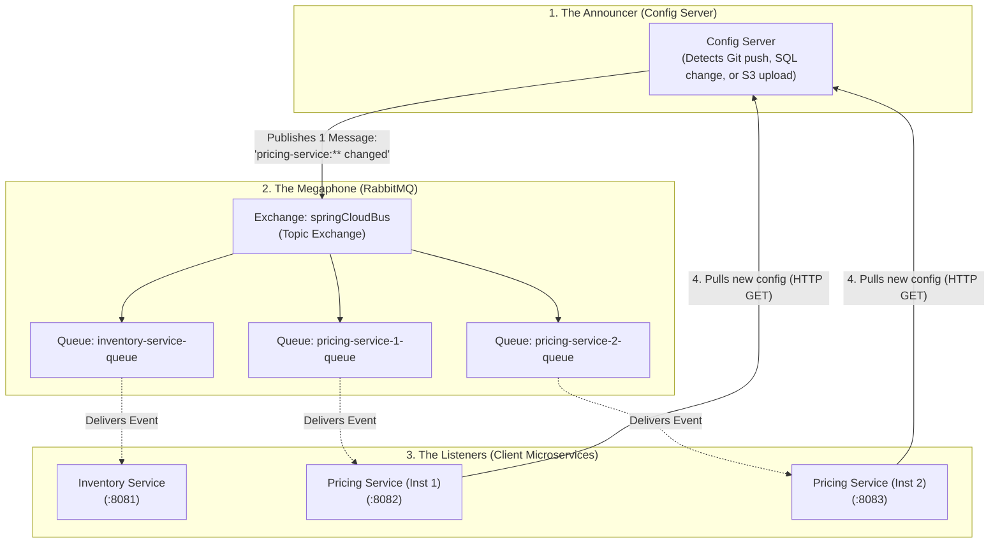

# Spring Cloud Config — External Configuration with Live Refresh

> **New to Spring Cloud Config? Start with [GETTING-STARTED.md](GETTING-STARTED.md).**
> It assumes no prior knowledge, explains every term before using it, and walks you through
> running one version and watching a configuration change take effect. This README is the
> reference — it is dense on purpose and assumes you already know the domain.

Three working, independently runnable implementations of one goal: **a property changed in
external configuration reaches every running service within seconds, with no restart and no
redeploy.**

Same Spring Boot 4 / Spring Cloud stack, same two client services, same guarantees — three
different storage backends and three genuinely different change-detection mechanisms.

| | Backend | Change trigger | Config server | Clients | Checks |
|---|---|---|---|---|---|
| [**version-a-git**](version-a-git/README.md) | Git repository (Remote GitHub / Local) | `post-commit` / Webhook → `/monitor` → Bus | 8888 | 8081-8083 | **23/23** |
| [**version-b-jdbc**](version-b-jdbc/README.md) | PostgreSQL 17.6 | trigger → `pg_notify` → `LISTEN` → Bus | 8898 | 8091-8093 | **27/27** |
| [**version-c-s3**](version-c-s3/README.md) | AWS S3 (Floci emulator) | S3 Event Notification → SQS → Bus | 8908 | 8101-8103 | **26/26** |

**428 automated checks** — 352 tests in `mvn verify` (345 unit/slice plus a
7-test Testcontainers integration suite), and 76 end-to-end acceptance checks against the running
Docker stacks, each E2E suite run twice consecutively to prove idempotency. Measured propagation: **0.1–0.6 s** typical.

Every module builds under an enforced quality gate: Spotless (google-java-format), Checkstyle,
SpotBugs, JaCoCo coverage, Maven Enforcer, and **ArchUnit rules that fail the build if the
refresh-safety constraints in [§4](#4-the-core-design-refresh-safe-configuration) are violated.**

### Contents

1. [Quick answer: cloud-agnostic and Kubernetes-ready?](#1-quick-answer-cloud-agnostic-and-kubernetes-ready)
2. [Version matrix](#2-version-matrix)
3. [Architecture](#3-architecture) — incl. [Kubernetes topology](#36-kubernetes-deployment-topology-version-c-on-floci-eks)
4. [The core design](#4-the-core-design-refresh-safe-configuration)
5. [Design patterns applied](#5-design-patterns-applied)
6. [Project layout](#6-project-layout)
7. [Quick start](#7-quick-start)
8. [Operator runbook: changing configuration](#8-operator-runbook-changing-configuration)
9. [Configuration reference](#9-configuration-reference)
10. [API reference](#10-api-reference)
11. [Observability](#11-observability)
12. [Security](#12-security)
13. [Testing and results](#13-testing-and-results)
14. [Portability and Kubernetes readiness](#14-portability-and-kubernetes-readiness)
15. [Findings that contradicted the specification](#15-findings-that-contradicted-the-specification)
16. [Troubleshooting](#16-troubleshooting)
17. [Known gaps and roadmap](#17-known-gaps-and-roadmap)

Beginner's guide: [GETTING-STARTED.md](GETTING-STARTED.md)

Design documents: [REQUIREMENTS.md](REQUIREMENTS.md) ·
[SPECIFICATION.md](SPECIFICATION.md) (version A) ·
[SPECIFICATION-BACKENDS.md](SPECIFICATION-BACKENDS.md) (versions B and C)

---

## 1. Quick answer: cloud-agnostic and Kubernetes-ready?

Short version: **two of the three are cloud-agnostic, and version B is deployed and verified on
Kubernetes.** Detail in [§14](#14-portability-and-kubernetes-readiness).

Two of the three are verified running on Kubernetes:

- **Version B on minikube** — 2 Config Server replicas, 2 pricing replicas, PodDisruptionBudget;
  **10 in-cluster checks pass**, including a `psql` UPDATE reaching all three client pods with
  **zero pod restarts**.
- **Version C on Floci EKS** — Floci's EKS service provisions a real `rancher/k3s` control plane;
  **12 in-cluster checks pass**, including an `aws s3 cp` reaching all three client pods with zero
  restarts. One command: `version-c-s3/k8s/deploy-floci-eks.sh` (unique image tag per deploy, and it
  asserts the cluster is running the image it just built).

Version A is manifests-only: its `file://` backend genuinely cannot run in a cluster and it needs a
remote Git URI (§14.2).

### Cloud-agnostic?

| Version | Cloud-agnostic | Why |
|---|---|---|
| **A — Git** | ✅ Yes | Any Git host (GitHub, GitLab, Bitbucket, self-hosted). Nothing AWS/GCP/Azure-specific. *But* the current `file://` local-repo configuration is not deployable anywhere — see §14.2. |
| **B — PostgreSQL** | ✅ Yes | PostgreSQL runs on RDS, Cloud SQL, Azure Database, or on-prem, unchanged. ⚠️ It is **not database-agnostic**: `LISTEN/NOTIFY` is PostgreSQL-only and the detector imports `org.postgresql.PGConnection` at compile scope. Moving to MySQL/Oracle means a new `ConfigChangeDetector`, not a rewrite — that is what the SPI is for. |
| **C — AWS S3** | ❌ **No** | Genuinely AWS-coupled. `AwsS3EnvironmentRepository` plus **SQS**, which has no equivalent outside AWS. The S3 *API* has compatible implementations (MinIO, Ceph, and the Floci emulator used here), but the notification path does not port. GCP would need GCS + Pub/Sub; Azure would need Blob + Event Grid — each a new detector. |

The portable part is the *design*, not version C: the `ConfigChangeDetector` → `ConfigChangePublisher`
seam means a new cloud costs one class (~150 lines). The clients never change.

### Kubernetes-ready?

**Version B: yes, verified running.** A and C: manifests written and API-validated, external
prerequisite outstanding.

| Concern | Status |
|---|---|
| Liveness / readiness / **startup** probes | ✅ All three, on the management port |
| Manifests | ✅ Namespace, ConfigMap, Secret, Deployments, StatefulSet, Services, NetworkPolicy, PDB, ServiceAccount |
| Secrets | ✅ Kubernetes `Secret`; the encryption keystore is created from file and never committed |
| Graceful shutdown | ✅ `server.shutdown: graceful` + `terminationGracePeriodSeconds: 45` |
| Management port separation | ✅ Actuator on 9888; `/actuator/env` returns **401** unauthenticated there |
| Bus instance id per pod | ✅ `APP_INDEX` from `fieldRef: metadata.name` |
| Rolling updates | ✅ `maxUnavailable: 0`, PodDisruptionBudget `minAvailable: 1` |
| Hardened pods | ✅ non-root, `readOnlyRootFilesystem`, all capabilities dropped, seccomp `RuntimeDefault`, no API token |
| Multi-replica Config Server | ✅ 2 replicas (safe for JDBC: no shared filesystem) |
| CI | ✅ GitHub Actions: build matrix, E2E matrix, scheduled CVE scan |
| **Version A on Kubernetes** | ⚠️ Needs a **remote** Git URI — `file://` cannot work in a cluster (§14.2) |
| **Version C on Kubernetes** | ✅ **Verified on Floci EKS** (real k3s control plane), 12 in-cluster checks |
| Broker HA / persistence | ⚠️ Single RabbitMQ pod, no persistence. Use a managed broker or the Cluster Operator. |
| HPA | ❌ Not included; needs metrics-server and a meaningful scaling signal |

Before porting this, §14.5 is still worth reading: on Kubernetes you may not want Config Server
*plus* a broker at all.

---

## 2. Version matrix

All versions verified against Maven Central and spring.io on 2026-08-30.

| Component | Version | Notes |
|---|---|---|
| Spring Boot | **4.0.8** | Latest 4.0.x |
| Spring Cloud | **2025.1.3** (Oakwood) | Current GA train; first to target Boot 4 |
| Spring Framework | 7.0.9 | Transitive |
| Spring Security | 7.0.7 | Transitive |
| Micrometer | 1.16.7 | Transitive |
| `spring-cloud-config` | 5.0.5 | BOM-managed |
| `spring-cloud-bus` | 5.0.3 | BOM-managed, Stream-based |
| Spring Cloud AWS | **4.1.1** | Version C only |
| Java | 21 (LTS) | Boot 4 baseline is 17 |
| Maven | 3.9.15 | Multi-module reactor per version |
| RabbitMQ | 4.3.5 (`rabbitmq:4-management`) | One per stack |
| PostgreSQL | 17.6 | Version B |
| Floci | 1.5.26 | Version C, local AWS emulator |

`spring-cloud-build` 5.0.3 — the build parent of Spring Cloud 2025.1.3 — itself declares
`spring-boot.version` = **4.0.8**, so this is the exact pair Spring Cloud is built against, not
merely a compatible one.

> **There is no Spring Cloud "2026.x".** The Boot-4 train is versioned `2025.1.x`. Declare only
> `2025.1.3` and let it manage every `spring-cloud-*` version — never pin them individually.

```xml
<parent>
  <groupId>org.springframework.boot</groupId>
  <artifactId>spring-boot-starter-parent</artifactId>
  <version>4.0.8</version>
</parent>
<properties>
  <java.version>21</java.version>
  <spring-cloud.version>2025.1.3</spring-cloud.version>
</properties>
```

---

## 3. Architecture

### 3.1 Shared shape

Every version is the same pipeline. Only the two leftmost boxes differ.

```text
  ┌───────────────┐   ┌────────────────────┐   ┌──────────────┐   ┌──────────────────┐
  │ Config store  │──▶│ Change detector    │──▶│ Spring Cloud │──▶│ Client services  │
  │ (system of    │   │ (backend-specific, │   │ Bus over     │   │ (IDENTICAL in    │
  │  record)      │   │  ~150 lines)       │   │ RabbitMQ     │   │  all 3 versions) │
  └───────────────┘   └────────────────────┘   └──────────────┘   └──────────────────┘
       Git / PG / S3      the only difference     bare app name        validate → compare
                                                  or "*"                → atomic swap
```

### 3.2 Version A — Git

```text
  operator ── git commit ──▶ config-repo/ (.git)
                  │                 │ file:// read (+ git checkout: needs WRITE)
                  │ post-commit hook▼
                  └──── POST /monitor ──▶ config-server :8888
                                            ├ MultipleJGitEnvironmentRepository
                                            ├ PropertyPathEndpoint  (path → app names)
                                            └ publishes RefreshRemoteApplicationEvent
                                                          │
                                          RabbitMQ :5672 ─┼──▶ inventory-service :8081
                                                          ├──▶ pricing-service   :8082
                                                          └──▶ pricing-service-2 :8083
```

### 3.3 Version B — PostgreSQL

```text
  operator ── psql UPDATE ──▶ PostgreSQL :5433
                                 ├ properties            (config, system of record)
                                 ├ properties_history    (replaces `git log`)
                                 ├ config_revision       (drives the reconciler)
                                 └ statement-level triggers
                                        │ pg_notify('config_changed')  ← transactional
                                        ▼
                              config-server :8898
                                 ├ JdbcEnvironmentRepository
                                 ├ PostgresNotifyChangeDetector  (dedicated LISTEN conn)
                                 ├ JdbcRevisionPollingDetector   (15 s reconciler)
                                 └ BusConfigChangePublisher
                                        │
                        RabbitMQ :5673 ──┴──▶ clients :8091-8093
```

### 3.4 Version C — AWS S3

```text
  operator ── aws s3 cp ──▶ S3 bucket acme-platform-config (versioning ON)
                               main/application.yml            ← main/ prefix IS label "main"
                               main/inventory-service.yml
                               main/pricing-service.yml
                                    │ s3:ObjectCreated:* / ObjectRemoved:*
                                    ▼
                            SQS config-change-queue ──▶ config-change-dlq (maxReceiveCount 3)
                                    │ @SqsListener
                                    ▼
                          config-server :8908
                             ├ AwsS3EnvironmentRepository
                             ├ S3EventSqsChangeDetector
                             ├ S3ObjectKeyApplicationMapper   (exact, no dash-guessing)
                             └ BusConfigChangePublisher
                                    │
                    RabbitMQ :5674 ──┴──▶ clients :8101-8103
```

### 3.5 Refresh sequence inside a client

```text
bus event → ContextRefresher.refresh()
              1. rebuild Environment (re-fetch from Config Server)
              2. publish EnvironmentChangeEvent(changedKeys)
              3. ConfigurationPropertiesRebinder re-initialises the props bean IN PLACE
              4. RefreshScope.refreshAll()
              5. publish RefreshScopeRefreshedEvent
                    │
                    ▼
              <Service>SettingsProvider (listens on step 5, not step 2)
                    validate(propertiesBeans)
                      ├ invalid  → REJECTED: keep last-known-good, metric + audit
                      └ valid    → build immutable snapshot
                                    ├ equals(current) → NO_CHANGE (version unchanged)
                                    └ differs         → AtomicReference.set, version++
```

It listens on step 5 rather than step 2 because `ConfigurationPropertiesRebinder` also listens on
`EnvironmentChangeEvent`, and listener order between the two is not guaranteed — reading the
properties bean from step 2 can observe pre-rebind values.

### 3.6 Kubernetes deployment topology (version C on Floci EKS)

Verified running: `version-c-s3/k8s/deploy-floci-eks.sh`. The two details that make this work at
all are marked — see [§14](#14-portability-and-kubernetes-readiness) and findings 15–16.

```text
 HOST (macOS) ─ Docker bridge 172.17.0.0/16
 ┌────────────────────────────────────────────────────────────────────────────────────────────┐
 │                                                                                            │
 │   operator                                                                                 │
 │      │  aws s3 cp application.yml s3://acme-platform-config/main/                          │
 │      ▼                                                                                     │
 │   ┌──────────────────────────────────────────────────────────┐                             │
 │   │  floci                        172.17.0.2:4566            │  AWS emulator;              │
 │   │    S3   acme-platform-config  (versioning ON)            │  its EKS service            │
 │   │    SQS  config-change-queue → config-change-dlq          │  runs here too              │
 │   └───────────────┬──────────────────────▲───────────────────┘                             │
 │        s3:Object  │                      │  @SqsListener + GetObject                       │
 │        Created:*  │                      │  AWS_ENDPOINT=http://172.17.0.2:4566            │
 │                   │                      │  ^^ an IP ⇒ the SDK uses PATH-style             │
 │   ┌─ floci-eks-config-demo  (rancher/k3s · API :6500 · ns config-demo) ────────────────┐   │
 │   │                                                                                    │   │
 │   │  ┌──────────────────────────────────────┐      ┌──────────────────────────┐        │   │
 │   │  │ config-server                    ×2  │      │ Secret                   │        │   │
 │   │  │   :8888  Environment API             │◀─────│  config-server.p12 (RO)  │        │   │
 │   │  │   :9888  actuator — 401 unauth       │mounts│  credentials             │        │   │
 │   │  │   S3EventSqsChangeDetector           │      │ ConfigMap ×2             │        │   │
 │   │  │   PodDisruptionBudget minAvailable=1 │      └──────────────────────────┘        │   │
 │   │  └───────────────────┬──────────────────┘                                          │   │
 │   │                      │ RefreshRemoteApplicationEvent (destination "*")             │   │
 │   │                      ▼                                                             │   │
 │   │             ┌──────────────────┐                                                   │   │
 │   │             │ rabbitmq     ×1  │  springCloudBus topic exchange                    │   │
 │   │             └──┬─────┬─────┬───┘                                                   │   │
 │   │    ┌───────────┘     │     └───────────┐  fanout: ONE broadcast, EVERY pod         │   │
 │   │    ▼                 ▼                 ▼                                           │   │
 │   │  inventory-service  pricing-service  pricing-service                               │   │
 │   │       ×1             replica 1        replica 2                                    │   │
 │   │  :8081 / :9081      :8082 / :9082    :8082 / :9082                                 │   │
 │   │                                                                                    │   │
 │   │  on refresh each pod: validate → equals? → AtomicReference swap;                   │   │
 │   │  invalid ⇒ keep last-known-good, never restart                                     │   │
 │   │                                                                                    │   │
 │   │  every pod: runAsNonRoot · readOnlyRootFilesystem · caps dropped ·                 │   │
 │   │             seccomp RuntimeDefault · no service-account token ·                    │   │
 │   │             enableServiceLinks=false ^^ else RABBITMQ_PORT=tcp://…                 │   │
 │   │             APP_INDEX from fieldRef metadata.name (unique bus id)                  │   │
 │   └────────────────────────────────────────────────────────────────────────────────────┘   │
 └────────────────────────────────────────────────────────────────────────────────────────────┘
```

Version B on minikube is the same shape with two substitutions: PostgreSQL replaces the S3+SQS box
(the detector becomes a `LISTEN/NOTIFY` listener plus a revision poller), and a NetworkPolicy
restricts port 5432 to the Config Server alone so no other pod can bypass the audit trigger.

### 3.7 Understanding RabbitMQ & Spring Cloud Bus (Layman's Guide & Web UI)

If you are new to distributed systems, message brokers, or Spring Cloud Bus, here is a simple breakdown of how RabbitMQ links Config Server and your microservices.

#### 1. The Core Problem RabbitMQ Solves (The "Megaphone" Analogy)
Imagine a teacher (Config Server) needs to tell a classroom of 50 students (microservice instances) that the class schedule has changed:
- **Without RabbitMQ (Point-to-Point HTTP)**: The teacher must walk up to each student's desk one by one and whisper the update. If students are coming and going (auto-scaling pods), the teacher has to maintain a live roster. If one student is asleep or busy (unresponsive pod), the teacher gets stuck waiting.
- **With RabbitMQ & Spring Cloud Bus (Pub/Sub Broadcast)**: The teacher speaks once into a **megaphone** (RabbitMQ). Every student hears the announcement simultaneously. The teacher doesn't need to know who is in the room, where they sit, or if new students just walked in.



#### 2. How the Link Works Step-by-Step
1. **Connection & Registration**: At startup, every microservice and Config Server establishes an AMQP connection to RabbitMQ (`port 5672`).
2. **Dynamic Private Queues**: Each microservice instance creates a temporary, auto-delete queue bound to the `springCloudBus` Topic Exchange.
3. **Change Event Published**: When a property is updated, Config Server sends a single `RefreshRemoteApplicationEvent` JSON payload to `springCloudBus` specifying the target destination (e.g., `pricing-service:**` or `**` for all).
4. **Broadcast Routing**: RabbitMQ instantly clones and routes the event to the queues of all connected services.
5. **Smart Processing**:
   - **Target Match**: If the destination matches the service (`pricing-service`), it queries Config Server over HTTP (`GET /pricing-service/default/main`), validates the new values, and atomically swaps its active configuration in memory with **zero downtime**.
   - **Target Mismatch**: If the destination doesn't match (`inventory-service`), it discards the message with zero overhead.

#### 3. How to See and Inspect RabbitMQ in Real-Time (Web Management UI)

Every version includes a pre-configured RabbitMQ Management Web Dashboard:

| Version | Web Management UI URL | Credentials | Broker AMQP Port |
|---|---|---|---|
| **Version A (Git)** | [http://localhost:15672](http://localhost:15672) | `guest` / `guest` | `5672` |
| **Version B (PostgreSQL)** | [http://localhost:15673](http://localhost:15673) | `guest` / `guest` | `5673` |
| **Version C (AWS S3)** | [http://localhost:15674](http://localhost:15674) | `guest` / `guest` | `5674` |

#### 4. What to Look for in the RabbitMQ Dashboard:

1. **Connections Tab ("The Phone Lines")**:
   - You will see **4 active connections** representing your 4 microservices.
   - **Service Name Identification**: Thanks to the `ConnectionNameStrategy` bean configured in each service's `RabbitConfig.java`, each connection sets a descriptive **Client-provided name** (e.g. `config-server:8888`, `inventory-service:8081`, `pricing-service:8082`).
   - *Tip*: In the RabbitMQ table, click the `+/-` icon on the top-right of the table to enable the **Client-provided name** column, or click any connection row to inspect its client properties.
2. **Exchanges Tab ("The Router")**:
   - Click on the **`springCloudBus`** exchange (`topic` type).
   - Scroll down to **Bindings**: You will see each microservice's queue bound to this exchange with routing pattern `#`.
3. **Queues and Streams Tab ("The Inboxes")**:
   - You will see 4 queues named `springCloudBus.anonymous.<random-hash>`.
   - **Why `anonymous.<hash>`?** Spring Cloud Bus generates unique queue names for each replica so that broadcasts are delivered to **every** replica (fan-out pattern). If they shared the same static queue name, RabbitMQ would load-balance messages, causing only one pod to refresh while other pods remain stale!
   - **How to know which queue belongs to which service?** Click on any queue name &rarr; scroll to **Consumers** &rarr; you will see the consumer's connection name (e.g. `pricing-service:8082`).
4. **Live Activity (Watch Messages Flow)**:
   - Keep the RabbitMQ UI `Overview` page open.
   - Trigger a config update (commit Git change, update Postgres row, or upload to S3).
   - Watch the **Message Rates** (`incoming` and `deliver / get`) immediately spike from 0 to 1 in real time!

#### 5. Architectural Decision: Why RabbitMQ instead of Kafka for Spring Cloud Bus?

Both **RabbitMQ** and **Apache Kafka** are supported by Spring Cloud Bus (`spring-cloud-starter-bus-amqp` vs `spring-cloud-starter-bus-kafka`). However, for a **configuration management bus**, **RabbitMQ is the industry-standard recommendation**:

##### A. The Nature of the Workload: "Ephemeral Broadcast" vs "Event Stream"

| Aspect | Spring Cloud Bus Requirement | RabbitMQ (Chosen) | Apache Kafka |
|---|---|---|---|
| **Message Type** | Rare, tiny notification signals *(e.g. "Pricing config updated")* | **Natural fit**: Built for point-in-time message routing. | **Mismatch**: Built for continuous streams of business data (millions of events/sec). |
| **History / Replay** | **Not needed**: If a pod boots up tomorrow, it pulls fresh config via HTTP `GET`. It does not need to replay past refresh events. | Discards messages immediately after delivery. | Retains and stores messages to disk in commit logs. |
| **Dynamic Scaling** | Pods scale from 2 to 50 and back down dynamically. | **Ephemeral Queues (`[AD]`)**: Creates a temporary queue on pod startup; deletes it the millisecond the pod terminates. | **Consumer Group Metadata**: Every replica needs a unique random Consumer Group, leaving behind orphaned metadata in Kafka when pods die. |
| **Resource Footprint** | Background infrastructure should be lightweight. | **~40–60 MB RAM**, starts in 2 seconds. | **~600 MB–1.5 GB RAM** (JVM + KRaft/Zookeeper), starts in 20–30s. |

##### B. The "Megaphone" Analogy (RabbitMQ) vs "The Permanent Archive" (Kafka)
- **RabbitMQ is a Megaphone**: When a config changes, Config Server shouts into the megaphone. Any microservice currently alive hears it and refreshes. If no one is listening or a pod is dead, the sound disappears. This is **exactly** what configuration refresh needs.
- **Kafka is a Recording Studio with Permanent Tape**: Kafka writes every shout onto disk, tracks offsets, and organizes data into partitions. For an occasional 1 KB config refresh ping once a week, spinning up Kafka partitions and storage segments is massive overkill.

##### C. Comparison Matrix

| Feature | RabbitMQ (Default) | Apache Kafka |
|---|---|---|
| **Spring Cloud Starter** | `spring-cloud-starter-bus-amqp` | `spring-cloud-starter-bus-kafka` |
| **Broker Memory Usage** | ~50 MB RAM | ~800 MB+ RAM |
| **Queue Lifecycle** | Automatically deleted on pod exit (`[AD]`) | Topic partition offsets must be managed/rebalanced |
| **Routing Flexibility** | Native Topic Exchanges (`pricing-service:**`) | Requires topic-per-service or manual payload filtering |
| **Local Dev & CI/CD Speed** | Instant startup in Docker/Testcontainers | Slower Docker spin-up |

##### D. Swapping to Kafka (If Required by Enterprise Policy)
If your organization mandates Apache Kafka, Spring Cloud Bus supports it via a simple **1-line dependency swap**:

**1. In `pom.xml`**:
```xml
<!-- Replace RabbitMQ: -->
<!-- <dependency>
       <groupId>org.springframework.cloud</groupId>
       <artifactId>spring-cloud-starter-bus-amqp</artifactId>
     </dependency> -->

<!-- With Kafka: -->
<dependency>
  <groupId>org.springframework.cloud</groupId>
  <artifactId>spring-cloud-starter-bus-kafka</artifactId>
</dependency>
```

**2. In `application.yml`**:
```yaml
spring:
  cloud:
    bus:
      id: ${spring.application.name}:${random.uuid}
  kafka:
    bootstrap-servers: localhost:9092
```

All your Java code, `@RefreshScope`, snapshot providers, and zero-downtime refresh mechanics remain **100% identical**.

---

## 4. The core design: refresh-safe configuration

Business code **never** reads a `@ConfigurationProperties` bean. It reads an immutable snapshot
from a provider. Three constraints force this, each verified against Spring Cloud source rather
than assumed.

### 4.1 Setter-based binding is mandatory

`ConfigurationPropertiesRebinder` refreshes by re-initialising the **existing** bean instance
through its setters. A `record` or any constructor-bound class is re-created instead, so every
reference injected before the refresh keeps stale values — and live refresh appears to work
intermittently.

```java
@Component
@ConfigurationProperties(prefix = "inventory")
// NOT @Validated - see §4.2
public class InventoryConfigProperties {
  @NotBlank private String warehouseCode;
  @Min(1) @Max(10_000) private int maxOrderQuantity;
  private boolean expressShippingEnabled;
  @Min(0) private int lowStockThreshold;
  // getters + SETTERS - the setters are what make refresh work
}
```

### 4.2 `@Validated` must NOT be on a refreshable properties class

`ConfigurationPropertiesRebinder.rebind` records the failure and then **rethrows**. A constraint
violation during rebind therefore propagates out of `ContextRefresher.refresh()` and
`RefreshScopeRefreshedEvent` is *never published* — so there is no opportunity to retain
last-known-good or report anything. The service would silently keep a partially-bound bean.

Validation is driven by the provider instead, on the already-rebound bean. Startup fail-fast is
preserved by validating in `@PostConstruct`.

### 4.3 Reads go through an `AtomicReference`

From the rebinder's own Javadoc:

> the bean is mutated in place, field by field, so a concurrent reader can observe transient
> intermediate state. Beans that need a consistent view across a refresh should use `RefreshScope`

The provider publishes a whole immutable snapshot in one atomic write, so a reader takes one
reference load and always sees a complete, self-consistent set of values.

```java
public record InventorySettings(          // values ONLY - no version, no timestamp,
    String warehouseCode,                 // so record equals() is the "did anything change?" test
    int maxOrderQuantity,
    boolean expressShippingEnabled,
    int lowStockThreshold,
    String bannerMessage,
    String environmentLabel) {}
```

```java
public ReservationResponse reserve(ReservationRequest request) {
  // ONE snapshot read per request. Every decision below uses one configuration generation,
  // so a refresh landing mid-request cannot produce a response mixing old and new values.
  InventorySettings settings = this.settingsProvider.get();
  if (request.quantity() > settings.maxOrderQuantity()) { throw ...; }
  boolean expressEligible = settings.expressShippingEnabled();
  ...
}
```

### 4.4 What this buys

| Requirement | How it is satisfied |
|---|---|
| Live refresh actually works | Setter binding (§4.1) |
| Last-known-good on bad config | Validate the candidate, swap only if valid (§4.2) |
| No torn reads under load | Single `AtomicReference` load (§4.3) |
| No-op refresh is free | Record `equals` short-circuits before any swap |
| No latency spike on refresh | Business beans are plain singletons, never `@RefreshScope` |
| Secrets never logged | Audit records changed key **names** only |

`@RefreshScope` is used nowhere in these projects. It is reserved for beans that must be rebuilt
from configuration (for example a `RestClient` with a config-driven base URL) and is deliberately
avoided for anything holding a pool or requiring orderly shutdown.

---

## 5. Design patterns applied

Mapped to concrete classes rather than named in the abstract.

| Pattern | Where | Why it fits |
|---|---|---|
| **Externalised Configuration** (12-Factor III) | Whole system | Same artefact runs in every environment |
| ~~**Template Method**~~ | *removed with `config-client-commons`* | Once each client owned its own plumbing there was one "subclass" per service, so the abstract base was collapsed into each concrete `<Service>SettingsProvider`. Duplicated algorithm, zero indirection — the trade this project now makes deliberately |
| **Provider / Facade** | `ConfigurationSnapshotProvider<T>` | One seam between mutable Spring binding and immutable domain state |
| **Immutable Value Object** | `InventorySettings`, `PricingSettings` | Thread-safe reads, no defensive copying |
| **Atomic swap (copy-on-write)** | `AtomicReference<T>` in each provider | Lock-free consistency under concurrent load |
| **Observer / Publish–Subscribe** | Bus `RefreshRemoteApplicationEvent`; `ApplicationListener<RefreshScopeRefreshedEvent>` | One publisher, N unknown subscribers — the only shape that reaches every replica |
| **Strategy** | `EnvironmentRepository` (Git/JDBC/S3); `ConfigChangeDetector` per backend | Backend and detection mechanism swap without touching clients |
| **Adapter** | `S3ObjectKeyApplicationMapper`, `post-commit` hook, `PropertyPathEndpoint` | Translates foreign key/path/webhook shapes into the internal event model |
| **Publisher / single fan-out** | `BusConfigChangePublisher` | Every backend converges on one broadcast path |
| **Reconciler** | `JdbcRevisionPollingDetector` | Closes gaps a push mechanism structurally cannot |
| **Dead Letter Channel** | SQS `config-change-dlq` | Poison messages are contained, not retried forever |
| **Transactional Outbox** (without the table) | `pg_notify` inside a trigger | `NOTIFY` is delivered only on COMMIT |
| **Retry with exponential backoff** | `spring.config.import` params; listener reconnect | Startup ordering is not guaranteed |
| **Fail-fast** | `spring.config.import` without `optional:`; no default for passwords | Never serve traffic in an unknown state |
| **Graceful degradation** | Broker down → keep serving; listener down → reconciler | Propagation is best-effort, availability is not |
| **Layered architecture** | `web → service → provider → domain` | Dependency direction is one-way |
| **DTO** | `web/dto/*` | Domain records never leak to the wire |
| **Problem Details (RFC 9457)** | `GlobalExceptionHandler` | Standard machine-readable errors |

---

## 6. Project layout

Identical in all three versions except where noted.

**Every service is a self-contained project.** It parents directly to
`spring-boot-starter-parent`, declares its own dependency management, carries its own quality-gate
configuration under `config/`, and owns its own `Dockerfile`. Nothing is inherited from the
version-level `pom.xml`, which is a pure *aggregator* — it lists the three services so one command
can build them all, and that is all it does. Both of these work:

```bash
cd version-a-git                    && mvn verify     # all three services
cd version-a-git/inventory-service  && mvn verify     # just this one, no reference to siblings
```

Aggregation and inheritance are independent in Maven. Deleting a version's `pom.xml` would cost
the build-all convenience and change nothing else — a service directory copied somewhere else on
its own still builds, quality gates included.

```text
version-X/
├── pom.xml                          AGGREGATOR ONLY — <modules> list, ~33 lines, not a parent
├── config-server/
│   ├── pom.xml                      standalone: parent is spring-boot-starter-parent
│   ├── Dockerfile                   own; build context is this directory
│   ├── config/                      own checkstyle + suppressions + spotbugs + dep-check
│   └── src/main/java/com/example/config/server/
│       ├── ConfigServerApplication.java
│       ├── config/
│       │   ├── SecurityConfig.java                    2 roles, stateless HTTP Basic
│       │   └── [B] NotificationDataSourceConfig.java  scheduling config for reconciler
│       └── change/                                    (versions B and C only)
│           ├── ConfigChangeNotification.java          normalised "what changed"
│           ├── ConfigChangePublisher.java             the SPI
│           ├── BusConfigChangePublisher.java          single fan-out onto the Bus
│           ├── ConfigChangeHealthIndicator.java
│           └── [B] PostgresNotifyChangeDetector.java, JdbcRevisionPollingDetector.java
│               [C] S3EventSqsChangeDetector.java, S3ObjectKeyApplicationMapper.java
├── inventory-service/               client 1 — feature flag + numeric limit
│   ├── pom.xml, Dockerfile, config/    same self-contained shape
│   └── src/
├── pricing-service/                 client 2 — proves scoping; runs as 2 instances
│   ├── pom.xml, Dockerfile, config/    same self-contained shape
│   └── src/
├── docker/
│   └── compose.yaml                 orchestration only — builds each service from its own
│                                    directory; no shared Dockerfile, no MODULE build-arg
└── scripts/
    ├── e2e-test.sh                  acceptance suite (idempotent)
    ├── [A] install-git-hook.sh, post-commit
    └── [C] provision-floci.sh
```

`docker/compose.yaml` stays at the version level deliberately: it wires *several* services plus
RabbitMQ into one runnable stack, which is orchestration rather than something any single service
can own. Each service still builds its own image independently:

```bash
cd version-a-git/inventory-service && mvn package && docker build -t inventory-service .
```

Version-specific extras:

- **A** — `config-repo/` (the Git repo that is the system of record)
- **B** — `config-server/src/main/resources/db/migration/V1__config_schema.sql`, `V2__config_change_notify.sql`
- **C** — `seed-config/` (objects uploaded to S3)

### Package structure (clients)

There is deliberately **no shared library**. Each client owns its refresh plumbing outright, so the
two services are independently deployable and neither can be broken by a change made on behalf of
the other. The cost is that the `refresh/` package is duplicated between them; the benefit is that
there is no coupling to negotiate.

```text
com.example.config.<service>
├── <Service>Application.java     @SpringBootApplication (default component scan)
├── config/     setter-bound @ConfigurationProperties + SharedConfigProperties (demo.shared.*)
├── controller/ REST controllers (<Service>Controller, ConfigInspectionController)
├── dto/        immutable request/response records with Jakarta validation (ReservationRequest, etc.)
├── domain/     immutable snapshot records (<Service>Settings)
├── service/    business logic — reads immutable snapshots from refresh provider, plain singleton
├── exception/  RFC 9457 ProblemDetail @RestControllerAdvice handler + domain exceptions
└── refresh/    this service's own refresh plumbing:
                ├── <Service>SettingsProvider.java       validate → compare → atomically swap → audit
                ├── ConfigurationSnapshotProvider.java   the SPI contract
                ├── ConfigSnapshotStatus.java            version, appliedAt, outcome, changed keys
                ├── EnvironmentChangeKeyRecorder.java    captures changed key NAMES
                ├── ConfigRefreshAuditor.java            structured JSON audit + history
                ├── ConfigRefreshMetrics.java            Micrometer counters/timers/gauges
                ├── ConfigurationHealthIndicator.java    config state in /actuator/health
                └── ConfigurationValidationException.java
```

---

## 7. Quick start

Prerequisites: Docker running, Java 21, Maven 3.9+. Version C also needs Floci.

### Version A — Git

```bash
cd version-a-git

# config-repo is the configuration system of record and must be a git repository at RUNTIME.
# It is committed here as plain files, not as a nested repo, so initialise it once after cloning
# (a nested .git would arrive as an empty gitlink for anyone who clones this project).
git -C config-repo init -b main
git -C config-repo add -A && git -C config-repo commit -m "Seed configuration"

mvn clean install -DskipTests
./scripts/generate-keystore.sh                       # RSA keypair for {cipher} values
./scripts/install-git-hook.sh                        # bridges git commit → /monitor
docker compose -f docker/compose.yaml up -d --build
./scripts/e2e-test.sh
```

### Version B — PostgreSQL

```bash
cd version-b-jdbc
./scripts/generate-keystore.sh                       # RSA keypair for {cipher} values
mvn clean install -DskipTests
docker compose -f docker/compose.yaml up -d --build  # postgres + rabbitmq + 4 apps
./scripts/e2e-test.sh
```

### Version C — AWS S3

```bash
floci start                                          # local AWS emulator
cd version-c-s3
./scripts/generate-keystore.sh                       # RSA keypair for {cipher} values
mvn clean install -DskipTests
./scripts/provision-floci.sh                         # bucket, versioning, SQS, DLQ, seed
docker compose -f docker/compose.yaml up -d --build
./scripts/e2e-test.sh
```

### All three at once

They use disjoint ports, so all three stacks can run simultaneously (~14 GB of images and
containers — check disk first).

### Tear down

```bash
for v in version-a-git version-b-jdbc version-c-s3; do
  docker compose -f $v/docker/compose.yaml down -v
done
floci stop
```

---

## 8. Operator runbook: changing configuration

In every version, verify with:

```bash
curl -s localhost:<client-port>/api/v1/config/snapshot | jq .
```

`version` increments **only when a value actually changed**, so comparing it before and after is
the definitive check.

### Version A — commit to Git

```bash
cd version-a-git
vim config-repo/inventory-service.yml
git -C config-repo commit -am "enable express shipping"   # post-commit fires /monitor
curl -s localhost:8081/api/v1/config/snapshot | jq .      # version+1
curl -s localhost:8082/api/v1/config/snapshot | jq .      # unchanged (scoped)
```

**Committing is what triggers propagation, not what makes the server serve the value.**
With a `file://` repository the Config Server reads the *working tree*, so an uncommitted
edit is already visible to a direct `GET` on the Environment API. What a commit does is fire
the `post-commit` hook, which is the only thing that tells running clients to refresh.
Verified by `GitBackendIT.fileUriServesTheWorkingTree`.

History / rollback: `git -C config-repo log --oneline`, then `git revert <sha>`.

### Version B — SQL

```bash
docker exec -it cfg-jdbc-postgres psql -U config_admin -d configdb -c \
  "UPDATE properties SET \"value\"='750'
     WHERE application='inventory-service' AND \"key\"='inventory.max-order-quantity';"
```

Row semantics that matter:

| Intent | `application` | `profile` | `label` |
|---|---|---|---|
| Shared by all clients | `'application'` (literal) | `NULL` | `'main'` |
| One app, all profiles | `'inventory-service'` | `NULL` | `'main'` |
| One app, one profile | `'inventory-service'` | `'dev'` | `'main'` |

`profile` must be a real `NULL`, not `'default'` or `''`.

History (replaces `git log`):

```bash
docker exec -it cfg-jdbc-postgres psql -U config_admin -d configdb -c \
  'SELECT changed_at, operation, "key", old_value, new_value, changed_by
     FROM properties_history ORDER BY history_id DESC LIMIT 10;'
```

### Version C — upload to S3

```bash
eval $(floci env)
aws s3 cp inventory-service.yml s3://acme-platform-config/main/inventory-service.yml
```

The `main/` prefix **is** the label `main`. Uploading to the bucket root makes the object
invisible to clients requesting `label=main`.

History / rollback (replaces `git revert`):

```bash
aws s3api list-object-versions --bucket acme-platform-config \
  --prefix main/inventory-service.yml --query 'Versions[].[VersionId,LastModified]' --output table

aws s3api copy-object --bucket acme-platform-config --key main/inventory-service.yml \
  --copy-source 'acme-platform-config/main/inventory-service.yml?versionId=<ID>'
```

### Manual recovery (any version)

If the automatic trigger is unavailable:

```bash
curl -X POST localhost:9081/actuator/refresh                          # one instance
curl -X POST -u config-admin:admin-secret \
     localhost:8888/actuator/busrefresh/inventory-service             # whole cluster
```

---

## 9. Configuration reference

### 9.1 Client services (identical in all three versions)

| Property | Default | Purpose |
|---|---|---|
| `SERVER_PORT` | 8081 / 8082 | HTTP port |
| `MANAGEMENT_PORT` | 9081 / 9082 | Separate actuator port |
| `APP_INDEX` | `${SERVER_PORT}` | Feeds `spring.cloud.bus.id` (see §14.4) |
| `CONFIG_SERVER_URI` | `http://localhost:8888` | Environment API |
| `CONFIG_CLIENT_USERNAME` / `_PASSWORD` | `config-client` / `client-secret` | Basic auth |
| `CONFIG_LABEL` | `main` | Git branch, DB label column, or S3 key prefix |
| `RABBITMQ_HOST` / `_PORT` / `_USERNAME` / `_PASSWORD` | `localhost` / 5672 / guest / guest | Bus transport |

```yaml
spring:
  config:
    # No 'optional:' prefix → an unreachable Config Server is a hard startup failure rather
    # than a service silently running with no configuration. Retry rides on the URI.
    import: "configserver:${CONFIG_SERVER_URI}?fail-fast=true&max-attempts=6&initial-interval=1000&multiplier=1.5&max-interval=8000"
```

No `bootstrap.yml` anywhere — config-data import only, so AOT is not excluded.

### 9.2 Version A — Git server

| Property | Default | Notes |
|---|---|---|
| `CONFIG_REPO_URI` | `file:///config-repo` | Mount must be **writable** (§15 #1) |
| `CONFIG_REPO_LABEL` | `main` | Git default label |
| `CONFIG_MONITOR_VALIDATION` | `true` | Secure default; verified working without a secret |

### 9.3 Version B — PostgreSQL server

| Property | Default | Notes |
|---|---|---|
| `DB_URL` | `jdbc:postgresql://localhost:5432/configdb` | |
| `DB_USERNAME` / `DB_PASSWORD` | `config_admin` / `config-secret` | |
| `CONFIG_LABEL` | `main` | **Shipped default is `master`** — must be set |
| `app.config-change.listener.channel` | `config_changed` | `NOTIFY` channel |
| `app.config-change.listener.*-backoff-millis` | 1000 / 30000 | Reconnect backoff |
| `app.config-change.revision-poller.interval` | 15000 | Reconciler period |

Both SQL statements are overridden (mandatory — §15 #3):

```yaml
spring.cloud.config.server.jdbc:
  sql: 'SELECT "key", "value" FROM properties WHERE application=? AND profile=? AND label=?'
  sql-without-profile: 'SELECT "key", "value" FROM properties WHERE application=? AND profile IS NULL AND label=?'
  fail-on-error: true   # a DB outage must NOT look like "no configuration"
```

### 9.4 Version C — S3 server

| Property | Default | Notes |
|---|---|---|
| `AWS_ENDPOINT` | `http://localhost.floci.io:4566` | **Omit on real AWS** |
| `AWS_REGION` | `us-east-1` | |
| `AWS_ACCESS_KEY_ID` / `_SECRET_ACCESS_KEY` | `test` / `test` | **Omit on real AWS** — use IRSA |
| `CONFIG_BUCKET` | `acme-platform-config` | Versioning must be enabled |
| `CONFIG_CHANGE_QUEUE` | `config-change-queue` | Needs a DLQ |
| `CONFIG_KEY_PREFIX` | `main/` | Doubles as the label |
| `app.known-applications` | `inventory-service,pricing-service` | Enables exact key→app mapping |

---

## 10. API reference

### Config Server

| Method | Path | Auth | Purpose |
|---|---|---|---|
| GET | `/{application}/{profile}[/{label}]` | `CONFIG_CLIENT` | Environment API |
| GET | `/{application}-{profile}.yml\|.properties\|.json` | `CONFIG_CLIENT` | Rendered forms |
| POST | `/encrypt`, `/decrypt` | `CONFIG_ADMIN` | Cipher management |
| POST | `/monitor` | `CONFIG_ADMIN` | Webhook receiver (version A only) |
| POST | `/actuator/busrefresh[/{destination}]` | `CONFIG_ADMIN` | Manual cluster broadcast |
| GET | `/actuator/health` | public | Includes backend + detector state |
| GET | `/actuator/metrics/{name}` | `CONFIG_ADMIN` | Micrometer |

### Client services

| Method | Path | Port | Purpose |
|---|---|---|---|
| GET | `/swagger-ui.html` | app | Interactive OpenAPI 3 / Swagger documentation & test console |
| GET | `/v3/api-docs` | app | OpenAPI 3.1 JSON Schema specification |
| GET | `/api/v1/config/snapshot` | app | Effective config + version + outcome |
| GET | `/api/v1/config/history` | app | Last 50 refresh audit records |
| POST | `/api/v1/inventory/reservations` | app | Config-driven business call |
| GET | `/api/v1/pricing/quotes/{sku}?basePrice=` | app | Config-driven quote |
| POST | `/actuator/refresh` | mgmt | Local refresh, returns changed keys |
| POST | `/actuator/busrefresh[/{destination}]` | mgmt | Cluster broadcast |
| GET | `/actuator/health/{liveness,readiness}` | mgmt | Kubernetes probes |

Snapshot response:

```json
{
  "application": "inventory-service",
  "version": 4,
  "appliedAt": "2026-08-30T15:00:13.154Z",
  "lastOutcome": "APPLIED",
  "refreshAttempts": 12,
  "rejectedCount": 1,
  "lastChangedKeys": ["inventory.max-order-quantity"],
  "settings": { "warehouseCode": "WH-BLR-01", "maxOrderQuantity": 750, "...": "..." }
}
```

RFC 9457 Problem Details for Error Responses (`GlobalExceptionHandler`):

```json
{
  "type": "https://api.acme.com/errors/validation-error",
  "title": "Validation Failed",
  "status": 400,
  "detail": "Request payload validation failed for 1 field(s)",
  "instance": "/api/v1/inventory/reservations",
  "errorId": "7b0d2d3e-953e-4b71-9c8d-2947113197f2",
  "timestamp": "2026-09-19T17:30:00Z",
  "fieldErrors": [
    {
      "field": "quantity",
      "rejectedValue": -5,
      "message": "Quantity must be greater than zero"
    }
  ]
}
```

---

## 11. Observability

### Health

`/actuator/health` on a client includes a `configuration` component:

```json
{ "snapshotVersion": 4, "lastOutcome": "APPLIED", "refreshAttempts": 12,
  "rejectedCount": 1, "lastChangedKeys": ["inventory.max-order-quantity"] }
```

A **rejected refresh does not make the service DOWN**. It is still serving valid last-known-good
configuration; reporting DOWN would pull a working instance out of a load balancer over a problem
that lives in the config store. Same reasoning for a dropped `LISTEN` connection in version B —
`propagationMode` degrades to `"degraded: poller only"` while status stays UP.

### Metrics

| Meter | Type | Tags |
|---|---|---|
| `config.refresh.attempts` | counter | application, trigger |
| `config.refresh.outcome` | counter | application, trigger, outcome |
| `config.refresh.failures` | counter | application, reason |
| `config.refresh.duration` | timer | application, outcome |
| `config.snapshot.version` | gauge | application |
| `config.refresh.age.seconds` | gauge | application |
| `config.change.broadcast` | counter | source, destination (server, B/C) |

### Audit

One structured JSON line per refresh, plus a bounded in-memory history:

```json
{"event":"config.refresh","application":"inventory-service","trigger":"refresh",
 "outcome":"APPLIED","version":4,"changedKeys":["inventory.max-order-quantity"],
 "timestamp":"2026-08-30T15:00:13.154Z"}
```

**Key names only, never values** — a refresh may carry a decrypted secret. `REJECTED` outcomes log
at ERROR with the constraint message. The acceptance suites assert the log contains no values.

---

## 12. Security

| Control | Implementation |
|---|---|
| Authentication | Stateless HTTP Basic, two principals |
| Authorisation | `CONFIG_CLIENT` reads the Environment API; `CONFIG_ADMIN` also gets `/encrypt`, `/decrypt`, `/monitor`, `/actuator/**` |
| Password storage | Delegating encoder — `{noop}` locally, `{bcrypt}$2a$...` accepted with no code change |
| Actuator exposure | Explicit allow-list; clients use a separate management port |
| Security Headers | Strict CSP (`default-src 'self'`), HSTS (`max-age=31536000`), `X-Frame-Options: DENY`, `X-Content-Type-Options: nosniff`, Referrer-Policy, Permissions-Policy |
| Telemetry masking | `env.show-values: never`, `configprops.show-values: never` |
| CSRF | Disabled — stateless REST endpoints with no session fixation risk (OWASP compliant) |
| Sessions | `SessionCreationPolicy.STATELESS` across all microservices and config servers |
| SAST / SCA Scanning | SpotBugs + `findsecbugs-plugin:1.13.0` and OWASP `dependency-check-maven:12.1.0` |
| Backend credentials | Read-only intent: no DB write grants needed, no `s3:PutObject`, no git push |
| Container | Non-root `app` user |
| Secrets in config | `{cipher}` supported by the server with RSA 4096-bit keystore |

Verified by the suites: the Environment API returns **401** unauthenticated in all three versions.

---

## 13. Testing and results

Each version has `scripts/e2e-test.sh`, run against the live Docker stack.

### Automated build (`mvn verify`)

| Version | Unit + slice | Integration | Gates |
|---|---|---|---|
| A — Git | 68 | — | all green |
| B — PostgreSQL | 82 | **7** (Testcontainers PostgreSQL) | all green |
| C — S3 | 103 | — | all green |

Enforced on every build, failing it on violation:

| Gate | Tool | What it caught here |
|---|---|---|
| Formatting | Spotless + google-java-format 1.36.1 | single source of truth for layout, so Checkstyle carries no whitespace rules |
| Static analysis | Checkstyle 14.1.0 (curated ruleset, not `google_checks`) | a null-unsafe `equals` orientation in the S3 key mapper |
| Bug patterns & SAST | SpotBugs 4.10.4 + FindSecBugs 1.13.0 (`Max` effort, `Medium` threshold) | **`VO_VOLATILE_INCREMENT`**, CSRF/SQL security checks, null pointer invariants |
| Dependency CVEs | OWASP Dependency-Check 12.1.0 (`mvn -Psecurity verify`) | Third-party dependency vulnerability scanning against NVD |
| Coverage | JaCoCo 0.8.15, 70%/60% line/branch | two `config-server` modules carry a documented lower gate with the reason in the POM |
| Dependency hygiene | Maven Enforcer | Testcontainers 1.x dragging in JUnit 4 |
| **Architecture** | **ArchUnit 1.5.0** | **the service layer depending on `web/dto`** — the DTOs were moved to an `api` package |

### ArchUnit: the design constraints are executable

Eleven rules per client module. Four exist because the corresponding mistake is silent at compile
time, silent at startup, and only shows up as configuration that mysteriously fails to refresh:

- a refreshable `@ConfigurationProperties` class **must not be a record** (it could not be rebound in place)
- it **must expose a setter for every mutable field**
- it **must not be `@Validated`** (a violation during rebind aborts the refresh chain)
- **no `@Value` fields**, and **no service or web class may depend on a properties bean directly**

### End-to-end acceptance (running Docker stacks)

| Version | Checks | Runs |
|---|---|---|
| A — Git | 29 | 2× green |
| B — PostgreSQL | 33 | 2× green |
| C — S3 | 32 | 2× green |

Running twice matters: the first version of each suite passed once and then failed on re-run
because it assumed a pristine config store. Each now resets a baseline first.

### Propagation latency

| Version | Typical | Observed range |
|---|---|---|
| A — Git | ~0.3 s | 0.11 – 3.54 s |
| B — PostgreSQL | ~0.4 s | 0.12 – 0.64 s |
| C — S3 → SQS | ~0.5 s | 0.13 – 0.59 s |

Version A's multi-second outlier comes from the Config Server re-checking-out the Git working
tree; B and C have no equivalent step.

### What is proven beyond basic propagation

- **Scoping** — app-specific change refreshes only that app; shared change refreshes all, including
  a second replica (one broadcast, every instance)
- **Last-known-good** — invalid value rejected, previous snapshot retained, HTTP 200 still served,
  rejection visible in health, metrics and audit
- **No-op detection** — a refresh changing nothing does not bump the version
- **Audit hygiene** — key names present, values absent
- **B: transactional delivery** — a rolled-back `UPDATE` produces **no** broadcast
- **B: bulk safety** — a 4-row `UPDATE` produces exactly **1** broadcast
- **B: listener recovery** — killing the dedicated `LISTEN` session still delivers the change
- **C: idempotency** — 3 duplicate S3 events → one `NO_CHANGE`, no version churn
- **C: poison containment** — unparseable message reaches the DLQ after 3 attempts, queue keeps working
- **C: rollback** — restoring a prior S3 object version propagates like any change

---

## 14. Portability and Kubernetes readiness

### 14.1 Summary

Cloud-agnostic: **A yes, B yes, C no** (see [§1](#1-quick-answer-cloud-agnostic-and-kubernetes-ready)).

Kubernetes: **version B is deployed and verified on minikube.** Run it with
`version-b-jdbc/k8s/deploy-minikube.sh`, which builds the jars and images, loads them into the
cluster, applies the manifests and runs `verify-in-cluster.sh`.

Two notes from actually doing it, both now fixed in the manifests:

- **`enableServiceLinks: false` is required.** Kubernetes injects legacy Docker-link env vars for
  every Service, so a Service named `rabbitmq` sets `RABBITMQ_PORT=tcp://10.97.198.48:5672`, which
  shadows `${RABBITMQ_PORT:5672}` and kills the app with
  `NumberFormatException: For input string: "tcp://10.97.198.48:5672"`.
- **Images are built on the host and loaded in**, not built inside minikube. The minikube VM here
  cannot pull from Docker Hub (`x509: certificate signed by unknown authority` — a corporate TLS
  certificate the host trusts and the VM does not).

A and C manifests are generated from B's verified set and pass `kubectl apply --dry-run=server`,
but each needs an external resource before it will actually run — §14.2 and §14.6.

### 14.2 Version A cannot go to Kubernetes as configured

The `file://` Git backend is fundamentally unsuited to a cluster, for reasons established while
building it:

- The Config Server uses the repository path **as its working directory** and performs a real
  `git checkout`, so the volume must be **writable**. `basedir` is ignored for `file:` URIs, so
  there is no clone to isolate the write.
- Multiple replicas would therefore need a shared **RWX** volume that they all write to, with
  concurrent `git checkout` against one working tree. That is a corruption risk, not a deployment.

**Fix:** switch to a remote URI. This is configuration only, no code change:

```yaml
spring.cloud.config.server.git:
  uri: https://github.com/<org>/<repo>.git      # or ssh://
  force-pull: true
  basedir: /var/tmp/config-repo-cache           # now honoured; per-pod, writable, ephemeral
  username: ${GIT_USERNAME}
  password: ${GIT_TOKEN}
```

Then each replica clones into its own cache and the `post-commit` hook is replaced by a real
provider webhook — at which point `spring.cloud.config.server.monitor.github.webhook-secret`
becomes mandatory so pushes are authenticated by signature.

### 14.3 What the manifests now do (and what is still missing)

| Concern | State |
|---|---|
| Manifests | **Done** — `k8s/` per version: namespace, ConfigMaps, Secret, StatefulSet, Deployments, Services, NetworkPolicy, PDB, ServiceAccount |
| Secrets | **Done** — a `Secret` for credentials; the keystore Secret is created from the local `.p12` by the deploy script and never committed |
| Graceful shutdown | **Done** — `server.shutdown: graceful`, `spring.lifecycle.timeout-per-shutdown-phase: 20s`, `terminationGracePeriodSeconds: 45` |
| Management port split | **Done** — actuator on 9888; verified `401` on `/actuator/env` unauthenticated, health open for probes |
| Resource requests/limits | **Done** on every pod; `MaxRAMPercentage=75` sizes the heap from the limit |
| Startup probes | **Done** — a slow start can no longer trip liveness and cause a crash loop |
| Pod hardening | **Done** — non-root, read-only root filesystem, capabilities dropped, seccomp, no service-account token |
| NetworkPolicy | **Done** (version B) — only the Config Server may reach PostgreSQL |
| RabbitMQ HA / persistence | **Still missing** — one pod, no persistent volume. Use a managed broker or the Cluster Operator. |
| Image build | **Still host-built.** Fine for CI (which publishes the jar) but there is no in-image builder stage, so `docker build` alone is not reproducible. |
| HPA | **Still missing** — needs metrics-server plus a scaling signal that actually correlates with load. |

Already fine: liveness/readiness probes work, containers run non-root, config is fully
env-var driven, clients hold no local state.

### 14.4 Bus instance id across replicas

`spring.cloud.bus.id` has the form `app:index:id`, where `index` comes from
`spring.application.index` / `server.port` and `id` is a random value per instance. These projects
set `APP_INDEX` from `SERVER_PORT`, which is distinct per *container* here but would be **identical
across replicas of one Deployment** — every pod listens on the same port.

Uniqueness would still hold because the third segment is random, so this is not a live defect. But
it makes bus ids opaque in logs and metrics. Derive the index from the pod instead:

```yaml
env:
  - name: APP_INDEX
    valueFrom:
      fieldRef:
        fieldPath: metadata.name        # e.g. pricing-service-7d4f9c8b6-x2klm
```

### 14.5 Worth asking before porting: do you want the Bus at all?

On Kubernetes, Spring Cloud Config plus a message broker is one option among several, and the
broker is real operational weight:

| Approach | Trade-off |
|---|---|
| **This design** (Config Server + Bus/RabbitMQ) | Backend-agnostic, works identically outside Kubernetes, and version B's audit/history is genuinely strong. Cost: you run and secure a broker. |
| **Spring Cloud Kubernetes ConfigMap PropertySource + Configuration Watcher** | The watcher observes ConfigMaps/Secrets and triggers refresh over HTTP — **no broker at all**. Cost: ConfigMaps become the config store, so you lose SQL queryability and the S3/Git review workflow, and it only works inside Kubernetes. |
| **Config Server backend + the Watcher as the trigger** | Keeps Git/DB/S3 as the system of record while dropping RabbitMQ. Most attractive middle ground, and the `ConfigChangePublisher` SPI is exactly the seam where it would plug in. |

The snapshot design in [§4](#4-the-core-design-refresh-safe-configuration) is unaffected by any of
these — it is about how a client applies a refresh, not how it is notified.

### 14.6 Making version C portable beyond AWS

Version C is AWS-coupled by construction. To reach another cloud you keep the storage abstraction
and replace the detector:

| Cloud | Store | Notification | New class |
|---|---|---|---|
| AWS | S3 | S3 Event → SQS | `S3EventSqsChangeDetector` ✅ built |
| GCP | GCS | GCS notification → Pub/Sub | `GcsPubSubChangeDetector` |
| Azure | Blob Storage | Event Grid → Service Bus | `BlobEventGridChangeDetector` |
| Any | S3-compatible (MinIO/Ceph) | MinIO bucket events → AMQP | `MinioAmqpChangeDetector` |

Each is one implementation of `ConfigChangeDetector` publishing to the same
`ConfigChangePublisher`. **Clients do not change.**

---

## 15. Findings that contradicted the specification

Discovered by building and running the system. The specs describe the intended design; where
reality differed, reality won. Each is commented at the point in the code where it matters, and
marked `[CORRECTED]` in the spec documents.

| # | The spec assumed | What is actually true |
|---|---|---|
| 1 | A `file://` Git repo can be mounted read-only. | **It cannot.** The Config Server uses the repo path as its working directory (`basedir` ignored, no clone) and runs `git checkout`, needing `.git/index.lock`. A `:ro` mount fails, surfacing as the misleading `No such label: master`. |
| 2 | `/monitor` rejects all requests without a webhook secret, so the validation filter must be disabled locally. | **The spec was right; finding #2 used to say otherwise and was itself wrong — corrected 2026-09-18.** With the filter *enabled* and no secret, a POST carrying valid `CONFIG_ADMIN` credentials returns `401` + `WWW-Authenticate` (while `POST /encrypt` with the same credentials returns 200, so it is the filter, not auth). `CONFIG_MONITOR_VALIDATION=false` is therefore required for the local `file://` stack, and is set in `docker/compose.yaml`. This hid for weeks because `FileMonitorConfiguration` *also* watches the mounted repo on a ~5 s poll, so propagation looked fine while the documented webhook path was dead — a remote repo has no such watcher and would have had no working trigger at all. |
| 3 | PostgreSQL works natively with the shipped JDBC SQL; only MySQL needs overrides. | **Backwards.** The defaults select `"KEY"`/`"VALUE"` — uppercase, double-quoted — and PostgreSQL double quotes are case-*sensitive*, so they never match lowercase columns. Either declare uppercase columns or override **both** statements. |
| 4 | `spring-retry` + `spring-boot-starter-aop` are needed for startup retry. | Neither is needed with `spring.config.import`, and **`spring-boot-starter-aop` no longer exists in Boot 4** (last GA 3.5.16). |
| 5 | `flyway-core` on the classpath is enough. | **Boot 4 split autoconfiguration into per-technology modules.** `spring-boot-flyway` is required; omitting it fails *silently* — the app starts clean, then `relation "properties" does not exist`. |
| 6 | The emulator may need path-style S3 addressing (open question `T-S3-03`). | Not needed. Floci's wildcard DNS resolves `<bucket>.localhost.floci.io`, so virtual-host addressing works. Inside containers, two `extra_hosts` entries mapped to `host-gateway` suffice. |
| 7 | Git `/monitor` dash-guessing causes duplicate client refreshes. | It over-broadcasts (`inventory-service.yml` → `["inventory-service","inventory"]`) but a bare prefix destination does **not** match `inventory-service` — wasted *bus traffic*, not duplicated client work. |
| 8 | *(not anticipated)* | With the S3 backend the **label is a key prefix**. `main/` *is* label `main`; requesting without a label reads the bucket root and correctly returns zero property sources. |
| 9 | *(not anticipated)* | A one-connection pool for `LISTEN` is a trap: Boot's auto-configured `JdbcTemplate` binds to it and the listener holds its only connection forever, so every other query times out. Use one raw `DriverManager` connection. |
| 10 | `@Validated` on refreshable properties gives fail-fast validation. | It **breaks refresh**. The rebinder rethrows, so the violation escapes `ContextRefresher.refresh()` and `RefreshScopeRefreshedEvent` never fires — no last-known-good, no report. Validate in the provider. |
| 11 | A `file://` repo serves only committed content. | **It serves the WORKING TREE.** The server uses the repository directory as its working directory and never clones, so an uncommitted edit changes what a `GET` returns immediately. Committing matters for a different reason: it fires the hook that notifies clients. Two separate concerns, conflated in the original docs. |
| 12 | *(not anticipated)* | A `file://` URI whose path contains a **symlinked component is rejected** — `Path component must not be a symbolic link: /var` — as a deliberate security check. This bites every macOS temp directory, since `/var` is a symlink to `/private/var`; `Files.createTempDirectory` paths need `toRealPath()`. |
| 13 | *(not anticipated)* | **Kubernetes service-link env vars collide with Spring placeholders.** A Service named `rabbitmq` injects `RABBITMQ_PORT=tcp://10.x.x.x:5672`, shadowing `${RABBITMQ_PORT:5672}`. Fix: `enableServiceLinks: false`. |
| 14 | *(not anticipated)* | **A 200 on the Config Server's app port proves nothing about actuator.** `/{application}/{profile}` is a catch-all, so `GET /actuator/env` returns an *Environment document* for `application=actuator, profile=env` rather than actuator data. |
| 15 | Reaching an S3 emulator from inside a cluster needs a `hostAliases` entry per bucket. | **Not needed — point the endpoint at an IP.** The AWS SDK falls back to path-style addressing automatically when the endpoint host is a bare IP, which sidesteps virtual-host DNS entirely. A hostname would require `<bucket>.<host>` to resolve in cluster DNS. |
| 16 | *(not anticipated)* | **A `Ready` node can be unable to run any pod.** Behind a corporate TLS proxy, k3s/minikube cannot pull `rancher/mirrored-pause` — the sandbox image every pod needs — so everything sits in `ContainerCreating` while the node reports `Ready`. Pre-import the image, or set `insecure_skip_verify` in `registries.yaml`. |
| 17 | *(not anticipated)* | **`aws eks update-kubeconfig` yields a kubeconfig GUI tools cannot use.** It writes an `exec` plugin calling `aws eks get-token`, which needs the aws CLI plus `AWS_ENDPOINT_URL`/credentials in the caller. k9s and kubeterm have none, so they report "Unable to locate credentials". Use k3s's client certificate instead. |
| 18 | *(not anticipated)* | **A mutable `:latest` tag plus `imagePullPolicy: IfNotPresent` silently runs stale code.** The kubelet resolves the tag once and pins that image; re-importing a rebuilt image under the same tag updates containerd but running pods keep the old one, so a fix appears to deploy and does nothing. Every deploy now gets a unique tag. |
| 19 | *(not anticipated)* | **kubelet's `imageID` cannot be compared to `docker images --format {{.ID}}`.** Docker reports the OCI index digest, kubelet the unpacked image-config digest, so they never match — an assertion built on that comparison always "fails". Compare containerd's digest for the tag against Docker's, plus the pod's requested tag. |
| 20 | The S3 backend's `Could not read YAML file` warnings signal a problem. | **They are normal probe misses.** The backend tries every candidate key per request (`application`/`<app>` × profile-suffixed/plain × `.properties`/`.yml`/`.yaml`/`.json`); with 3 objects most probes miss, producing ~100 WARN lines per handful of requests. Verified nothing was lost, then silenced those two loggers. |

---

## 16. Troubleshooting

| Symptom | Cause | Fix |
|---|---|---|
| `No such label: master` (version A) | Read-only repo mount; the real error is `.git/index.lock: Read-only file system` a few lines earlier | Mount the repo writable (§15 #1) |
| Client starts with no properties (version B) | `default-label` left at its shipped `master` while rows use `main` | Set `spring.cloud.config.server.jdbc.default-label` |
| `column "KEY" does not exist` | Case-sensitive uppercase in the shipped SQL | Override both `sql` and `sql-without-profile` (§15 #3) |
| `relation "properties" does not exist` | `spring-boot-flyway` missing, so migrations never ran | Add the dependency (§15 #5) |
| Environment API returns 0 property sources (version C) | Label omitted; bucket root is empty | Request `/{app}/{profile}/main` |
| Config changed but nothing refreshed | Version A: not committed. B: rolled back, or listener down (check `listenerDrops`). C: object outside the `main/` prefix | Check `/actuator/health` → `configChange` |
| Version changed but value looks stale | Value is genuinely unchanged → `NO_CHANGE` is correct | Compare `lastOutcome`, not just timing |
| `lastOutcome: REJECTED` | Invalid value; last-known-good retained by design | Read `lastFailureReason`, fix the value |
| Everything times out (version B) | Pool starvation from a pooled `LISTEN` connection | Already fixed — see §15 #9 if reintroduced |
| Container cannot reach Floci | Missing `extra_hosts` | Map `localhost.floci.io` and `<bucket>.localhost.floci.io` to `host-gateway` |

Useful commands:

```bash
docker compose -f docker/compose.yaml ps                  # health of every service
docker logs cfg-<stack>-server 2>&1 | grep -E 'ERROR|Caused by'
curl -s localhost:<mgmt>/actuator/health | jq .           # config + detector state
curl -s localhost:<app>/api/v1/config/history | jq .      # recent refreshes
curl -s -u config-admin:admin-secret \
     localhost:<server>/inventory-service/default/main | jq .   # what the server serves
```

---

## 17. Known gaps and roadmap

Specified but **not implemented** — stated plainly rather than left to be discovered:

| Gap | Impact |
|---|---|
| **Testcontainers ITs only exist for version B** | B's SQL (migrations, triggers, transactional `NOTIFY`) is verified in `mvn verify`. A and C have no in-build integration layer, so their broadcast path is still proven only by `scripts/e2e-test.sh` against a running stack. |
| ~~No quality gates~~ | **Done.** Enforcer, Spotless, Checkstyle, SpotBugs, JaCoCo and ArchUnit all enforced; ArchUnit makes the setter-binding and no-`@Validated` constraints executable rather than documented. |
| **`{cipher}` encryption wired but unused** | The RSA 4096 PKCS12 keystore and the `/encrypt` / `/decrypt` endpoints are configured and authenticated in all three versions, but no configuration value is encrypted any more. The one `{cipher}` secret (`inventory.downstream-api-key`) was removed, because a keystore that cannot decrypt it serves the key back as `invalid.<key>` and the client then fails `@NotBlank` at startup — a decryption fault that presents as a validation bug. `AC-08` is therefore no longer exercised; only the endpoint authorisation is asserted (`NFR-10`). |
| **No Kubernetes manifests** | See §14. Graceful shutdown is now configured; the manifests, Secrets and the management-port split are not. |
| **Config-server actuator shares the app port** | Splitting it needs a security chain for Boot's child management context plus a test asserting 401 on that port, or the split would expose `/actuator/env` and `/actuator/busrefresh` unauthenticated. The reason is recorded in each `config-server/application.yml`. |
| ~~No CI pipeline~~ | **Done.** `.github/workflows/ci.yml`: 3-way build matrix, E2E matrix for A and B, CVE scan on demand. |
| **Version A: 3 refreshes per commit** | Two carry no changed keys. Harmless (absorbed by no-op detection, version does not move) but not fully root-caused. |
| **Composite/migration mode untested** | `SPECIFICATION-BACKENDS.md §6` describes a zero-downtime Git→DB migration using ordered repositories; not exercised. |
| **Single Config Server replica** | HA is designed for (§14.2) but never run with more than one instance. |

Suggested order of work: quality gates and in-build tests first (they protect the design
constraints), then `{cipher}`, then Kubernetes manifests starting from version B — it is the most
cluster-ready of the three, since PostgreSQL is a normal external dependency and its change
detection needs no shared filesystem.
