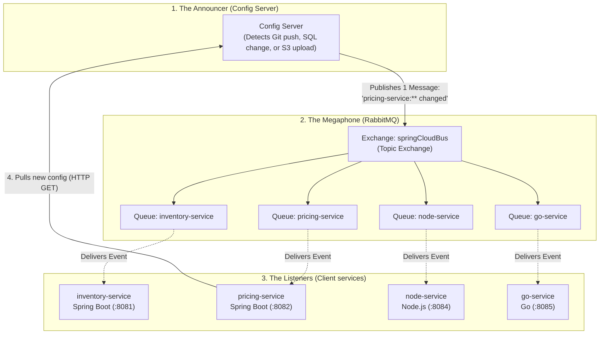

# Spring Cloud Config — External Configuration with Live Refresh

> **New to Spring Cloud Config? Start with [GETTING-STARTED.md](GETTING-STARTED.md).**
> It assumes no prior knowledge, explains every term before using it, and walks you through
> running one version and watching a configuration change take effect. This README is the
> reference — it is dense on purpose and assumes you already know the domain.

Three working, independently runnable implementations of one goal: **a property changed in
external configuration reaches every running service within seconds, with no restart and no
redeploy.**

Same Spring Boot 4 / Spring Cloud stack and the same five client services in every version -
three different storage backends and three genuinely different change-detection mechanisms.

**Five clients, three languages.** Each client has **one API** that returns only its own
configuration, and each picks up a change **without a restart**:

| Client | Language | How it hears about a change |
|---|---|---|
| inventory-service, pricing-service | Spring Boot 4 | Spring Cloud Bus (`spring-cloud-starter-bus-amqp`) |
| node-service | Node.js 22 | Spring Cloud Bus, joined with its own small RabbitMQ listener (`amqplib`); config via [`cloud-config-client`](https://www.npmjs.com/package/cloud-config-client) |
| go-service | Go 1.23 | Spring Cloud Bus, joined with its own small RabbitMQ listener (`amqp091-go`); config via [`cloudconfigclient`](https://github.com/Piszmog/cloudconfigclient) |
| lambda-service | AWS Lambda (Node.js 22) behind API Gateway, in Floci | none needed - reads the Config Server on every call |

No Spring Cloud Bus library exists for Node.js or Go, and none is needed: the bus is plain JSON
messages on a RabbitMQ topic exchange (§3.7).

| | Backend | Change trigger | Config server | Clients (inventory / pricing / node / go) | E2E checks |
|---|---|---|---|---|---|
| [**version-a-git**](version-a-git/README.md) | Git repository (Remote GitHub / Local) | `post-commit` / Webhook → `/monitor` → Bus | 8888 | 8081 / 8082 / 8084 / 8085 | **36/36** |
| [**version-b-jdbc**](version-b-jdbc/README.md) | PostgreSQL 17.6 | trigger → `pg_notify` → `LISTEN` → Bus | 8898 | 8091 / 8092 / 8094 / 8095 | **43/43** |
| [**version-c-s3**](version-c-s3/README.md) | AWS S3 (Floci emulator) | S3 Event Notification → SQS → Bus | 8908 | 8101 / 8102 / 8104 / 8105 | **45/45** |

**477 automated checks** - 207 tests in `mvn verify` (including 18 Testcontainers / Floci
integration tests), 120 Node.js, Lambda and Go tests, 124 end-to-end checks against the running
Docker stacks (each suite run twice in a row to prove it can be repeated), and 26 in-cluster checks
on Kubernetes. Measured propagation: **0-1 s** typical.

Every Java module builds under an enforced quality gate: Spotless (google-java-format),
Checkstyle, SpotBugs, JaCoCo coverage, Maven Enforcer, and **ArchUnit rules that fail the build if
the refresh-safety constraints in [§4](#4-the-core-design-refresh-safe-configuration) are
violated.** Go code must pass `gofmt`, `go vet` and `go test -race`.

### Contents

1. [Quick answer: cloud-agnostic and Kubernetes-ready?](#1-quick-answer-cloud-agnostic-and-kubernetes-ready)
2. [Version matrix](#2-version-matrix)
3. [Architecture](#3-architecture) — incl. [Kubernetes topology](#36-kubernetes-deployment-topology-version-c-on-floci-eks)
4. [The core design](#4-the-core-design-refresh-safe-configuration)
5. [Design patterns applied](#5-design-patterns-applied)
6. [Project layout](#6-project-layout)
7. [Quick start](#7-quick-start)
8. [Operator runbook: changing configuration](#8-operator-runbook-changing-configuration)
9. [Configuration reference](#9-configuration-reference)
10. [API reference](#10-api-reference)
11. [Observability](#11-observability)
12. [Security](#12-security)
13. [Testing and results](#13-testing-and-results)
14. [Portability and Kubernetes readiness](#14-portability-and-kubernetes-readiness)
15. [Findings that contradicted the specification](#15-findings-that-contradicted-the-specification)
16. [Troubleshooting](#16-troubleshooting)
17. [Known gaps and roadmap](#17-known-gaps-and-roadmap)

Beginner's guide: [GETTING-STARTED.md](GETTING-STARTED.md)

Design documents: [REQUIREMENTS.md](REQUIREMENTS.md) ·
[SPECIFICATION.md](SPECIFICATION.md) (version A) ·
[SPECIFICATION-BACKENDS.md](SPECIFICATION-BACKENDS.md) (versions B and C)

---

## 1. Quick answer: cloud-agnostic and Kubernetes-ready?

Short version: **two of the three are cloud-agnostic, and version B is deployed and verified on
Kubernetes.** Detail in [§14](#14-portability-and-kubernetes-readiness).

Two of the three are verified running on Kubernetes:

- **Version B on minikube** — 2 Config Server replicas, PodDisruptionBudget, and the four client
  services (Spring Boot, Node.js, Go); **13 in-cluster checks pass**, including a `psql` UPDATE
  reaching every client pod with **zero pod restarts**.
- **Version C on Floci EKS** — Floci's EKS service provisions a real `rancher/k3s` control plane;
  **13 in-cluster checks pass**, including an `aws s3 cp` reaching every client pod - Spring Boot,
  Node.js and Go - with zero restarts. One command: `version-c-s3/k8s/deploy-floci-eks.sh` (unique image tag per deploy, and it
  asserts the cluster is running the image it just built).

Version A's cluster setup reads the **GitHub** repository (its `file://` mode genuinely cannot run
in a cluster, §14.2). It was verified in-cluster before the Node.js and Go clients were added; with
them it needs their YAML files pushed to GitHub first, and its in-cluster check pushes (and reverts)
test commits, so it has not been re-run.

### Cloud-agnostic?

| Version | Cloud-agnostic | Why |
|---|---|---|
| **A — Git** | ✅ Yes | Any Git host (GitHub, GitLab, Bitbucket, self-hosted). Nothing AWS/GCP/Azure-specific. *But* the current `file://` local-repo configuration is not deployable anywhere — see §14.2. |
| **B — PostgreSQL** | ✅ Yes | PostgreSQL runs on RDS, Cloud SQL, Azure Database, or on-prem, unchanged. ⚠️ It is **not database-agnostic**: `LISTEN/NOTIFY` is PostgreSQL-only and the detector imports `org.postgresql.PGConnection` at compile scope. Moving to MySQL/Oracle means a new `ConfigChangeDetector`, not a rewrite — that is what the SPI is for. |
| **C — AWS S3** | ❌ **No** | Genuinely AWS-coupled. `AwsS3EnvironmentRepository` plus **SQS**, which has no equivalent outside AWS. The S3 *API* has compatible implementations (MinIO, Ceph, and the Floci emulator used here), but the notification path does not port. GCP would need GCS + Pub/Sub; Azure would need Blob + Event Grid — each a new detector. |

The portable part is the *design*, not version C: the `ConfigChangeDetector` → `ConfigChangePublisher`
seam means a new cloud costs one class (~150 lines). The clients never change - and the Node.js,
Go and Lambda clients show they do not even need to be Spring.

### Kubernetes-ready?

**Version B: yes, verified running.** A and C: manifests written and API-validated, external
prerequisite outstanding.

| Concern | Status |
|---|---|
| Liveness / readiness / **startup** probes | ✅ All three, on the management port |
| Manifests | ✅ Namespace, ConfigMap, Secret, Deployments, StatefulSet, Services, NetworkPolicy, PDB, ServiceAccount, HPA |
| Secrets | ✅ Kubernetes `Secret`; the encryption keystore is created from file and never committed |
| Graceful shutdown | ✅ `server.shutdown: graceful` + `terminationGracePeriodSeconds: 45` |
| Management port separation | ✅ Actuator on 9888; `/actuator/env` returns **401** unauthenticated there |
| Bus instance id per pod | ✅ `APP_INDEX` from `fieldRef: metadata.name` |
| Rolling updates | ✅ `maxUnavailable: 0`, PodDisruptionBudget `minAvailable: 1` |
| Hardened pods | ✅ non-root (`1000:1000`), `readOnlyRootFilesystem`, all capabilities dropped, seccomp `RuntimeDefault`, no API token |
| Multi-replica Config Server | ✅ 2 replicas (safe for JDBC: no shared filesystem) |
| NetworkPolicy | ✅ Zero-Trust `default-deny-ingress` & least-privilege pod communication (`k8s/04-network-policies.yaml`) |
| HPA | ✅ One autoscaler per client, starting at 1 pod (`k8s/05-hpa.yaml`; needs metrics-server) |
| Container Image Build | ✅ Google Jib 3.5.2 (`mvn compile jib:dockerBuild` / `jib:buildTar` / `jib:build`) + multi-stage Dockerfiles |
| CI | ✅ GitHub Actions: build matrix, E2E matrix, k8s-validate, secret-audit, scheduled CVE scan |
| **Version A on Kubernetes** | ⚠️ Needs a **remote** Git URI — `file://` cannot work in a cluster (§14.2) |
| **Version C on Kubernetes** | ✅ **Verified on Floci EKS** (real k3s control plane), 13 in-cluster checks |
| Broker HA / persistence | ⚠️ Single RabbitMQ pod, no persistence. Use a managed broker or the Cluster Operator. |

Before porting this, §14.5 is still worth reading: on Kubernetes you may not want Config Server
*plus* a broker at all.

---

## 2. Version matrix

All versions verified against Maven Central and spring.io on 2026-08-30.

| Component | Version | Notes |
|---|---|---|
| Spring Boot | **4.0.8** | Latest 4.0.x |
| Spring Cloud | **2025.1.3** (Oakwood) | Current GA train; first to target Boot 4 |
| Spring Framework | 7.0.9 | Transitive |
| Spring Security | 7.0.7 | Transitive |
| Micrometer | 1.16.7 | Transitive |
| `spring-cloud-config` | 5.0.5 | BOM-managed |
| `spring-cloud-bus` | 5.0.3 | BOM-managed, Stream-based |
| Spring Cloud AWS | **4.1.1** | Version C only |
| Java | 21 (LTS) | Boot 4 baseline is 17 |
| Maven | 3.9.15 | Multi-module reactor per version |
| RabbitMQ | 4.3.5 (`rabbitmq:4-management`) | One per stack |
| PostgreSQL | 17.6 | Version B |
| Floci | 1.5.26 | Version C, local AWS emulator |

`spring-cloud-build` 5.0.3 — the build parent of Spring Cloud 2025.1.3 — itself declares
`spring-boot.version` = **4.0.8**, so this is the exact pair Spring Cloud is built against, not
merely a compatible one.

> **There is no Spring Cloud "2026.x".** The Boot-4 train is versioned `2025.1.x`. Declare only
> `2025.1.3` and let it manage every `spring-cloud-*` version — never pin them individually.

```xml
<parent>
  <groupId>org.springframework.boot</groupId>
  <artifactId>spring-boot-starter-parent</artifactId>
  <version>4.0.8</version>
</parent>
<properties>
  <java.version>21</java.version>
  <spring-cloud.version>2025.1.3</spring-cloud.version>
</properties>
```

---

## 3. Architecture

### 3.1 Shared shape

Every version is the same pipeline. Only the two leftmost boxes differ.

```text
  ┌───────────────┐   ┌────────────────────┐   ┌──────────────┐   ┌──────────────────┐
  │ Config store  │──▶│ Change detector    │──▶│ Spring Cloud │──▶│ Client services  │
  │ (system of    │   │ (backend-specific, │   │ Bus over     │   │ (IDENTICAL in    │
  │  record)      │   │  ~150 lines)       │   │ RabbitMQ     │   │  all 3 versions) │
  └───────────────┘   └────────────────────┘   └──────────────┘   └──────────────────┘
       Git / PG / S3      the only difference     bare app name        Spring: re-bind in place
                                                  or "*"               Node/Go: re-fetch
                                                                       Lambda: fetch every call
```

### 3.2 Version A — Git

```text
  operator ── git commit ──▶ config-repo/ (.git)
                  │                 │ file:// read (+ git checkout: needs WRITE)
                  │ post-commit hook▼
                  └──── POST /monitor ──▶ config-server :8888
                                            ├ MultipleJGitEnvironmentRepository
                                            ├ PropertyPathEndpoint  (path → app names)
                                            └ publishes RefreshRemoteApplicationEvent
                                                          │
                                          RabbitMQ :5672 ─┼──▶ inventory-service :8081
                                                          ├──▶ pricing-service   :8082
                                                          ├──▶ node-service      :8084
                                                          └──▶ go-service        :8085
```

### 3.3 Version B — PostgreSQL

```text
  operator ── psql UPDATE ──▶ PostgreSQL (host :5433)
                                 ├ properties            (config, system of record)
                                 ├ properties_history    (replaces `git log`)
                                 ├ config_revision       (drives the reconciler)
                                 └ statement-level triggers
                                        │ pg_notify('config_changed')  ← transactional
                                        ▼
                              config-server :8898
                                 ├ JdbcEnvironmentRepository
                                 ├ PostgresNotifyChangeDetector  (dedicated LISTEN conn)
                                 ├ JdbcRevisionPollingDetector   (15 s reconciler)
                                 └ BusConfigChangePublisher
                                        │
                        RabbitMQ :5673 ──┴──▶ clients :8091 / :8092 / :8094 / :8095
```

### 3.4 Version C — AWS S3

```text
  operator ── aws s3 cp ──▶ S3 bucket acme-platform-config (versioning ON)
                               main/application.yml            ← main/ prefix IS label "main"
                               main/inventory-service.yml
                               main/pricing-service.yml
                               main/node-service.yml, go-service.yml, lambda-service.yml
                                    │ s3:ObjectCreated:* / ObjectRemoved:*
                                    ▼
                            SQS config-change-queue ──▶ config-change-dlq (maxReceiveCount 3)
                                    │ @SqsListener
                                    ▼
                          config-server :8908
                             ├ AwsS3EnvironmentRepository
                             ├ S3EventSqsChangeDetector
                             ├ S3ObjectKeyApplicationMapper   (exact, no dash-guessing)
                             └ BusConfigChangePublisher
                                    │
                    RabbitMQ :5674 ──┴──▶ clients :8101 / :8102 / :8104 / :8105
```

### 3.5 Refresh sequence inside a client

**Spring Boot clients:**

```text
bus event → ContextRefresher.refresh()
              1. rebuild Environment (re-fetch from Config Server)
              2. publish EnvironmentChangeEvent(changedKeys)
              3. ConfigurationPropertiesRebinder re-initialises the props bean IN PLACE
              4. RefreshScope.refreshAll()
              5. publish RefreshScopeRefreshedEvent
                    │
                    ▼
              <Service>PropertiesValidator (listens on step 5, not step 2)
                    valid   → nothing to do: the controller already reads the rebound bean
                    invalid → log ERROR naming every broken rule; keep running
```

It listens on step 5 rather than step 2 because `ConfigurationPropertiesRebinder` also listens on
`EnvironmentChangeEvent`, and listener order between the two is not guaranteed — reading the
properties bean from step 2 can observe pre-rebind values.

**Node.js and Go clients:** their bus listener receives the same `RefreshRemoteApplicationEvent`,
checks that `destinationService` matches their bus id (Spring's own matching rule), re-fetches,
validates, and swaps in the new values - or keeps the old ones and logs an error if the new ones
are invalid. **Lambda** has no step at all: it fetches on every invocation.

### 3.6 Kubernetes deployment topology (version C on Floci EKS)

Verified running: `version-c-s3/k8s/deploy-floci-eks.sh`. The two details that make this work at
all are marked — see [§14](#14-portability-and-kubernetes-readiness) and findings 15–16.

```text
 HOST (macOS) ─ Docker bridge 172.17.0.0/16
 ┌────────────────────────────────────────────────────────────────────────────────────────────┐
 │                                                                                            │
 │   operator                                                                                 │
 │      │  aws s3 cp application.yml s3://acme-platform-config/main/                          │
 │      ▼                                                                                     │
 │   ┌──────────────────────────────────────────────────────────┐                             │
 │   │  floci                        172.17.0.2:4566            │  AWS emulator;              │
 │   │    S3   acme-platform-config  (versioning ON)            │  its EKS service            │
 │   │    SQS  config-change-queue → config-change-dlq          │  runs here too              │
 │   └───────────────┬──────────────────────▲───────────────────┘                             │
 │        s3:Object  │                      │  @SqsListener + GetObject                       │
 │        Created:*  │                      │  AWS_ENDPOINT=http://172.17.0.2:4566            │
 │                   │                      │  ^^ an IP ⇒ the SDK uses PATH-style             │
 │   ┌─ floci-eks-config-demo  (rancher/k3s · API :6500 · ns config-demo) ────────────────┐   │
 │   │                                                                                    │   │
 │   │  ┌──────────────────────────────────────┐      ┌──────────────────────────┐        │   │
 │   │  │ config-server                    ×2  │      │ Secret                   │        │   │
 │   │  │   :8888  Environment API             │◀─────│  config-server.p12 (RO)  │        │   │
 │   │  │   :9888  actuator — 401 unauth       │mounts│  credentials             │        │   │
 │   │  │   S3EventSqsChangeDetector           │      │ ConfigMap ×2             │        │   │
 │   │  │   PodDisruptionBudget minAvailable=1 │      └──────────────────────────┘        │   │
 │   │  └───────────────────┬──────────────────┘                                          │   │
 │   │                      │ RefreshRemoteApplicationEvent (destination "*")             │   │
 │   │                      ▼                                                             │   │
 │   │             ┌──────────────────┐                                                   │   │
 │   │             │ rabbitmq     ×1  │  springCloudBus topic exchange                    │   │
 │   │             └──┬──────┬──────┬──────┬┘                                             │   │
 │   │    ┌───────────┘      │      │      └──────────┐  fanout: ONE broadcast, EVERY pod  │   │
 │   │    ▼                  ▼      ▼                 ▼                                    │   │
 │   │  inventory-service  pricing-service  node-service  go-service                     │   │
 │   │  Spring Boot ×1     Spring Boot ×1   Node.js ×1    Go ×1                          │   │
 │   │  :8081 / :9081      :8082 / :9082    :8084         :8085                          │   │
 │   │                                                                                    │   │
 │   │  on refresh each pod re-reads its config; an invalid value is logged, never        │   │
 │   │  a restart. (lambda-service runs in Floci's Lambda, not in this cluster.)          │   │
 │   │                                                                                    │   │
 │   │  every pod: runAsNonRoot · readOnlyRootFilesystem · caps dropped ·                 │   │
 │   │             seccomp RuntimeDefault · no service-account token ·                    │   │
 │   │             enableServiceLinks=false ^^ else RABBITMQ_PORT=tcp://…                 │   │
 │   │             APP_INDEX from fieldRef metadata.name (unique bus id)                  │   │
 │   └────────────────────────────────────────────────────────────────────────────────────┘   │
 └────────────────────────────────────────────────────────────────────────────────────────────┘
```

Version B on minikube is the same shape with two substitutions: PostgreSQL replaces the S3+SQS box
(the detector becomes a `LISTEN/NOTIFY` listener plus a revision poller), and a NetworkPolicy
restricts port 5432 to the Config Server alone so no other pod can bypass the audit trigger.

### 3.7 Understanding RabbitMQ & Spring Cloud Bus (Layman's Guide & Web UI)

If you are new to distributed systems, message brokers, or Spring Cloud Bus, here is a simple breakdown of how RabbitMQ links Config Server and your microservices.

#### 1. The Core Problem RabbitMQ Solves (The "Megaphone" Analogy)
Imagine a teacher (Config Server) needs to tell a classroom of 50 students (microservice instances) that the class schedule has changed:
- **Without RabbitMQ (Point-to-Point HTTP)**: The teacher must walk up to each student's desk one by one and whisper the update. If students are coming and going (auto-scaling pods), the teacher has to maintain a live roster. If one student is asleep or busy (unresponsive pod), the teacher gets stuck waiting.
- **With RabbitMQ & Spring Cloud Bus (Pub/Sub Broadcast)**: The teacher speaks once into a **megaphone** (RabbitMQ). Every student hears the announcement simultaneously. The teacher doesn't need to know who is in the room, where they sit, or if new students just walked in.


```mermaid
graph TD
    subgraph ConfigServer["1. The Announcer (Config Server)"]
        CS["Config Server<br/>(Detects Git push, SQL change, or S3 upload)"]
    end

    subgraph Broker["2. The Megaphone (RabbitMQ)"]
        Ex["Exchange: springCloudBus<br/>(Topic Exchange)"]
        Q1["Queue: inventory-service"]
        Q2["Queue: pricing-service"]
        Q3["Queue: node-service"]
        Q4["Queue: go-service"]
        Ex --> Q1
        Ex --> Q2
        Ex --> Q3
        Ex --> Q4
    end

    subgraph Microservices["3. The Listeners (Client services)"]
        Inv["inventory-service<br/>Spring Boot (:8081)"]
        Prc["pricing-service<br/>Spring Boot (:8082)"]
        Node["node-service<br/>Node.js (:8084)"]
        Go["go-service<br/>Go (:8085)"]
        Q1 -. Delivers Event .-> Inv
        Q2 -. Delivers Event .-> Prc
        Q3 -. Delivers Event .-> Node
        Q4 -. Delivers Event .-> Go
    end

    CS -- "Publishes 1 Message:<br/>'pricing-service:** changed'" --> Ex
    Prc -- "4. Pulls new config (HTTP GET)" --> CS
```

#### 2. How the Link Works Step-by-Step
1. **Connection & Registration**: At startup, every microservice and Config Server establishes an AMQP connection to RabbitMQ (`port 5672`).
2. **Dynamic Private Queues**: Each microservice instance creates a temporary, auto-delete queue bound to the `springCloudBus` Topic Exchange.
3. **Change Event Published**: When a property is updated, Config Server sends a single `RefreshRemoteApplicationEvent` JSON payload to `springCloudBus` specifying the target destination (e.g., `pricing-service:**` or `**` for all).
4. **Broadcast Routing**: RabbitMQ instantly clones and routes the event to the queues of all connected services.
5. **Smart Processing**:
   - **Target Match**: If the destination matches the service (`pricing-service`), it queries Config Server over HTTP (`GET /pricing-service/default/main`), validates the new values, and atomically swaps its active configuration in memory with **zero downtime**.
   - **Target Mismatch**: If the destination doesn't match (`inventory-service`), it discards the message with zero overhead.

#### 3. How to See and Inspect RabbitMQ in Real-Time (Web Management UI)

Every version includes a pre-configured RabbitMQ Management Web Dashboard:

| Version | Web Management UI URL | Credentials | Broker AMQP Port |
|---|---|---|---|
| **Version A (Git)** | [http://localhost:15672](http://localhost:15672) | `guest` / `guest` | `5672` |
| **Version B (PostgreSQL)** | [http://localhost:15673](http://localhost:15673) | `guest` / `guest` | `5673` |
| **Version C (AWS S3)** | [http://localhost:15674](http://localhost:15674) | `guest` / `guest` | `5674` |

#### 4. What to Look for in the RabbitMQ Dashboard:

1. **Connections Tab ("The Phone Lines")**:
   - You will see **5 active connections**: the Config Server and the four clients.
   - **Service Name Identification**: each connection sets a descriptive **Client-provided name** - the Spring services through `spring.cloud.stream.rabbit.binder.connection-name-prefix` (e.g. `inventory-service:8081#0`), node-service and go-service through their bus id (e.g. `node-service:8084:3f2a...`).
   - *Tip*: In the RabbitMQ table, click the `+/-` icon on the top-right of the table to enable the **Client-provided name** column, or click any connection row to inspect its client properties.
2. **Exchanges Tab ("The Router")**:
   - Click on the **`springCloudBus`** exchange (`topic` type).
   - Scroll down to **Bindings**: You will see each microservice's queue bound to this exchange with routing pattern `#`.
3. **Queues and Streams Tab ("The Inboxes")**:
   - You will see one queue per subscriber: `springCloudBus.anonymous.<random-hash>` for the Spring services and server-named `amq.gen-<hash>` queues for node-service and go-service - all bound to `springCloudBus` with `#`.
   - **Why `anonymous.<hash>`?** Spring Cloud Bus generates unique queue names for each replica so that broadcasts are delivered to **every** replica (fan-out pattern). If they shared the same static queue name, RabbitMQ would load-balance messages, causing only one pod to refresh while other pods remain stale!
   - **How to know which queue belongs to which service?** Click on any queue name &rarr; scroll to **Consumers** &rarr; you will see the consumer's connection name (e.g. `pricing-service:8082`).
4. **Live Activity (Watch Messages Flow)**:
   - Keep the RabbitMQ UI `Overview` page open.
   - Trigger a config update (commit Git change, update Postgres row, or upload to S3).
   - Watch the **Message Rates** (`incoming` and `deliver / get`) immediately spike from 0 to 1 in real time!

#### 5. Architectural Decision: Why RabbitMQ instead of Kafka for Spring Cloud Bus?

Both **RabbitMQ** and **Apache Kafka** are supported by Spring Cloud Bus (`spring-cloud-starter-bus-amqp` vs `spring-cloud-starter-bus-kafka`). However, for a **configuration management bus**, **RabbitMQ is the industry-standard recommendation**:

##### A. The Nature of the Workload: "Ephemeral Broadcast" vs "Event Stream"

| Aspect | Spring Cloud Bus Requirement | RabbitMQ (Chosen) | Apache Kafka |
|---|---|---|---|
| **Message Type** | Rare, tiny notification signals *(e.g. "Pricing config updated")* | **Natural fit**: Built for point-in-time message routing. | **Mismatch**: Built for continuous streams of business data (millions of events/sec). |
| **History / Replay** | **Not needed**: If a pod boots up tomorrow, it pulls fresh config via HTTP `GET`. It does not need to replay past refresh events. | Discards messages immediately after delivery. | Retains and stores messages to disk in commit logs. |
| **Dynamic Scaling** | Pods scale from 2 to 50 and back down dynamically. | **Ephemeral Queues (`[AD]`)**: Creates a temporary queue on pod startup; deletes it the millisecond the pod terminates. | **Consumer Group Metadata**: Every replica needs a unique random Consumer Group, leaving behind orphaned metadata in Kafka when pods die. |
| **Resource Footprint** | Background infrastructure should be lightweight. | **~40–60 MB RAM**, starts in 2 seconds. | **~600 MB–1.5 GB RAM** (JVM + KRaft/Zookeeper), starts in 20–30s. |

##### B. The "Megaphone" Analogy (RabbitMQ) vs "The Permanent Archive" (Kafka)
- **RabbitMQ is a Megaphone**: When a config changes, Config Server shouts into the megaphone. Any microservice currently alive hears it and refreshes. If no one is listening or a pod is dead, the sound disappears. This is **exactly** what configuration refresh needs.
- **Kafka is a Recording Studio with Permanent Tape**: Kafka writes every shout onto disk, tracks offsets, and organizes data into partitions. For an occasional 1 KB config refresh ping once a week, spinning up Kafka partitions and storage segments is massive overkill.

##### C. Comparison Matrix

| Feature | RabbitMQ (Default) | Apache Kafka |
|---|---|---|
| **Spring Cloud Starter** | `spring-cloud-starter-bus-amqp` | `spring-cloud-starter-bus-kafka` |
| **Broker Memory Usage** | ~50 MB RAM | ~800 MB+ RAM |
| **Queue Lifecycle** | Automatically deleted on pod exit (`[AD]`) | Topic partition offsets must be managed/rebalanced |
| **Routing Flexibility** | Native Topic Exchanges (`pricing-service:**`) | Requires topic-per-service or manual payload filtering |
| **Local Dev & CI/CD Speed** | Instant startup in Docker/Testcontainers | Slower Docker spin-up |

##### D. Swapping to Kafka (If Required by Enterprise Policy)
If your organization mandates Apache Kafka, Spring Cloud Bus supports it via a simple **1-line dependency swap**:

**1. In `pom.xml`**:
```xml
<!-- Replace RabbitMQ: -->
<!-- <dependency>
       <groupId>org.springframework.cloud</groupId>
       <artifactId>spring-cloud-starter-bus-amqp</artifactId>
     </dependency> -->

<!-- With Kafka: -->
<dependency>
  <groupId>org.springframework.cloud</groupId>
  <artifactId>spring-cloud-starter-bus-kafka</artifactId>
</dependency>
```

**2. In `application.yml`**:
```yaml
spring:
  cloud:
    bus:
      id: ${spring.application.name}:${random.uuid}
  kafka:
    bootstrap-servers: localhost:9092
```

The Spring Boot code needs no change. **node-service and go-service do**: they talk to RabbitMQ
directly (`amqplib` / `amqp091-go`), so with Kafka their bus listener would have to be rewritten
on a Kafka client. lambda-service is unaffected - it never uses the bus.

---

## 4. The core design: refresh-safe configuration

Each client has **one API** returning its own configuration. The interesting part is not the API
but making the values behind it change safely while the service runs. Three constraints shape the
Spring Boot clients, each verified against Spring Cloud source rather than assumed.

### 4.1 Setter-based binding is mandatory

`ConfigurationPropertiesRebinder` refreshes by re-initialising the **existing** bean instance
through its setters. A `record` or any constructor-bound class is re-created instead, so every
reference injected before the refresh keeps stale values — and live refresh appears to work
intermittently.

```java
@Component
@ConfigurationProperties(prefix = "inventory")
// NOT @Validated - see §4.2
public class InventoryProperties {
  @NotBlank private String warehouseCode;
  @Min(1) @Max(10_000) private int maxOrderQuantity;
  private boolean expressShippingEnabled;
  @Min(0) private int lowStockThreshold;
  // getters + SETTERS - the setters are what make refresh work
}
```

The controller holds a reference to this one bean and builds its response from it on every
request, so a refresh is visible on the very next call with no extra plumbing.

### 4.2 `@Validated` must NOT be on a refreshable properties class

`ConfigurationPropertiesRebinder.rebind` records the failure and then **rethrows**. A constraint
violation during rebind therefore propagates out of `ContextRefresher.refresh()` and
`RefreshScopeRefreshedEvent` is *never published* — the refresh fails for the whole application.

The constraints stay on the class, and a separate `<Service>PropertiesValidator` checks them:

- on `ApplicationStartedEvent` - an invalid value **stops the service** (fail fast), with a message
  naming every broken rule, e.g. `Invalid inventory configuration: inventory.maxOrderQuantity must
  be less than or equal to 10000`;
- on `RefreshScopeRefreshedEvent` - an invalid value is **logged as an ERROR** and the service keeps
  running; the operator fixes the value in the backend.

### 4.3 The trade-off that was accepted

An earlier version of these clients read configuration through an immutable snapshot published in
one `AtomicReference` write, with last-known-good retention, an audit trail and metrics. That
machinery was **removed on purpose** to keep each client a small, readable example. What it cost,
stated plainly:

- **A refreshed invalid value is served** (after the ERROR log) rather than rejected; startup still
  fails fast. The Node.js and Go clients *do* keep their previous values on an invalid refresh,
  because they validate before swapping.
- **A request racing a refresh can see a mix** of old and new values for the microseconds the
  rebinder takes to set the fields one by one (the rebinder's own Javadoc warns about this).

If either matters for a service, reintroduce a snapshot: validate the rebound bean, build an
immutable record, publish it through an `AtomicReference`, and read only that.

### 4.4 The non-Spring clients

| Need | Spring Boot | node-service | go-service | lambda-service |
|---|---|---|---|---|
| Read config | `spring-cloud-starter-config` | `cloud-config-client` | `cloudconfigclient` (fetch only; merge done in-house because its `Unmarshal` lets the *least* specific source win) | `cloud-config-client` |
| Hear a change | `spring-cloud-starter-bus-amqp` | own listener on `amqplib` | own listener on `amqp091-go` | not needed: fetch per call |
| Validate | `PropertiesValidator` | `node-config.js` | `goconfig.go` | `lambda-config.js` |
| Invalid at startup | refuse to start | refuse to start | refuse to start | `503` problem details |

The listeners implement the Spring Cloud Bus wire format directly: bind an exclusive queue to the
topic exchange `springCloudBus`, accept `RefreshRemoteApplicationEvent`, ignore events whose
`destinationService` does not match the bus id `<application>:<port>:<unique id>` (Spring's
`ServiceMatcher` rule) or that the service itself sent, and reconnect with back-off - re-fetching
once on reconnect, because events published while disconnected are lost.

`@RefreshScope` is used nowhere in these projects. It is reserved for beans that must be rebuilt
from configuration (for example a `RestClient` with a config-driven base URL).

---

## 5. Design patterns applied

Mapped to concrete classes rather than named in the abstract.

| Pattern | Where | Why it fits |
|---|---|---|
| **Externalised Configuration** (12-Factor III) | Whole system | Same artefact runs in every environment |
| **Observer / Publish–Subscribe** | Bus `RefreshRemoteApplicationEvent`; the Node.js / Go bus listeners; `@EventListener(RefreshScopeRefreshedEvent)` | One publisher, N unknown subscribers in any language — the only shape that reaches every replica |
| **Immutable Value Object** | `*ConfigResponse` records; frozen Node.js config objects; Go `Config` structs | The API body cannot be mutated after it is built |
| **Atomic swap** | Node.js / Go stores replace the whole config object (Go under a `sync.RWMutex`) | A reader sees the old or the new configuration, never a mix |
| **Strategy** | `EnvironmentRepository` (Git/JDBC/S3); `ConfigChangeDetector` per backend | Backend and detection mechanism swap without touching clients |
| **Adapter** | `S3ObjectKeyApplicationMapper`, `post-commit` hook, `PropertyPathEndpoint` | Translates foreign key/path/webhook shapes into the internal event model |
| **Publisher / single fan-out** | `BusConfigChangePublisher` | Every backend converges on one broadcast path |
| **Reconciler** | `JdbcRevisionPollingDetector` | Closes gaps a push mechanism structurally cannot |
| **Dead Letter Channel** | SQS `config-change-dlq` | Poison messages are contained, not retried forever |
| **Transactional Outbox** (without the table) | `pg_notify` inside a trigger | `NOTIFY` is delivered only on COMMIT |
| **Retry with exponential backoff** | `spring.config.import` params; LISTEN reconnect; Node.js / Go RabbitMQ reconnect | Startup ordering is not guaranteed |
| **Fail-fast** | `spring.config.import` without `optional:`; startup validation in every client | Never serve traffic in an unknown state |
| **Graceful degradation** | Broker down → keep serving; listener down → reconciler; failed Node.js / Go refresh → keep previous values | Propagation is best-effort, availability is not |
| **Layered architecture** | Spring: `controller → config, dto`; Node.js `src/{config,bus,http}`; Go `cmd/` + `internal/` | Dependency direction is one-way (ArchUnit-enforced in Java) |
| **DTO** | `dto/*ConfigResponse` | Properties beans never leak to the wire |
| **Problem Details (RFC 9457)** | `GlobalExceptionHandler`; Node.js `problem.js`; Go `problem.go` | Standard machine-readable errors in every language |

---

## 6. Project layout

Identical in all three versions except where noted.

**Every service is a self-contained project.** It parents directly to
`spring-boot-starter-parent`, declares its own dependency management, carries its own quality-gate
configuration under `config/`, and owns its own `Dockerfile`. Nothing is inherited from the
version-level `pom.xml`, which is a pure *aggregator* — it lists the three services so one command
can build them all, and that is all it does. Both of these work:

```bash
cd version-a-git                    && mvn verify     # all three services
cd version-a-git/inventory-service  && mvn verify     # just this one, no reference to siblings
```

Aggregation and inheritance are independent in Maven. Deleting a version's `pom.xml` would cost
the build-all convenience and change nothing else — a service directory copied somewhere else on
its own still builds, quality gates included.

```text
version-X/
├── pom.xml                          AGGREGATOR ONLY — <modules> list, ~33 lines, not a parent
├── config-server/
│   ├── pom.xml                      standalone: parent is spring-boot-starter-parent
│   ├── Dockerfile                   own; build context is this directory
│   ├── config/                      own checkstyle + suppressions + spotbugs + dep-check
│   └── src/main/java/com/example/config/server/
│       ├── ConfigServerApplication.java
│       ├── config/
│       │   ├── SecurityConfig.java                    2 roles, stateless HTTP Basic
│       │   └── [B] NotificationDataSourceConfig.java  scheduling config for reconciler
│       └── change/                                    (versions B and C only)
│           ├── ConfigChangeNotification.java          normalised "what changed"
│           ├── ConfigChangePublisher.java             the SPI
│           ├── BusConfigChangePublisher.java          single fan-out onto the Bus
│           ├── ConfigChangeHealthIndicator.java
│           └── [B] PostgresNotifyChangeDetector.java, JdbcRevisionPollingDetector.java
│               [C] S3EventSqsChangeDetector.java, S3ObjectKeyApplicationMapper.java
├── inventory-service/               Spring Boot client — GET /api/v1/inventory/config
│   ├── pom.xml, Dockerfile, config/    same self-contained shape
│   └── src/
├── pricing-service/                 Spring Boot client — GET /api/v1/pricing/config
│   ├── pom.xml, Dockerfile, config/    same self-contained shape
│   └── src/
├── node-service/                    Node.js client — GET /api/v1/node/config
│   ├── package.json, package-lock.json, Dockerfile
│   └── src/{config,bus,http}/, test/
├── go-service/                      Go client — GET /api/v1/go/config
│   ├── go.mod, go.sum, Dockerfile
│   └── cmd/go-service/, internal/{settings,config,bus,httpapi}/
├── lambda-service/                  AWS Lambda behind API Gateway, in Floci — GET /api/v1/lambda/config
│   ├── package.json, openapi.json
│   └── src/, test/, scripts/{deploy,invoke}-floci.sh
├── docker/
│   └── compose.yaml                 orchestration only — builds each service from its own
│                                    directory; no shared Dockerfile, no MODULE build-arg
└── scripts/
    ├── e2e-test.sh                  acceptance suite (idempotent)
    ├── [A] install-git-hook.sh, post-commit
    └── [C] provision-floci.sh
```

`docker/compose.yaml` stays at the version level deliberately: it wires *several* services plus
RabbitMQ into one runnable stack, which is orchestration rather than something any single service
can own. Each service can build its container image independently via **Google Jib 3.5.2** (daemonless, fast layer caching) or traditional `docker build`:

```bash
# Option A: Build image using Google Jib (recommended - daemonless or directly to Docker daemon)
cd version-a-git/inventory-service && mvn compile jib:dockerBuild

# Option B: Build host JAR then build with Dockerfile
cd version-a-git/inventory-service && mvn -Pfast package && docker build -t inventory-service .
```

Version-specific extras:

- **A** — `config-repo/` (the Git repo that is the system of record)
- **B** — `config-server/src/main/resources/db/migration/V1__config_schema.sql`, `V2__config_change_notify.sql`, `V3__seed_polyglot_clients.sql`
- **C** — `seed-config/` (objects uploaded to S3)

### Package structure (Spring Boot clients)

There is deliberately **no shared library**. Each client is independently deployable and neither
can be broken by a change made on behalf of the other; the small amount of duplicated code is the
accepted price.

```text
com.example.config.<service>
├── <Service>ServiceApplication.java   @SpringBootApplication (default component scan)
├── config/      <Service>Properties (setter-bound @ConfigurationProperties)
│                <Service>PropertiesValidator (startup fail-fast, ERROR on a bad refresh)
│                SecurityConfig, OpenApiConfig, InvalidConfigurationException
├── controller/  <Service>Controller — the one endpoint, GET /api/v1/<service>/config
├── dto/         <Service>ConfigResponse — the JSON body (a record)
└── exception/   GlobalExceptionHandler — RFC 9457 ProblemDetail for every error
```

Each service also has its own README (for example
[version-b-jdbc/node-service/README.md](version-b-jdbc/node-service/README.md)) covering its
layout, settings, four ways to run it, and troubleshooting with the real error messages.

---

## 7. Quick start

Prerequisites: Docker running, Java 21, Maven 3.9+, and Floci (`floci start`) plus the AWS CLI
for lambda-service. Node.js 22 and Go 1.23 are only needed to run those services' tests or to run
them without Docker. Behind a TLS-inspecting proxy (e.g. Zscaler), `export EXTRA_CA_CERT="$(cat
proxy-root.pem)"` before `docker compose up --build`, or the Node.js and Go images fail to download
their dependencies.

### Version A — Git

```bash
cd version-a-git

# config-repo is the configuration system of record and must be a git repository at RUNTIME.
# It is committed here as plain files, not as a nested repo, so initialise it once after cloning
# (a nested .git would arrive as an empty gitlink for anyone who clones this project).
git -C config-repo init -b main
git -C config-repo add -A && git -C config-repo commit -m "Seed configuration"

mvn clean install -DskipTests
./scripts/generate-keystore.sh                       # RSA keypair for {cipher} values
./scripts/install-git-hook.sh                        # bridges git commit → /monitor
# local mode: the Config Server reads config-repo/ on disk (the e2e suite needs this)
CONFIG_REPO_URI=file:///config-repo CONFIG_REPO_SEARCH_PATHS= CONFIG_REPO_FORCE_PULL=false \
  docker compose -f docker/compose.yaml up -d --build
./lambda-service/scripts/deploy-floci.sh             # lambda-service into Floci (floci start first)
./scripts/e2e-test.sh
```

### Version B — PostgreSQL

```bash
cd version-b-jdbc
./scripts/generate-keystore.sh                       # RSA keypair for {cipher} values
mvn clean install -DskipTests
docker compose -f docker/compose.yaml up -d --build  # postgres + rabbitmq + server + 4 clients
./lambda-service/scripts/deploy-floci.sh             # lambda-service into Floci (floci start first)
./scripts/e2e-test.sh
```

### Version C — AWS S3

```bash
floci start                                          # local AWS emulator
cd version-c-s3
./scripts/generate-keystore.sh                       # RSA keypair for {cipher} values
mvn clean install -DskipTests
./scripts/provision-floci.sh                         # bucket, versioning, SQS, DLQ, seed
docker compose -f docker/compose.yaml up -d --build
./lambda-service/scripts/deploy-floci.sh
./scripts/e2e-test.sh
```

### All three at once

They use disjoint ports, so all three stacks can run simultaneously (~14 GB of images and
containers — check disk first).

### Tear down

```bash
for v in version-a-git version-b-jdbc version-c-s3; do
  docker compose -f $v/docker/compose.yaml down -v
done
floci stop
```

---

## 8. Operator runbook: changing configuration

In every version, verify with the owning client's endpoint:

```bash
curl -s localhost:<client-port>/api/v1/<inventory|pricing|node|go>/config | jq .
```

### Version A — commit to Git

```bash
cd version-a-git
vim config-repo/inventory-service.yml
git -C config-repo commit -am "enable express shipping"   # post-commit fires /monitor
curl -s localhost:8081/api/v1/inventory/config | jq .     # new value
curl -s localhost:8082/api/v1/pricing/config | jq .       # unchanged (scoped)
```

**Committing is what triggers propagation, not what makes the server serve the value.**
With a `file://` repository the Config Server reads the *working tree*, so an uncommitted
edit is already visible to a direct `GET` on the Environment API. What a commit does is fire
the `post-commit` hook, which is the only thing that tells running clients to refresh.
Verified by `GitBackendIT.fileUriServesTheWorkingTree`.

History / rollback: `git -C config-repo log --oneline`, then `git revert <sha>`.

### Version B — SQL

```bash
docker exec -it cfg-jdbc-postgres psql -U config_admin -d configdb -c \
  "UPDATE properties SET \"value\"='750'
     WHERE application='inventory-service' AND \"key\"='inventory.max-order-quantity';"
```

Row semantics that matter:

| Intent | `application` | `profile` | `label` |
|---|---|---|---|
| Shared by all clients | `'application'` (literal) | `NULL` | `'main'` |
| One app, all profiles | `'inventory-service'` | `NULL` | `'main'` |
| One app, one profile | `'inventory-service'` | `'dev'` | `'main'` |

`profile` must be a real `NULL`, not `'default'` or `''`.

History (replaces `git log`):

```bash
docker exec -it cfg-jdbc-postgres psql -U config_admin -d configdb -c \
  'SELECT changed_at, operation, "key", old_value, new_value, changed_by
     FROM properties_history ORDER BY history_id DESC LIMIT 10;'
```

### Version C — upload to S3

```bash
eval $(floci env)
aws s3 cp inventory-service.yml s3://acme-platform-config/main/inventory-service.yml
```

The `main/` prefix **is** the label `main`. Uploading to the bucket root makes the object
invisible to clients requesting `label=main`.

History / rollback (replaces `git revert`):

```bash
aws s3api list-object-versions --bucket acme-platform-config \
  --prefix main/inventory-service.yml --query 'Versions[].[VersionId,LastModified]' --output table

aws s3api copy-object --bucket acme-platform-config --key main/inventory-service.yml \
  --copy-source 'acme-platform-config/main/inventory-service.yml?versionId=<ID>'
```

### Manual recovery (any version)

If the automatic trigger is unavailable, broadcast by hand from the Config Server's management
port (the clients deliberately expose no refresh endpoint):

```bash
curl -i -X POST -u config-admin:admin-secret -H "Content-Type: application/json" \
     localhost:9898/actuator/busrefresh/inventory-service:**          # version A; B 9899, C 9900
```

The `Content-Type` header is mandatory: without it the call fails `415` and nothing is sent.

---

## 9. Configuration reference

### 9.1 Spring Boot client services

Defaults are per version so that each runs on the host with no settings (A shown; B uses
8091/8092, 9091/9092, server 8898, RabbitMQ 5673; C uses 8101/8102, 9101/9102, 8908, 5674).

| Property | Default | Purpose |
|---|---|---|
| `SERVER_PORT` | 8081 / 8082 | HTTP port |
| `MANAGEMENT_PORT` | 9081 / 9082 | Separate actuator port (exposes `health` only) |
| `APP_INDEX` | `${SERVER_PORT}` | Feeds `spring.cloud.bus.id` (see §14.4) |
| `CONFIG_SERVER_URI` | `http://localhost:8888` | Environment API |
| `CONFIG_CLIENT_USERNAME` / `_PASSWORD` | `config-client` / `client-secret` | Basic auth |
| `CONFIG_LABEL` | `main` | Git branch, DB label column, or S3 key prefix |
| `RABBITMQ_HOST` / `_PORT` / `_USERNAME` / `_PASSWORD` | `localhost` / 5672 / guest / guest | Bus transport |

```yaml
spring:
  config:
    # No 'optional:' prefix → an unreachable Config Server is a hard startup failure rather
    # than a service silently running with no configuration. Retry rides on the URI.
    import: "configserver:${CONFIG_SERVER_URI}?fail-fast=true&max-attempts=6&initial-interval=1000&multiplier=1.5&max-interval=8000"
```

No `bootstrap.yml` anywhere — config-data import only, so AOT is not excluded.

### 9.1b Node.js, Go and Lambda clients

| Variable | Default (version A) | Purpose |
|---|---|---|
| `PORT` | 8084 (node) / 8085 (go) | HTTP port |
| `CONFIG_SERVER_URL` | `http://localhost:8888` | Environment API (credentials never in the URL) |
| `CONFIG_CLIENT_USERNAME` / `_PASSWORD` | `config-client` / `client-secret` | Basic auth |
| `CONFIG_LABEL` / `CONFIG_PROFILE` | `main` / `default` | Which configuration |
| `CONFIG_TIMEOUT_MS` | 5000 | Config Server call timeout |
| `RABBITMQ_HOST` / `_PORT` / `_USERNAME` / `_PASSWORD` | `localhost` / 5672 / guest / guest | Bus transport (node, go only) |

lambda-service gets its variables from `scripts/deploy-floci.sh`
(`CONFIG_SERVER_URL=http://host.docker.internal:<server port>`).

### 9.2 Version A — Git server

| Property | Default | Notes |
|---|---|---|
| `CONFIG_REPO_URI` | this project's GitHub repo | `file:///config-repo` for local mode; that mount must be **writable** (§15 #1) |
| `CONFIG_REPO_SEARCH_PATHS` | `version-a-git/config-repo` | Empty in local mode |
| `CONFIG_REPO_FORCE_PULL` | `true` | Must be `false` in local mode (§15 #21) |
| `CONFIG_REPO_LABEL` | `main` | Git default label |
| `CONFIG_MONITOR_VALIDATION` | `true` | Secure default; verified working without a secret |

### 9.3 Version B — PostgreSQL server

| Property | Default | Notes |
|---|---|---|
| `DB_URL` | `jdbc:postgresql://localhost:5433/configdb` | Compose publishes PostgreSQL on 5433 (§15 #22) |
| `DB_USERNAME` / `DB_PASSWORD` | `config_admin` / `config-secret` | |
| `CONFIG_LABEL` | `main` | **Shipped default is `master`** — must be set |
| `app.config-change.listener.channel` | `config_changed` | `NOTIFY` channel |
| `app.config-change.listener.*-backoff-millis` | 1000 / 30000 | Reconnect backoff |
| `app.config-change.revision-poller.interval` | 15000 | Reconciler period |

Both SQL statements are overridden (mandatory — §15 #3):

```yaml
spring.cloud.config.server.jdbc:
  sql: 'SELECT "key", "value" FROM properties WHERE application=? AND profile=? AND label=?'
  sql-without-profile: 'SELECT "key", "value" FROM properties WHERE application=? AND profile IS NULL AND label=?'
  fail-on-error: true   # a DB outage must NOT look like "no configuration"
```

### 9.4 Version C — S3 server

| Property | Default | Notes |
|---|---|---|
| `AWS_ENDPOINT` | `http://localhost.floci.io:4566` | **Omit on real AWS** |
| `AWS_REGION` | `us-east-1` | |
| `AWS_ACCESS_KEY_ID` / `_SECRET_ACCESS_KEY` | `test` / `test` | **Omit on real AWS** — use IRSA |
| `CONFIG_BUCKET` | `acme-platform-config` | Versioning must be enabled |
| `CONFIG_CHANGE_QUEUE` | `config-change-queue` | Needs a DLQ |
| `CONFIG_KEY_PREFIX` | `main/` | Doubles as the label |
| `app.known-applications` | `inventory-service,pricing-service,node-service,go-service,lambda-service` | Enables exact key→app mapping |

---

## 10. API reference

### Config Server

| Method | Path | Auth | Purpose |
|---|---|---|---|
| GET | `/{application}/{profile}[/{label}]` | `CONFIG_CLIENT` | Environment API |
| GET | `/{application}-{profile}.yml\|.properties\|.json` | `CONFIG_CLIENT` | Rendered forms |
| POST | `/encrypt`, `/decrypt` | `CONFIG_ADMIN` | Cipher management |
| POST | `/monitor` | `CONFIG_ADMIN` | Webhook receiver (version A only) |
| POST | `/actuator/busrefresh[/{destination}]` | `CONFIG_ADMIN` | Manual cluster broadcast |
| GET | `/actuator/health` | public | Includes backend + detector state |
| GET | `/actuator/metrics/{name}` | `CONFIG_ADMIN` | Micrometer |

### Client services

| Service | Method | Path | Purpose |
|---|---|---|---|
| inventory-service | GET | `/api/v1/inventory/config` | The `inventory.*` configuration in use |
| pricing-service | GET | `/api/v1/pricing/config` | The `pricing.*` configuration in use |
| node-service | GET | `/api/v1/node/config` | The `node.*` configuration in use |
| go-service | GET | `/api/v1/go/config` | The `go.*` configuration in use |
| lambda-service | GET | `/api/v1/lambda/config` (API Gateway route) | The `lambda.*` configuration, read on this call |
| Spring services | GET | `/swagger-ui.html`, `/v3/api-docs` | Swagger UI and OpenAPI document |
| node, go | GET | `/v3/api-docs`, `/health` | OpenAPI document; health probe |
| Spring services | GET | `/actuator/health/{liveness,readiness}` (mgmt port) | Kubernetes probes |

Example:

```json
{"warehouseCode":"WH-BLR-01","maxOrderQuantity":750,"expressShippingEnabled":true,"lowStockThreshold":115}
```

Every error, in every language, is RFC 9457 `application/problem+json`:

```json
{"type":"urn:problem:resource-not-found","title":"Resource not found","status":404,
 "detail":"No endpoint api/v1/inventory/nope","instance":"/api/v1/inventory/nope",
 "timestamp":"2026-10-06T16:18:39Z"}
```

An unexpected error is a `500` carrying only an `errorId` that matches the log line; the cause is
never returned.

---

## 11. Observability

### Health

- **Config Server**: `/actuator/health` includes the backend and, in B and C, the change detector
  (`configChange`: `eventsReceived`, `lastEventAt`, and in B `listenerDrops`). A dropped `LISTEN`
  connection degrades propagation to the reconciler but keeps status `UP`.
- **Spring clients**: `/actuator/health` (liveness / readiness) on the management port.
- **Node.js / Go**: `GET /health`.

### Metrics

| Meter | Type | Tags |
|---|---|---|
| `config.change.broadcast` | counter | source, destination (server, B/C) |

The B suite uses it to prove that a bulk `UPDATE` produces exactly one broadcast.

### Logs

Every client logs each refresh: Spring writes the usual Boot log plus `ERROR Refreshed ...
configuration is invalid` on a bad value; node-service and go-service write one JSON object per
line (`"message":"Configuration changed","reason":"bus event <id>","config":{...}`). Passwords and
`Authorization` headers are never logged.

---

## 12. Security

| Control | Implementation |
|---|---|
| Authentication | Stateless HTTP Basic, two principals |
| Authorisation | `CONFIG_CLIENT` reads the Environment API; `CONFIG_ADMIN` also gets `/encrypt`, `/decrypt`, `/monitor`, `/actuator/**` |
| Password storage | Delegating encoder — `{noop}` locally, `{bcrypt}$2a$...` accepted with no code change |
| Actuator exposure | Explicit allow-list; clients expose only `health`, on a separate management port that the security chain also guards (Boot 4) |
| Client API | Deny by default: only the API, OpenAPI docs and health are reachable; everything else `403` |
| Security Headers | Strict CSP (`default-src 'self'`), HSTS (`max-age=31536000`), `X-Frame-Options: DENY`, `X-Content-Type-Options: nosniff`, Referrer-Policy, Permissions-Policy |
| Telemetry masking | Config Server: `env.show-values: never`; clients do not expose `env` / `configprops` at all |
| CSRF | Disabled — stateless REST endpoints with no session fixation risk (OWASP compliant) |
| Sessions | `SessionCreationPolicy.STATELESS` across all microservices and config servers |
| SAST / SCA Scanning | SpotBugs + `findsecbugs-plugin:1.13.0` and OWASP `dependency-check-maven:13.0.0` |
| Backend credentials | Read-only intent: no DB write grants needed, no `s3:PutObject`, no git push |
| Container | Non-root user in every image (Java, Node.js, Go); Kubernetes adds `readOnlyRootFilesystem` and drops all capabilities |
| Lambda | Runs under its own IAM role that may only write its own logs |
| Secrets in config | `{cipher}` supported by the server with RSA 4096-bit keystore |

Verified by the suites: the Environment API returns **401** unauthenticated in all three versions.

---

## 13. Testing and results

Each version has `scripts/e2e-test.sh`, run against the live Docker stack.

### Automated build & Maven workflow

```bash
# Full verification (unit/integration tests, Spotless, Checkstyle, SpotBugs, JaCoCo, ArchUnit)
mvn clean verify

# Fast developer build (skips slow QA gates to quickly produce runnable JARs)
mvn -Pfast package

# Security audit (OWASP Dependency-Check against NVD CVEs)
mvn -Psecurity verify

# Code formatting (auto-formats Java code to Google Java Format standard)
mvn spotless:apply

# Container builds with Google Jib 3.5.2 (OCI/Docker compliant, non-root 1000:1000)
mvn compile jib:dockerBuild                              # Build directly into local Docker daemon
mvn compile jib:buildTar                                 # Build standalone tarball (target/jib-image.tar)
mvn compile jib:build -Dimage=<registry>/<image>:<tag>   # Daemonless build & push to container registry
```

| Version | Java unit + slice | Java integration | Node.js | Lambda | Go | Gates |
|---|---|---|---|---|---|---|
| A — Git | 48 | **6** (`GitBackendIT`) | 17 | 8 | 15 | all green |
| B — PostgreSQL | 60 | **7** (Testcontainers PostgreSQL) | 17 | 8 | 15 | all green |
| C — S3 | 81 | **5** (`SqsChangeDetectorIT`, Floci) | 17 | 8 | 15 | all green |

Go runs with `gofmt`, `go vet` and the race detector (`go test -race`).

Enforced on every build, failing it on violation:

| Gate | Tool | What it caught here |
|---|---|---|
| Formatting | Spotless + google-java-format 1.36.1 | single source of truth for layout, so Checkstyle carries no whitespace rules |
| Static analysis | Checkstyle 14.1.0 (curated ruleset, not `google_checks`) | a null-unsafe `equals` orientation in the S3 key mapper |
| Bug patterns & SAST | SpotBugs 4.10.4 + FindSecBugs 1.13.0 (`Max` effort, `Medium` threshold) | **`VO_VOLATILE_INCREMENT`**, CSRF/SQL security checks, null pointer invariants |
| Dependency CVEs | OWASP Dependency-Check 13.0.0 (`mvn -Psecurity verify`) | Third-party dependency vulnerability scanning against NVD |
| Coverage | JaCoCo 0.8.15, 70%/60% line/branch | two `config-server` modules carry a documented lower gate with the reason in the POM |
| Dependency hygiene | Maven Enforcer | Testcontainers 1.x dragging in JUnit 4 |
| **Architecture** | **ArchUnit 1.5.0** | **the service layer depending on `web/dto`** — the DTOs were moved to an `api` package |

### ArchUnit: the design constraints are executable

Ten rules per Spring client module. Three exist because the corresponding mistake is silent at
compile time, silent at startup, and only shows up as configuration that mysteriously fails to
refresh:

- a `@ConfigurationProperties` class **must not be a record** (it could not be rebound in place)
- it **must expose a setter for every mutable field**
- **no `@Value` fields** (resolved once at startup, never refreshed)

The rest keep the layering (`@ConfigurationProperties` only in `config`, nothing depends on
`controller`, DTOs free of Spring types) and the general standards (no field injection, no
`System.out`, no generic exceptions, no `java.util.logging`).

### End-to-end acceptance (running Docker stacks)

| Version | Checks | Runs |
|---|---|---|
| A — Git | 36 | 2× green |
| B — PostgreSQL | 43 | 2× green |
| C — S3 | 45 | 2× green |

In-cluster (`k8s/verify-in-cluster.sh`): **B 13/13 on minikube, C 13/13 on Floci EKS.**

Running twice matters: the first version of each suite passed once and then failed on re-run
because it assumed a pristine config store. Each now resets a baseline first.

### Propagation latency

| Version | Typical (all clients, incl. Node.js and Go) |
|---|---|
| A — Git | 0 – 1 s |
| B — PostgreSQL | 0 – 1 s |
| C — S3 → SQS | 0 – 1 s |

The suites poll every 0.3 s and report whole seconds against a 5 s SLA.

Version A's multi-second outlier comes from the Config Server re-checking-out the Git working
tree; B and C have no equivalent step.

### What is proven beyond basic propagation

- **Own properties only** — every client's response contains exactly its own keys
- **Scoping** — a change reaches only the service that owns it; the others are checked untouched
- **Every language** — Spring Boot, Node.js and Go refresh from the same broadcast; Lambda on its next call
- **Security** — unauthenticated Config Server reads `401`; client paths outside the API `403`; no
  open client refresh endpoint; security headers on every response; errors as problem details
- **B: transactional delivery** — a rolled-back `UPDATE` is never served
- **B: bulk safety** — a 4-row `UPDATE` produces exactly **1** broadcast
- **B: listener recovery** — killing the dedicated `LISTEN` session still delivers the change, and
  the drop shows in health
- **B: audit** — `properties_history` records operation, key, old → new value and actor
- **C: idempotency** — 3 duplicate S3 events change nothing
- **C: poison containment** — an unparseable message reaches the DLQ after 3 attempts, the queue keeps working
- **C: rollback** — restoring a prior S3 object version propagates like any change

---

## 14. Portability and Kubernetes readiness

### 14.1 Summary

Cloud-agnostic: **A yes, B yes, C no** (see [§1](#1-quick-answer-cloud-agnostic-and-kubernetes-ready)).

Kubernetes: **version B is verified on minikube and version C on Floci EKS, both with all four
in-cluster clients.** Run it with
`version-b-jdbc/k8s/deploy-minikube.sh`, which builds the jars and images, loads them into the
cluster, applies the manifests and runs `verify-in-cluster.sh`.

Two notes from actually doing it, both now fixed in the manifests:

- **`enableServiceLinks: false` is required.** Kubernetes injects legacy Docker-link env vars for
  every Service, so a Service named `rabbitmq` sets `RABBITMQ_PORT=tcp://10.97.198.48:5672`, which
  shadows `${RABBITMQ_PORT:5672}` and kills the app with
  `NumberFormatException: For input string: "tcp://10.97.198.48:5672"`.
- **Images are built on the host and loaded in**, not built inside minikube. The minikube VM here
  cannot pull from Docker Hub (`x509: certificate signed by unknown authority` — a corporate TLS
  certificate the host trusts and the VM does not).

A and C manifests are generated from B's verified set and pass `kubectl apply --dry-run=server`,
but each needs an external resource before it will actually run — §14.2 and §14.6.

### 14.2 Version A cannot go to Kubernetes as configured

The `file://` Git backend is fundamentally unsuited to a cluster, for reasons established while
building it:

- The Config Server uses the repository path **as its working directory** and performs a real
  `git checkout`, so the volume must be **writable**. `basedir` is ignored for `file:` URIs, so
  there is no clone to isolate the write.
- Multiple replicas would therefore need a shared **RWX** volume that they all write to, with
  concurrent `git checkout` against one working tree. That is a corruption risk, not a deployment.

**Fix:** switch to a remote URI. This is configuration only, no code change:

```yaml
spring.cloud.config.server.git:
  uri: https://github.com/<org>/<repo>.git      # or ssh://
  force-pull: true
  basedir: /var/tmp/config-repo-cache           # now honoured; per-pod, writable, ephemeral
  username: ${GIT_USERNAME}
  password: ${GIT_TOKEN}
```

Then each replica clones into its own cache and the `post-commit` hook is replaced by a real
provider webhook — at which point `spring.cloud.config.server.monitor.github.webhook-secret`
becomes mandatory so pushes are authenticated by signature.

### 14.3 What the manifests now do (and what is still missing)

| Concern | State |
|---|---|
| Manifests | **Done** — `k8s/` per version: namespace, ConfigMaps, Secret, StatefulSet, Deployments, Services, NetworkPolicy, PDB, ServiceAccount, HPA |
| Secrets | **Done** — a `Secret` for credentials; the keystore Secret is created from the local `.p12` by the deploy script and never committed |
| Graceful shutdown | **Done** — `server.shutdown: graceful`, `spring.lifecycle.timeout-per-shutdown-phase: 20s`, `terminationGracePeriodSeconds: 45` |
| Management port split | **Done** — actuator on 9888; verified `401` on `/actuator/env` unauthenticated, health open for probes |
| Resource requests/limits | **Done** on every pod; `MaxRAMPercentage=75` sizes the heap from the limit |
| Startup probes | **Done** — a slow start can no longer trip liveness and cause a crash loop |
| Pod hardening | **Done** — non-root (`1000:1000`), read-only root filesystem, capabilities dropped, seccomp, no service-account token |
| NetworkPolicy | **Done** (all versions) — `k8s/04-network-policies.yaml` with Zero-Trust default-deny ingress and least-privilege pod rules |
| Image build | **Done** — **Google Jib 3.5.2** (`mvn compile jib:dockerBuild` / `jib:buildTar` / `jib:build`) + multi-stage Dockerfiles |
| HPA | **Done** (all versions) — `k8s/05-hpa.yaml`, one per client, starting at 1 pod |
| RabbitMQ HA / persistence | **Still missing** — single RabbitMQ broker pod. In production, use a managed broker or the RabbitMQ Cluster Operator. |

Already fine: liveness/readiness probes work, containers run non-root, config is fully
env-var driven, clients hold no local state.

### 14.4 Bus instance id across replicas

`spring.cloud.bus.id` has the form `app:index:id`, where `index` comes from
`spring.application.index` / `server.port` and `id` is a random value per instance. These projects
set `APP_INDEX` from `SERVER_PORT`, which is distinct per *container* here but would be **identical
across replicas of one Deployment** — every pod listens on the same port.

Uniqueness would still hold because the third segment is random, so this is not a live defect. But
it makes bus ids opaque in logs and metrics. Derive the index from the pod instead:

```yaml
env:
  - name: APP_INDEX
    valueFrom:
      fieldRef:
        fieldPath: metadata.name        # e.g. pricing-service-7d4f9c8b6-x2klm
```

### 14.5 Worth asking before porting: do you want the Bus at all?

On Kubernetes, Spring Cloud Config plus a message broker is one option among several, and the
broker is real operational weight:

| Approach | Trade-off |
|---|---|
| **This design** (Config Server + Bus/RabbitMQ) | Backend-agnostic, works identically outside Kubernetes, and version B's audit/history is genuinely strong. Cost: you run and secure a broker. |
| **Spring Cloud Kubernetes ConfigMap PropertySource + Configuration Watcher** | The watcher observes ConfigMaps/Secrets and triggers refresh over HTTP — **no broker at all**. Cost: ConfigMaps become the config store, so you lose SQL queryability and the S3/Git review workflow, and it only works inside Kubernetes. |
| **Config Server backend + the Watcher as the trigger** | Keeps Git/DB/S3 as the system of record while dropping RabbitMQ. Most attractive middle ground, and the `ConfigChangePublisher` SPI is exactly the seam where it would plug in. |

The client design in [§4](#4-the-core-design-refresh-safe-configuration) is unaffected by any of
these — it is about how a client applies a refresh, not how it is notified. (The Node.js and Go
bus listeners are the exception: they are RabbitMQ-specific.)

### 14.6 Making version C portable beyond AWS

Version C is AWS-coupled by construction. To reach another cloud you keep the storage abstraction
and replace the detector:

| Cloud | Store | Notification | New class |
|---|---|---|---|
| AWS | S3 | S3 Event → SQS | `S3EventSqsChangeDetector` ✅ built |
| GCP | GCS | GCS notification → Pub/Sub | `GcsPubSubChangeDetector` |
| Azure | Blob Storage | Event Grid → Service Bus | `BlobEventGridChangeDetector` |
| Any | S3-compatible (MinIO/Ceph) | MinIO bucket events → AMQP | `MinioAmqpChangeDetector` |

Each is one implementation of `ConfigChangeDetector` publishing to the same
`ConfigChangePublisher`. **Clients do not change.**

---

## 15. Findings that contradicted the specification

Discovered by building and running the system. The specs describe the intended design; where
reality differed, reality won. Each is commented at the point in the code where it matters, and
marked `[CORRECTED]` in the spec documents.

| # | The spec assumed | What is actually true |
|---|---|---|
| 1 | A `file://` Git repo can be mounted read-only. | **It cannot.** The Config Server uses the repo path as its working directory (`basedir` ignored, no clone) and runs `git checkout`, needing `.git/index.lock`. A `:ro` mount fails, surfacing as the misleading `No such label: master`. |
| 2 | `/monitor` rejects all requests without a webhook secret, so the validation filter must be disabled locally. | **The spec was right; finding #2 used to say otherwise and was itself wrong — corrected 2026-09-18.** With the filter *enabled* and no secret, a POST carrying valid `CONFIG_ADMIN` credentials returns `401` + `WWW-Authenticate` (while `POST /encrypt` with the same credentials returns 200, so it is the filter, not auth). `CONFIG_MONITOR_VALIDATION=false` is therefore required for the local `file://` stack, and is set in `docker/compose.yaml`. This hid for weeks because `FileMonitorConfiguration` *also* watches the mounted repo on a ~5 s poll, so propagation looked fine while the documented webhook path was dead — a remote repo has no such watcher and would have had no working trigger at all. |
| 3 | PostgreSQL works natively with the shipped JDBC SQL; only MySQL needs overrides. | **Backwards.** The defaults select `"KEY"`/`"VALUE"` — uppercase, double-quoted — and PostgreSQL double quotes are case-*sensitive*, so they never match lowercase columns. Either declare uppercase columns or override **both** statements. |
| 4 | `spring-retry` + `spring-boot-starter-aop` are needed for startup retry. | Neither is needed with `spring.config.import`, and **`spring-boot-starter-aop` no longer exists in Boot 4** (last GA 3.5.16). |
| 5 | `flyway-core` on the classpath is enough. | **Boot 4 split autoconfiguration into per-technology modules.** `spring-boot-flyway` is required; omitting it fails *silently* — the app starts clean, then `relation "properties" does not exist`. |
| 6 | The emulator may need path-style S3 addressing (open question `T-S3-03`). | Not needed. Floci's wildcard DNS resolves `<bucket>.localhost.floci.io`, so virtual-host addressing works. Inside containers, two `extra_hosts` entries mapped to `host-gateway` suffice. |
| 7 | Git `/monitor` dash-guessing causes duplicate client refreshes. | It over-broadcasts (`inventory-service.yml` → `["inventory-service","inventory"]`) but a bare prefix destination does **not** match `inventory-service` — wasted *bus traffic*, not duplicated client work. |
| 8 | *(not anticipated)* | With the S3 backend the **label is a key prefix**. `main/` *is* label `main`; requesting without a label reads the bucket root and correctly returns zero property sources. |
| 9 | *(not anticipated)* | A one-connection pool for `LISTEN` is a trap: Boot's auto-configured `JdbcTemplate` binds to it and the listener holds its only connection forever, so every other query times out. Use one raw `DriverManager` connection. |
| 10 | `@Validated` on refreshable properties gives fail-fast validation. | It **breaks refresh**. The rebinder rethrows, so the violation escapes `ContextRefresher.refresh()` and `RefreshScopeRefreshedEvent` never fires. Validate in a separate component instead (`<Service>PropertiesValidator`). |
| 11 | A `file://` repo serves only committed content. | **It serves the WORKING TREE.** The server uses the repository directory as its working directory and never clones, so an uncommitted edit changes what a `GET` returns immediately. Committing matters for a different reason: it fires the hook that notifies clients. Two separate concerns, conflated in the original docs. |
| 12 | *(not anticipated)* | A `file://` URI whose path contains a **symlinked component is rejected** — `Path component must not be a symbolic link: /var` — as a deliberate security check. This bites every macOS temp directory, since `/var` is a symlink to `/private/var`; `Files.createTempDirectory` paths need `toRealPath()`. |
| 13 | *(not anticipated)* | **Kubernetes service-link env vars collide with Spring placeholders.** A Service named `rabbitmq` injects `RABBITMQ_PORT=tcp://10.x.x.x:5672`, shadowing `${RABBITMQ_PORT:5672}`. Fix: `enableServiceLinks: false`. |
| 14 | *(not anticipated)* | **A 200 on the Config Server's app port proves nothing about actuator.** `/{application}/{profile}` is a catch-all, so `GET /actuator/env` returns an *Environment document* for `application=actuator, profile=env` rather than actuator data. |
| 15 | Reaching an S3 emulator from inside a cluster needs a `hostAliases` entry per bucket. | **Not needed — point the endpoint at an IP.** The AWS SDK falls back to path-style addressing automatically when the endpoint host is a bare IP, which sidesteps virtual-host DNS entirely. A hostname would require `<bucket>.<host>` to resolve in cluster DNS. |
| 16 | *(not anticipated)* | **A `Ready` node can be unable to run any pod.** Behind a corporate TLS proxy, k3s/minikube cannot pull `rancher/mirrored-pause` — the sandbox image every pod needs — so everything sits in `ContainerCreating` while the node reports `Ready`. Pre-import the image, or set `insecure_skip_verify` in `registries.yaml`. |
| 17 | *(not anticipated)* | **`aws eks update-kubeconfig` yields a kubeconfig GUI tools cannot use.** It writes an `exec` plugin calling `aws eks get-token`, which needs the aws CLI plus `AWS_ENDPOINT_URL`/credentials in the caller. k9s and kubeterm have none, so they report "Unable to locate credentials". Use k3s's client certificate instead. |
| 18 | *(not anticipated)* | **A mutable `:latest` tag plus `imagePullPolicy: IfNotPresent` silently runs stale code.** The kubelet resolves the tag once and pins that image; re-importing a rebuilt image under the same tag updates containerd but running pods keep the old one, so a fix appears to deploy and does nothing. Every deploy now gets a unique tag. |
| 19 | *(not anticipated)* | **kubelet's `imageID` cannot be compared to `docker images --format {{.ID}}`.** Docker reports the OCI index digest, kubelet the unpacked image-config digest, so they never match — an assertion built on that comparison always "fails". Compare containerd's digest for the tag against Docker's, plus the pod's requested tag. |
| 20 | The S3 backend's `Could not read YAML file` warnings signal a problem. | **They are normal probe misses.** The backend tries every candidate key per request (`application`/`<app>` × profile-suffixed/plain × `.properties`/`.yml`/`.yaml`/`.json`); with 3 objects most probes miss, producing ~100 WARN lines per handful of requests. Verified nothing was lost, then silenced those two loggers. |
| 21 | *(not anticipated)* | **`force-pull: true` silently reverts changes in local `file://` mode.** Meant for a remote, it makes the server "reset the dirty repository to origin" while you commit, rewriting the working tree it serves back to the old values. Compose now passes `CONFIG_REPO_FORCE_PULL`; local mode sets it `false`. |
| 22 | *(not anticipated)* | **A natively installed PostgreSQL owns host port 5432**, so the Compose container fails with `bind: address already in use`. Version B publishes on 5433 (`POSTGRES_HOST_PORT` to override). |
| 23 | *(not anticipated)* | **Boot 4's security chain also guards the separate management port.** With a deny-by-default chain, `/actuator/health` answered `403` and every Docker / Kubernetes probe failed until it was permitted explicitly. |
| 24 | *(not anticipated)* | **Node.js reports an unreachable `localhost` with an empty message** — an `AggregateError` of the `::1` and `127.0.0.1` failures — which would log as `"error":""`. The clients list the individual causes. |
| 25 | *(not anticipated)* | **A fresh k3s cluster behind a TLS proxy has no DNS**: it cannot pull CoreDNS, so every client crash-loops with `getaddrinfo EAI_AGAIN config-server`, which looks like a Config Server fault. The EKS deploy imports all `kube-system` images from the host. |

---

## 16. Troubleshooting

| Symptom | Cause | Fix |
|---|---|---|
| `No such label: master` (version A) | Read-only repo mount; the real error is `.git/index.lock: Read-only file system` a few lines earlier | Mount the repo writable (§15 #1) |
| Client starts with no properties (version B) | `default-label` left at its shipped `master` while rows use `main` | Set `spring.cloud.config.server.jdbc.default-label` |
| `column "KEY" does not exist` | Case-sensitive uppercase in the shipped SQL | Override both `sql` and `sql-without-profile` (§15 #3) |
| `relation "properties" does not exist` | `spring-boot-flyway` missing, so migrations never ran | Add the dependency (§15 #5) |
| Environment API returns 0 property sources (version C) | Label omitted; bucket root is empty | Request `/{app}/{profile}/main` |
| Config changed but nothing refreshed | Version A: not committed. B: rolled back, or listener down (check `listenerDrops`). C: object outside the `main/` prefix | Check `/actuator/health` → `configChange` |
| `Refreshed ... configuration is invalid` (Spring) | A refresh delivered a value that breaks a rule | Fix the value in the backend; the next refresh clears it |
| `Startup failed ... Could not load configuration` (node) / `startup failed, could not load configuration` (go) | Config Server unreachable or wrong login | Check `CONFIG_SERVER_URL` and the credentials |
| Node.js / Go image build fails: `x509: certificate signed by unknown authority` | A TLS-inspecting proxy | `export EXTRA_CA_CERT="$(cat proxy-root.pem)"` before `docker compose up --build` |
| Health probes get `403` (Spring) | `/actuator/health/**` missing from the security chain | Already permitted — see §15 #23 if reintroduced |
| Everything times out (version B) | Pool starvation from a pooled `LISTEN` connection | Already fixed — see §15 #9 if reintroduced |
| Container cannot reach Floci | Missing `extra_hosts` | Map `localhost.floci.io` and `<bucket>.localhost.floci.io` to `host-gateway` |

Useful commands:

```bash
docker compose -f docker/compose.yaml ps                  # health of every service
docker logs cfg-<stack>-server 2>&1 | grep -E 'ERROR|Caused by'
curl -s localhost:<mgmt>/actuator/health | jq .           # config + detector state
curl -s localhost:<app>/api/v1/<service>/config | jq .    # what the client is using
curl -s -u config-admin:admin-secret \
     localhost:<server>/inventory-service/default/main | jq .   # what the server serves
```

---

## 17. Known gaps and roadmap

Specified but **not implemented** — stated plainly rather than left to be discovered:

| Gap | Impact |
|---|---|
| **Testcontainers ITs only exist for version B** | B's SQL (migrations, triggers, transactional `NOTIFY`) is verified in `mvn verify`. A and C have no in-build integration layer, so their broadcast path is still proven only by `scripts/e2e-test.sh` against a running stack. |
| ~~No quality gates~~ | **Done.** Enforcer, Spotless, Checkstyle, SpotBugs, JaCoCo and ArchUnit all enforced; ArchUnit makes the setter-binding and no-`@Validated` constraints executable rather than documented. |
| **`{cipher}` encryption wired but unused** | The RSA 4096 PKCS12 keystore and the `/encrypt` / `/decrypt` endpoints are configured and authenticated in all three versions, but no configuration value is encrypted any more. The one `{cipher}` secret (`inventory.downstream-api-key`) was removed, because a keystore that cannot decrypt it serves the key back as `invalid.<key>` and the client then fails `@NotBlank` at startup — a decryption fault that presents as a validation bug. `AC-08` is therefore no longer exercised; only the endpoint authorisation is asserted (`NFR-10`). |
| **Version A in-cluster not re-run with the new clients** | Its cluster reads GitHub, so `node-service.yml` / `go-service.yml` must be pushed first, and `verify-in-cluster.sh` pushes test commits. B and C are verified. |
| **Lambda not in CI** | GitHub Actions has no Floci, so the e2e job runs with `SKIP_LAMBDA=1`; lambda-service's unit tests do run. |
| **Spring clients serve a refreshed invalid value** | By design since the simplification (§4.3): logged as ERROR, not rejected. Node.js and Go keep their previous values. |
| ~~No CI pipeline~~ | **Done.** `.github/workflows/ci.yml`: 3-way build matrix, E2E matrix for A and B, CVE scan on demand. |
| **Version A: 3 refreshes per commit** | The post-commit hook and the file watcher both notify; two refreshes carry no changed keys. Harmless but not fully root-caused. |
| **Composite/migration mode untested** | `SPECIFICATION-BACKENDS.md §6` describes a zero-downtime Git→DB migration using ordered repositories; not exercised. |
| **Config Server HA only on Kubernetes** | Compose runs one Config Server; the manifests run two replicas (verified on minikube and EKS). |

Suggested order of work: quality gates and in-build tests first (they protect the design
constraints), then `{cipher}`, then Kubernetes manifests starting from version B — it is the most
cluster-ready of the three, since PostgreSQL is a normal external dependency and its change
detection needs no shared filesystem.
