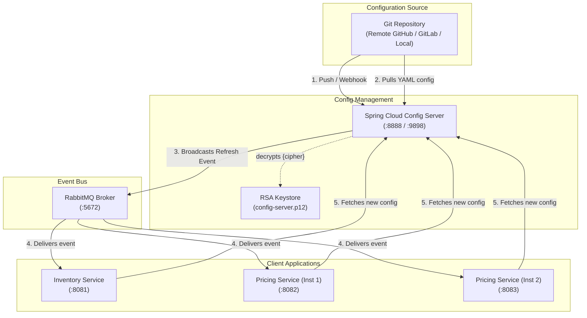
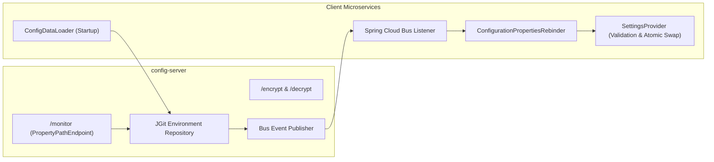
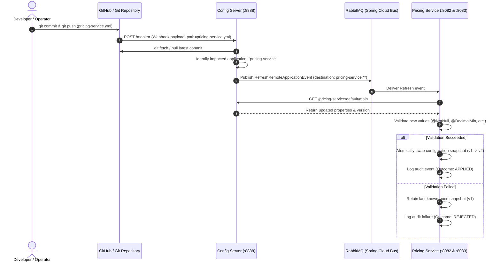

# Version A: Git Backend with Live Refresh over Spring Cloud Bus

> **Storage Backend:** Git repository (Local `file://` or Remote GitHub / GitLab)  
> **Change Detection:** Git Webhook / Post-Commit Hook &rarr; `/monitor` endpoint &rarr; Spring Cloud Bus (RabbitMQ)  
> **Encryption:** Asymmetric RSA 4096-bit Keystore (PKCS12)  
> **Default Ports:** Config Server `8888` (Management: `9898` / `9888`), Inventory Service `8081`, Pricing Service `8082`, Pricing Service 2 `8083`

---

## 1. Architectural Overview

Version A uses a **Git repository** as the single source of truth for externalized configurations. Changes pushed to Git trigger dynamic, zero-downtime property refreshes across all active microservices via **Spring Cloud Bus** backed by **RabbitMQ**.



---

## 2. Component Diagram



---

## 3. Sequence Diagram: Dynamic Configuration Refresh



---

## 4. Quick Start: Build and Run

### Prerequisites
- **Java 21**
- **Maven 3.9+**
- **Docker & Docker Compose**

### Step 1: Generate Encryption Keystore
Generate the RSA 4096-bit PKCS12 keystore used to decrypt `{cipher}` values:
```bash
cd version-a-git
./scripts/generate-keystore.sh
```
*(Creates `secrets/config-server.p12` with alias `configkey` and password `keystore-secret`)*

### Step 2: Build Application JARs
```bash
mvn -Pfast package
```

### Step 3: Run with Docker Compose
```bash
docker compose -f docker/compose.yaml build --no-cache
docker compose -f docker/compose.yaml up -d
```

### Step 4: Verify Container Status
```bash
docker ps
```
All 5 containers will report `(healthy)`:
- `cfg-git-server` (Config Server)
- `cfg-git-inventory` (Inventory Service)
- `cfg-git-pricing` (Pricing Service 1)
- `cfg-git-pricing-2` (Pricing Service 2)
- `cfg-git-rabbitmq` (RabbitMQ Message Broker)

---

## 5. Configuration & Environment Variables

| Variable | Default Value | Description |
|---|---|---|
| `CONFIG_REPO_URI` | `https://github.com/kirankumarhm/springboot-config-server-external-properties-demo.git` | Git repository URL (or `file:///config-repo`) |
| `CONFIG_REPO_SEARCH_PATHS` | `version-a-git/config-repo` | Subdirectory containing application YAMLs |
| `CONFIG_REPO_LABEL` | `main` | Default branch/tag/commit |
| `CONFIG_REPO_FORCE_PULL` | `true` | Force pull remote commits into local cache |
| `CONFIG_MONITOR_VALIDATION` | `false` | Enable/disable webhook signature verification |
| `ENCRYPT_KEYSTORE_LOCATION` | `file:/secrets/config-server.p12` | Path to RSA PKCS12 keystore |
| `CONFIG_ADMIN_PASSWORD` | `{noop}admin-secret` | Basic auth for `/encrypt`, `/decrypt`, `/monitor` |
| `CONFIG_CLIENT_PASSWORD` | `{noop}client-secret` | Basic auth for client Environment API |

---

## 6. Testing Guide

### A. Automated End-to-End Test Suite
Run the full automated acceptance suite that validates zero-downtime live refresh, SLA (<5s), secret decryption, multi-instance broadcasting, and validation error rollback:

```bash
cd version-a-git
./scripts/e2e-test.sh
```

---

### B. Manual Testing & Verification

#### 1. Verify Config Server Environment & Decryption API
Fetch resolved properties for `pricing-service` and `inventory-service`:
```bash
# Pricing service configuration (from GitHub / Git)
curl -s -u config-client:client-secret http://localhost:8888/pricing-service/default/main | jq .

# Inventory service configuration (decrypted server-side)
curl -s -u config-client:client-secret http://localhost:8888/inventory-service/default/main | jq .
```

#### 2. Test Encrypting and Decrypting Secrets
Encrypt a secret with Config Server's active RSA key:
```bash
# Encrypt
CIPHER=$(curl -s -u config-admin:admin-secret -X POST http://localhost:8888/encrypt \
  -H "Content-Type: text/plain" --data-binary "my_super_secret_token")
echo "Ciphertext: $CIPHER"

# Decrypt
curl -s -u config-admin:admin-secret -X POST http://localhost:8888/decrypt \
  -H "Content-Type: text/plain" --data-binary "$CIPHER"
```

#### 3. Inspect Microservice Configuration Snapshots
Check the active configuration loaded into memory by each service:
```bash
# Inventory Service Snapshot
curl -s http://localhost:8081/api/v1/config/snapshot | jq .

# Pricing Service 1 Snapshot
curl -s http://localhost:8082/api/v1/config/snapshot | jq .

# Pricing Service 2 Snapshot
curl -s http://localhost:8083/api/v1/config/snapshot | jq .
```

#### 4. Test Business Endpoints
```bash
# Test Inventory reservation
curl -s -X POST http://localhost:8081/api/v1/inventory/reservations \
  -H 'Content-Type: application/json' \
  -d '{"sku":"SKU-1","quantity":10}' | jq .

# Test Price Quote calculation
curl -s "http://localhost:8082/api/v1/pricing/quotes/SKU-100?basePrice=1000.00" | jq .
```

---

### C. Testing Live Refresh (Zero-Downtime Propagation)

#### Step 1: Change a Configuration Property
Edit `version-a-git/config-repo/pricing-service.yml` in your Git repo:
```yaml
pricing:
  currency: "INR"
  discount-percentage: 25.0   # Changed from 10.0 to 25.0
  surge-pricing-enabled: false
  surge-multiplier: 1.5
```
Commit and push to `main`.

#### Step 2: Notify Config Server
Trigger the `/monitor` webhook notification:
```bash
curl -s -u config-admin:admin-secret -X POST http://localhost:8888/monitor \
  -d "path=pricing-service.yml"
```
*(Output: `["pricing-service:8082", "pricing-service:8083"]` indicating broadcast to all instances)*

#### Step 3: Verify Updated Live State
Without restarting containers, query the quote endpoints:
```bash
curl -s "http://localhost:8082/api/v1/pricing/quotes/SKU-100?basePrice=1000.00" | jq .
curl -s "http://localhost:8083/api/v1/pricing/quotes/SKU-100?basePrice=1000.00" | jq .
```
Both instances will immediately reflect:
- `discountPercentage: 25.0`
- `finalPrice: 750.00`
- `configVersion: 2`

---

### D. Testing Validation Failure & Last-Known-Good Safety

If an operator commits an invalid value (e.g. `discount-percentage: 95.0`, violating `@DecimalMax("90.0")`):
1. Push the invalid change and notify `/monitor`.
2. Inspect `curl -s http://localhost:8082/api/v1/config/snapshot | jq .`:
   - `lastOutcome`: `"REJECTED"`
   - `lastFailureReason`: `"discountPercentage must be less than or equal to 90.0"`
   - `settings`: **Retains previous valid snapshot (last-known-good)**.
   - Traffic continues serving without disruption or errors.

---

## 7. Automating Refresh (Webhooks & Hooks)

### Option A: GitHub Webhook Setup
1. In your GitHub repo, navigate to **Settings** &rarr; **Webhooks** &rarr; **Add webhook**.
2. **Payload URL**: `http://<your-public-host>:8888/monitor`
3. **Content type**: `application/json`
4. **Events**: Select **Just the push event**.

### Option B: Local Post-Commit Hook
Install the post-commit hook so local commits automatically fire `/monitor`:
```bash
cp version-a-git/scripts/post-commit .git/hooks/post-commit
chmod +x .git/hooks/post-commit
```
