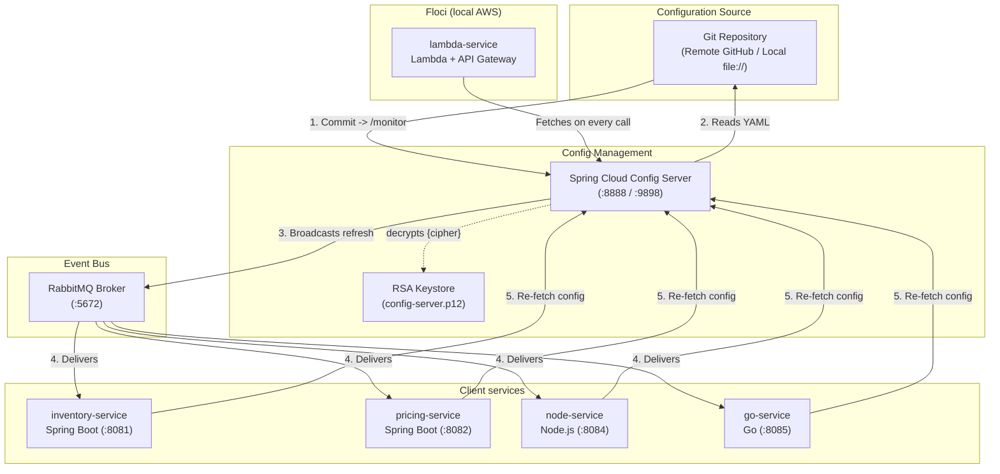
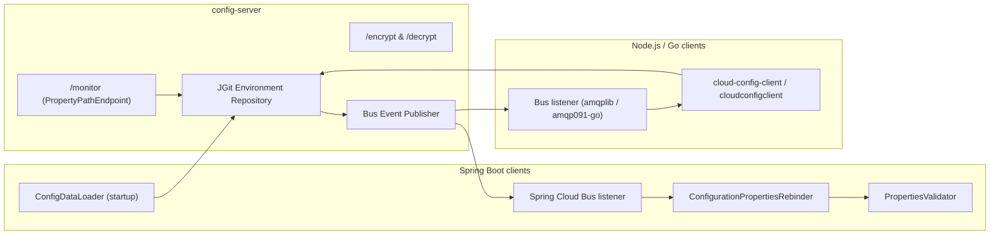
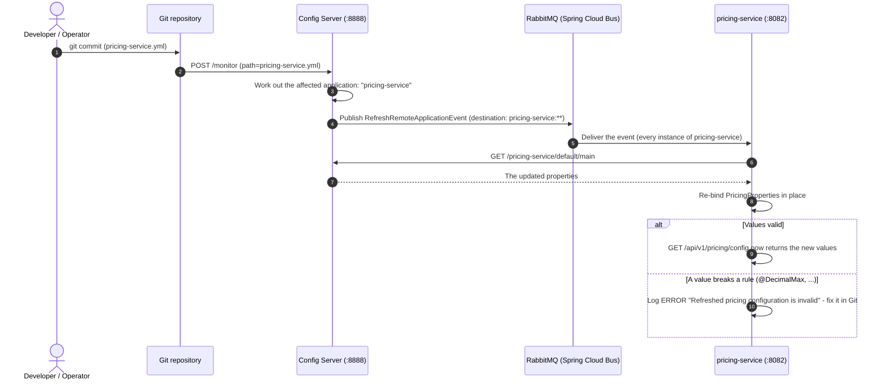
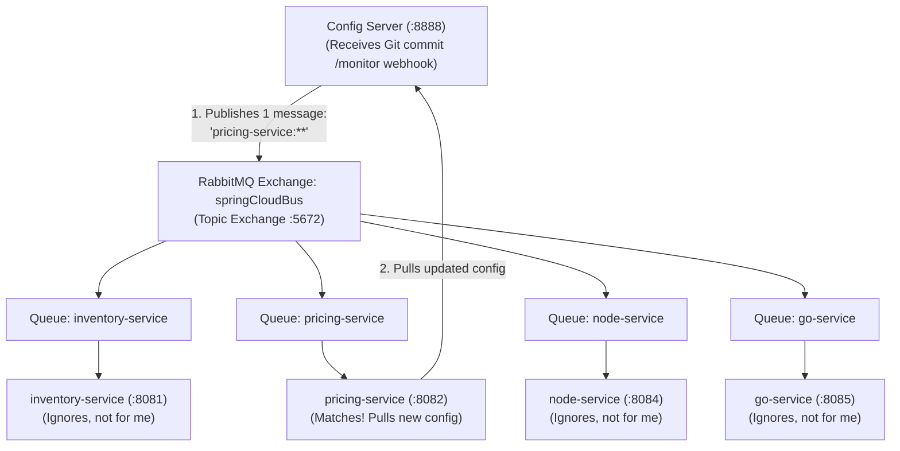

# Version A: Git Backend with Live Refresh over Spring Cloud Bus

> **Storage Backend:** Git repository (Local `file://` or Remote GitHub / GitLab)  
> **Change Detection:** Git Webhook / Post-Commit Hook &rarr; `/monitor` endpoint &rarr; Spring Cloud Bus (RabbitMQ)  
> **Encryption:** Asymmetric RSA 4096-bit Keystore (PKCS12)  
> **Default Ports (host):** Config Server `8888` (Actuator `9898` &rarr; container `9888`), inventory-service `8081` (Actuator `9081`), pricing-service `8082` (Actuator `9082`), node-service `8084`, go-service `8085`, RabbitMQ `5672` / UI `15672`, Floci (Lambda) `4566`

> **Further reading:** [How Spring Boot reloads configuration without restart](https://medium.com/@AlexanderObregon/how-spring-boot-reloads-configuration-without-restart-4d9dc9e8b926)

---

## The services in this version

One Config Server, five clients in three languages. Every client has **one API** that returns
its own configuration, and every client picks up a change **without a restart**.

| Service | Language | Its API | How it hears about a change | README |
|---|---|---|---|---|
| inventory-service | Spring Boot | `GET :8081/api/v1/inventory/config` | Spring Cloud Bus (RabbitMQ) | [inventory-service/](inventory-service/README.md) |
| pricing-service | Spring Boot | `GET :8082/api/v1/pricing/config` | Spring Cloud Bus (RabbitMQ) | [pricing-service/](pricing-service/README.md) |
| node-service | Node.js 22 | `GET :8084/api/v1/node/config` | Spring Cloud Bus, via its own small RabbitMQ listener | [node-service/](node-service/README.md) |
| go-service | Go 1.23 | `GET :8085/api/v1/go/config` | Spring Cloud Bus, via its own small RabbitMQ listener | [go-service/](go-service/README.md) |
| lambda-service | AWS Lambda (Node.js 22) in Floci | `GET /api/v1/lambda/config` through API Gateway | none needed - it reads the Config Server on every call | [lambda-service/](lambda-service/README.md) |

Each lives in its own directory, builds on its own and shares no code with the others.

## 1. Architectural Overview

Version A uses a **Git repository** as the single source of truth for configuration. A commit
triggers a live refresh of every affected client via **Spring Cloud Bus**, backed by **RabbitMQ**.


```mermaid
graph TD
    subgraph Storage["Configuration Source"]
        GitRepo["Git Repository<br/>(Remote GitHub / Local file://)"]
    end

    subgraph ConfigLayer["Config Management"]
        CS["Spring Cloud Config Server<br/>(:8888 / :9898)"]
        Keystore["RSA Keystore<br/>(config-server.p12)"]
        CS -. decrypts {cipher} .-> Keystore
    end

    subgraph Messaging["Event Bus"]
        RabbitMQ["RabbitMQ Broker<br/>(:5672)"]
    end

    subgraph Clients["Client services"]
        Inv["inventory-service<br/>Spring Boot (:8081)"]
        Prc["pricing-service<br/>Spring Boot (:8082)"]
        Node["node-service<br/>Node.js (:8084)"]
        Go["go-service<br/>Go (:8085)"]
    end

    subgraph Floci["Floci (local AWS)"]
        Lambda["lambda-service<br/>Lambda + API Gateway"]
    end

    GitRepo -- "1. Commit -> /monitor" --> CS
    CS -- "2. Reads YAML" --> GitRepo
    CS -- "3. Broadcasts refresh" --> RabbitMQ
    RabbitMQ -- "4. Delivers" --> Inv & Prc & Node & Go
    Inv & Prc & Node & Go -- "5. Re-fetch config" --> CS
    Lambda -- "Fetches on every call" --> CS
```

---

## 2. Component Diagram


```mermaid
graph LR
    subgraph ConfigServer["config-server"]
        JGit["JGit Environment Repository"]
        MonEndpoint["/monitor (PropertyPathEndpoint)"]
        EncController["/encrypt & /decrypt"]
        BusPublisher["Bus Event Publisher"]
    end

    subgraph Spring["Spring Boot clients"]
        ConfigDataLoader["ConfigDataLoader (startup)"]
        SpringBus["Spring Cloud Bus listener"]
        Rebinder["ConfigurationPropertiesRebinder"]
        Validator["PropertiesValidator"]
    end

    subgraph Polyglot["Node.js / Go clients"]
        Lib["cloud-config-client / cloudconfigclient"]
        OwnBus["Bus listener (amqplib / amqp091-go)"]
    end

    MonEndpoint --> JGit
    JGit --> BusPublisher
    BusPublisher --> SpringBus --> Rebinder --> Validator
    BusPublisher --> OwnBus --> Lib
    ConfigDataLoader --> JGit
    Lib --> JGit
```

---

## 3. Sequence Diagram: Dynamic Configuration Refresh


```mermaid
sequenceDiagram
    autonumber
    actor Dev as Developer / Operator
    participant Git as Git repository
    participant CS as Config Server (:8888)
    participant RMQ as RabbitMQ (Spring Cloud Bus)
    participant Client as pricing-service (:8082)

    Dev->>Git: git commit (pricing-service.yml)
    Git->>CS: POST /monitor (path=pricing-service.yml)
    CS->>CS: Work out the affected application: "pricing-service"
    CS->>RMQ: Publish RefreshRemoteApplicationEvent (destination: pricing-service:**)
    RMQ->>Client: Deliver the event (every instance of pricing-service)
    Client->>CS: GET /pricing-service/default/main
    CS-->>Client: The updated properties
    Client->>Client: Re-bind PricingProperties in place
    alt Values valid
        Client->>Client: GET /api/v1/pricing/config now returns the new values
    else A value breaks a rule (@DecimalMax, ...)
        Client->>Client: Log ERROR "Refreshed pricing configuration is invalid" - fix it in Git
    end
```

node-service and go-service follow the same steps with their own listener; lambda-service skips
steps 3-5 because it reads the Config Server on every call.

---

## 4. Understanding RabbitMQ & Spring Cloud Bus (Layman's Guide & Web UI)

### The Core Role of RabbitMQ (The "Megaphone" Analogy)
Think of **RabbitMQ** as a central **broadcast megaphone**:
- **Without RabbitMQ**: Config Server would need to maintain a list of all running instances across all environments and call each instance's HTTP `/actuator/refresh` endpoint one by one. If you have 50 pricing service replicas or instances scaling up and down, Config Server gets overwhelmed or out of sync.
- **With RabbitMQ & Spring Cloud Bus**: When you push a Git commit, Config Server simply shouts **once** into RabbitMQ's topic exchange (`springCloudBus`): *"Hey everyone, `pricing-service` configuration has changed!"*. RabbitMQ automatically duplicates and delivers this message to every connected service's private queue.


```mermaid
graph TD
    CS["Config Server (:8888)<br/>(Receives Git commit /monitor webhook)"]
    Ex["RabbitMQ Exchange: springCloudBus<br/>(Topic Exchange :5672)"]
    Q1["Queue: inventory-service"]
    Q2["Queue: pricing-service"]
    Q3["Queue: node-service"]
    Q4["Queue: go-service"]
    Inv["inventory-service (:8081)<br/>(Ignores, not for me)"]
    Prc["pricing-service (:8082)<br/>(Matches! Pulls new config)"]
    Node["node-service (:8084)<br/>(Ignores, not for me)"]
    Go["go-service (:8085)<br/>(Ignores, not for me)"]

    CS -- "1. Publishes 1 message:<br/>'pricing-service:**'" --> Ex
    Ex --> Q1 --> Inv
    Ex --> Q2 --> Prc
    Ex --> Q3 --> Node
    Ex --> Q4 --> Go
    Prc -- "2. Pulls updated config" --> CS
```

### Accessing the RabbitMQ Web Management Dashboard

RabbitMQ comes with an interactive web dashboard running out of the box:

- **Web Dashboard URL**: [http://localhost:15672](http://localhost:15672)
- **Username**: `guest`
- **Password**: `guest`

#### What to observe in the RabbitMQ UI:
1. **Connections Tab ("The Phone Lines")**:
   - You will see 5 active AMQP connections: the Config Server and the four clients.
   - **Service Name Identification**: each connection carries a readable name - the Spring services set it with `spring.cloud.stream.rabbit.binder.connection-name-prefix` (e.g. `inventory-service:8081#0`), and node-service / go-service use their bus id (e.g. `node-service:8084:3f2a...`).
   - *Tip*: Click the `+/-` icon on the top-right of the table to enable the **Client-provided name** column, or click any connection to inspect its details.
2. **Exchanges Tab ("The Router")**:
   - Click on **`springCloudBus`** (`topic` type) to see the broadcast bindings to each microservice's queue (`#`).
3. **Queues and Streams Tab ("The Inboxes")**:
   - See the temporary, auto-delete queues created by each microservice instance (`springCloudBus.anonymous.*`).
   - *Why anonymous names?* To ensure fan-out delivery so that every replica receives the refresh broadcast.
   - *How to match queue to service?* Click any queue &rarr; check **Consumers** to see the service name.
4. **Live Activity**: Push a Git commit and watch the **Message Rates** graph spike in real time!

### Why RabbitMQ instead of Kafka for Spring Cloud Bus?

Both **RabbitMQ** and **Apache Kafka** are supported by Spring Cloud Bus (`spring-cloud-starter-bus-amqp` vs `spring-cloud-starter-bus-kafka`). However, for a **configuration management bus**, **RabbitMQ is the industry-standard recommendation**:

#### A. The Nature of the Workload: "Ephemeral Broadcast" vs "Event Stream"

| Aspect | Spring Cloud Bus Requirement | RabbitMQ (Chosen) | Apache Kafka |
|---|---|---|---|
| **Message Type** | Rare, tiny notification signals *(e.g. "Pricing config updated")* | **Natural fit**: Built for point-in-time message routing. | **Mismatch**: Built for continuous streams of business data (millions of events/sec). |
| **History / Replay** | **Not needed**: If a pod boots up tomorrow, it pulls fresh config via HTTP `GET`. It does not need to replay past refresh events. | Discards messages immediately after delivery. | Retains and stores messages to disk in commit logs. |
| **Dynamic Scaling** | Pods scale from 2 to 50 and back down dynamically. | **Ephemeral Queues (`[AD]`)**: Creates a temporary queue on pod startup; deletes it the millisecond the pod terminates. | **Consumer Group Metadata**: Every replica needs a unique random Consumer Group, leaving behind orphaned metadata in Kafka when pods die. |
| **Resource Footprint** | Background infrastructure should be lightweight. | **~40–60 MB RAM**, starts in 2 seconds. | **~600 MB–1.5 GB RAM** (JVM + KRaft/Zookeeper), starts in 20–30s. |

#### B. The "Megaphone" Analogy (RabbitMQ) vs "The Permanent Archive" (Kafka)
- **RabbitMQ is a Megaphone**: When a config changes, Config Server shouts into the megaphone. Any microservice currently alive hears it and refreshes. If no one is listening or a pod is dead, the sound disappears. This is **exactly** what configuration refresh needs.
- **Kafka is a Recording Studio with Permanent Tape**: Kafka writes every shout onto disk, tracks offsets, and organizes data into partitions. For an occasional 1 KB config refresh ping once a week, spinning up Kafka partitions and storage segments is massive overkill.

#### C. Comparison Matrix

| Feature | RabbitMQ (Default) | Apache Kafka |
|---|---|---|
| **Spring Cloud Starter** | `spring-cloud-starter-bus-amqp` | `spring-cloud-starter-bus-kafka` |
| **Broker Memory Usage** | ~50 MB RAM | ~800 MB+ RAM |
| **Queue Lifecycle** | Automatically deleted on pod exit (`[AD]`) | Topic partition offsets must be managed/rebalanced |
| **Routing Flexibility** | Native Topic Exchanges (`pricing-service:**`) | Requires topic-per-service or manual payload filtering |
| **Local Dev & CI/CD Speed** | Instant startup in Docker/Testcontainers | Slower Docker spin-up |

#### D. Swapping to Kafka (If Required by Enterprise Policy)
If your organization mandates Apache Kafka, Spring Cloud Bus supports it via a simple **1-line dependency swap**:

**1. In `pom.xml`**:
```xml
<!-- Replace RabbitMQ: -->
<!-- <dependency>
       <groupId>org.springframework.cloud</groupId>
       <artifactId>spring-cloud-starter-bus-amqp</artifactId>
     </dependency> -->

<!-- With Kafka: -->
<dependency>
  <groupId>org.springframework.cloud</groupId>
  <artifactId>spring-cloud-starter-bus-kafka</artifactId>
</dependency>
```

**2. In `application.yml`**:
```yaml
spring:
  cloud:
    bus:
      id: ${spring.application.name}:${random.uuid}
  kafka:
    bootstrap-servers: localhost:9092
```

The Spring Boot code needs no change. **node-service and go-service do**: they talk to RabbitMQ
directly (`amqplib` / `amqp091-go`), so with Kafka their bus listener would have to be rewritten
on a Kafka client. lambda-service is unaffected - it never uses the bus.

---

## 5. Quick Start: Build and Run

### Where to run these commands

Almost everything runs from **`version-a-git/`**, not from the repository root. Every code block
below starts with a `# from: ...` comment saying which directory it assumes, and those paths are
relative to wherever you cloned this project.

```
springboot-external-properties-demo-II/     <- repository root ("the project repo")
├── version-a-git/                          <- run nearly everything from HERE
│   ├── config-repo/                        <- the configuration files being served
│   ├── config-server/  inventory-service/  pricing-service/   <- Spring Boot
│   ├── node-service/   go-service/   lambda-service/        <- Node.js, Go, AWS Lambda
│   ├── docker/compose.yaml                 <- referenced as docker/compose.yaml, so cwd matters
│   ├── k8s/                                <- deploy / verify / teardown scripts
│   ├── scripts/                            <- keystore, git hook, e2e test, docker teardown
│   └── secrets/                            <- generated, gitignored, never committed
├── version-b-jdbc/
└── version-c-s3/
```

To get there from a fresh clone:

```bash
# from: wherever you keep your projects
git clone https://github.com/kirankumarhm/springboot-config-server-external-properties-demo.git
cd springboot-config-server-external-properties-demo/version-a-git
```

Two exceptions to "run it from `version-a-git/`", both about Git rather than the build:

| What you are doing | Run it from | Why |
|---|---|---|
| Editing config for the **remote** backend (the default) | the **repository root** | The Config Server clones *this project's* GitHub repo and reads `version-a-git/config-repo/` inside it. The commit has to go to that repo, so it must be pushed from the root. |
| Editing config for the **local `file://`** backend | **`version-a-git/config-repo/`** | That directory is *its own* separate Git repository with no remote. The `file://` backend serves **its** commits, and the post-commit hook lives in *its* `.git/hooks`. |

> **This catches people out, so it is worth stating plainly: the same YAML files belong to
> two different Git repositories.** `version-a-git/config-repo/*.yml` are tracked by the project
> repo *and* by the standalone repo at `version-a-git/config-repo/.git`. Committing in the root
> does nothing for a `file://` server; committing inside `config-repo/` never reaches GitHub. Check
> which one you are in with `git rev-parse --show-toplevel`.

### Prerequisites
- **Java 21** and **Maven 3.9+** (`java -version`, `mvn -v`)
- **Docker & Docker Compose** with Docker Desktop running (`docker ps`)
- **`keytool`** - ships with the JDK, so Java 21 covers it
- **`jq`** and **`python3`** - used by the curl examples and by `scripts/e2e-test.sh`
- **Node.js 22** and **npm** - only to test node-service / lambda-service, or run them without Docker
- **Go 1.23** - only to test go-service or run it without Docker (Docker builds it for you otherwise)
- **Floci** (`floci start`) and the **AWS CLI** - only for lambda-service

Check all of them in one go:

```bash
# from: version-a-git/
java -version && mvn -v && docker ps >/dev/null && keytool -help >/dev/null 2>&1 && jq --version && python3 -V
```

### Step 1: Generate the Encryption Keystore

```bash
# from: version-a-git/
./scripts/generate-keystore.sh
```

**Why this step exists at all**, since nothing in `config-repo/` is currently encrypted: the
Config Server is configured with `encrypt.key-store.*` in
`config-server/src/main/resources/application.yml`, and Spring Cloud Config resolves that keystore
while it is still *preparing the environment* - before the application context is even built. If
the file is not there, the server does not start degraded, it **does not start at all**:

```
java.lang.IllegalStateException: Invalid keystore location
    at org.springframework.cloud.bootstrap.encrypt.TextEncryptorUtils.createTextEncryptor(...)
```

So this is a hard prerequisite for Steps 3 onward, not an optional security extra. It is also the
first step because the keystore is **not in Git** (`secrets/` is gitignored) - a fresh clone has
no keystore, and that is deliberate: a private key in a repository is a private key you have to
assume is compromised.

**What the script creates** (it is idempotent - run it twice and the second run prints
`Keystore already exists` and changes nothing):

| Property | Value | Where it comes from |
|---|---|---|
| Path | `version-a-git/secrets/config-server.p12` | fixed, relative to the script |
| Format | PKCS12 | `-storetype PKCS12` |
| Key | RSA 4096-bit, valid 10 years | `-keyalg RSA -keysize 4096 -validity 3650` |
| Alias | `configkey` | `$ENCRYPT_KEYSTORE_ALIAS`, default `configkey` |
| Password | `keystore-secret` | `$ENCRYPT_KEYSTORE_PASSWORD`, default `keystore-secret` |
| Permissions | `600` (owner read/write only) | `chmod 600` |

Those last three must match what the server is told to look for. Compose passes them as
`ENCRYPT_KEYSTORE_ALIAS` / `ENCRYPT_KEYSTORE_PASSWORD` (section 6); Kubernetes takes the file as a
Secret and the password from `config-credentials` (section 13.9). Inspect what you generated:

```bash
# from: version-a-git/
keytool -list -keystore secrets/config-server.p12 -storepass keystore-secret
```

**Why a keystore (asymmetric) rather than a plain `encrypt.key` (symmetric).** With an RSA keypair
the private key never leaves the Config Server, and an operator can be handed only the public
certificate and still *encrypt* new values. A shared symmetric secret gives everyone who can
encrypt the ability to decrypt, which for production credentials is the whole problem.

> **PKCS12 has no separate key password, and that is a real trap.** `keytool` silently ignores
> `-keypass` for a PKCS12 store, so `encrypt.key-store.secret` **must equal**
> `encrypt.key-store.password`. Set them differently and startup fails with
> `UnrecoverableKeyException: Get Key failed: Given final block not properly padded`. (JKS does
> support separate passwords, but it is a deprecated proprietary format.)

**What you can now do with it** - this is the part the step is *for*. Once the stack is up
(Step 3), encrypt a secret and store the ciphertext in Git instead of the plaintext:

```bash
# from: anywhere - these are just HTTP calls
CIPHER=$(curl -s -u config-admin:admin-secret -X POST http://localhost:8888/encrypt \
  -H "Content-Type: text/plain" --data-binary "s3cr3t-db-password")
echo "$CIPHER"
```

Paste that into any file under `config-repo/` prefixed with `{cipher}`:

```yaml
inventory:
  api-key: "{cipher}AQBv0K...the long base64 blob..."
```

Clients never see the ciphertext. The Config Server decrypts on the way out with the private key
and serves the plaintext, so `{cipher}` is transparent to the application.

> **The failure mode to recognise.** If a `{cipher}` value cannot be decrypted with the current
> keystore - typically because the keystore was regenerated after the value was encrypted, which
> produces a *new* keypair - the Config Server does not error. It serves the key renamed to
> `invalid.<key>` with the value `<n/a>`. The client then fails validation on a missing property
> and it looks like an application bug. If you see `invalid.` anywhere in an Environment API
> response, the keystore no longer matches the ciphertext: re-encrypt the value with the current
> key, or restore the keystore that encrypted it.
>
> Note that `config-repo/` currently contains **no `{cipher}` values**, so nothing in the default
> setup exercises decryption. The keystore is still mandatory, for the startup reason above.

### Step 2: Build Application JARs & Container Images

You can build the applications using either standard Maven packaging with Docker Compose, or containerize directly using **Google Jib 3.5.2**:

```bash
# from: version-a-git/

# Option A: Build host JARs for Docker Compose
mvn -Pfast package

# Option B: Build container images directly into local Docker daemon with Google Jib 3.5.2
mvn compile jib:dockerBuild

# Option C: Build container images as standalone tarballs without a Docker daemon
mvn compile jib:buildTar
```
*(`-Pfast` skips the quality gates - Spotless, Checkstyle, SpotBugs, JaCoCo - which are not needed to produce a runnable jar. Add `-o` if Maven stalls checking the network for dependencies it already has.)*

### Step 3: Run with Docker Compose

Choose where the Config Server reads its configuration from:

```bash
# from: version-a-git/

# (a) LOCAL mode - reads version-a-git/config-repo/ on your disk. A local commit is enough to
#     change a value, and the end-to-end test needs this mode.
CONFIG_REPO_URI=file:///config-repo CONFIG_REPO_SEARCH_PATHS= CONFIG_REPO_FORCE_PULL=false \
  docker compose -f docker/compose.yaml up -d --build

# (b) GITHUB mode (the default) - reads this project's GitHub repository. A change must be
#     committed AND pushed from the repository root.
docker compose -f docker/compose.yaml up -d --build
```

Why `CONFIG_REPO_FORCE_PULL=false` in local mode: with `true` (right for GitHub), the Config
Server "resets the dirty repository to origin" while you commit, rewriting the files it serves
back to the previous values - a change appears for a moment and then silently reverts.

Compose builds node-service and go-service itself (they download their dependencies while
building). **Behind a TLS-inspecting corporate proxy** such as Zscaler that fails with
`x509: certificate signed by unknown authority`; export the proxy's root certificate first:
`export EXTRA_CA_CERT="$(cat proxy-root.pem)"` (on macOS:
`security find-certificate -a -c Zscaler -p /Library/Keychains/System.keychain`).

Then deploy lambda-service to Floci (it is not a container in this file):

```bash
# from: version-a-git/
floci start                                  # if it is not running yet
./lambda-service/scripts/deploy-floci.sh     # role, function and API Gateway route
./lambda-service/scripts/invoke-floci.sh     # -> {"greeting":"Hello from AWS Lambda",...}
```

### Step 4: Verify Container Status
```bash
# from: version-a-git/
docker compose -f docker/compose.yaml ps
```
All 6 containers will report `(healthy)`:

| Container | Role | Host ports | Image tag built by Compose |
|---|---|---|---|
| `cfg-git-server` | Config Server | `8888`, `9898` | `config-git-demo-config-server:latest` |
| `cfg-git-inventory` | inventory-service | `8081`, `9081` | `config-git-demo-inventory-service:latest` |
| `cfg-git-pricing` | pricing-service | `8082`, `9082` | `config-git-demo-pricing-service:latest` |
| `cfg-git-node` | node-service | `8084` | `config-git-demo-node-service:latest` |
| `cfg-git-go` | go-service | `8085` | `config-git-demo-go-service:latest` |
| `cfg-git-rabbitmq` | RabbitMQ broker | `5672`, `15672` | `rabbitmq:4-management` (pulled) |

The tags come from `name: config-git-demo` on line 1 of `docker/compose.yaml` (`<project>-<service>:latest`). The Kubernetes manifests in `k8s/` reference these exact strings - see section 13.6.

Ask each client for its configuration:

```bash
# from: anywhere (these are just HTTP calls)
curl -s http://localhost:8081/api/v1/inventory/config
curl -s http://localhost:8082/api/v1/pricing/config
curl -s http://localhost:8084/api/v1/node/config
curl -s http://localhost:8085/api/v1/go/config
```

### Step 5: Shut Down

`./scripts/teardown-docker.sh` is tiered, prints what it is about to do, and asks first:

```bash
# from: version-a-git/
./scripts/teardown-docker.sh                # remove the containers and network; next `up` is instant
./scripts/teardown-docker.sh --stop         # only stop them; resume with `docker compose start`
./scripts/teardown-docker.sh --volumes      # also remove anonymous volumes (RabbitMQ leaves one per `up`)
./scripts/teardown-docker.sh --images       # also remove the images built here (next `up` must rebuild)
./scripts/teardown-docker.sh --base-images  # also remove rabbitmq:4-management (see the warning below)
./scripts/teardown-docker.sh --hook         # also uninstall config-repo/.git/hooks/post-commit
./scripts/teardown-docker.sh --jars         # also run `mvn clean`
./scripts/teardown-docker.sh --all -y       # --volumes --images --jars, no prompt
```

**`config-repo/` is never touched** - it *is* the configuration, and it is its own Git repository.
The script does warn if a leftover test value (`e2e-*`, `k8s-verified-*`, `test-*`) is still
sitting in it, because the next `up` would serve that value as if it were real.

> **`--base-images` has a side effect worth knowing.** `k8s/deploy-minikube.sh` loads
> `rabbitmq:4-management` from the **host** daemon into minikube, because the VM cannot pull it
> itself. Removing it here breaks the Kubernetes deploy until you `docker pull` it again.

The equivalent by hand is `docker compose -f docker/compose.yaml down` (add `-v` for volumes).

---

## 6. Configuration & Environment Variables

Two columns matter here and they are **not** the same thing: the default compiled into
`config-server/src/main/resources/application.yml`, and the value `docker/compose.yaml` actually
sets for the local stack.

| Variable | Default in `application.yml` | Set by `docker/compose.yaml` | Description |
|---|---|---|---|
| `CONFIG_REPO_URI` | `https://github.com/kirankumarhm/springboot-config-server-external-properties-demo.git` | same | Git repository URL (or `file:///config-repo` for the mounted local repo) |
| `CONFIG_REPO_SEARCH_PATHS` | `version-a-git/config-repo` | same | Subdirectory inside the repo holding the application YAMLs |
| `CONFIG_REPO_LABEL` | `main` | same | Default branch / tag / commit |
| `CONFIG_REPO_FORCE_PULL` | `true` | *(not set)* | Force-pull remote commits into the local cache |
| `CONFIG_MONITOR_VALIDATION` | **`true`** | **`false`** | Webhook signature verification on `POST /monitor`. `true` is the correct posture for a remote repo; the local `file://` stack must switch it off because no provider signs the payload - see section 7.C Step 2 |
| `MANAGEMENT_PORT` | `9888` | `9888` (published as `9898`) | Actuator port - a separate management child context |
| `ENCRYPT_KEYSTORE_LOCATION` | `file:./secrets/config-server.p12` | `file:/secrets/config-server.p12` | Path to the RSA PKCS12 keystore (mounted read-only in the container) |
| `ENCRYPT_KEYSTORE_PASSWORD` | `keystore-secret` | same | Keystore password. Also used as the key password - PKCS12 has no separate one |
| `ENCRYPT_KEYSTORE_ALIAS` | `configkey` | same | Key alias inside the keystore |
| `CONFIG_ADMIN_USERNAME` | `config-admin` | *(not set)* | Admin user for `/encrypt`, `/decrypt`, `/monitor`, `/actuator/busrefresh` |
| `CONFIG_ADMIN_PASSWORD` | `{noop}admin-secret` | same | Admin password. Supply `{bcrypt}$2a$...` in a deployed environment - the delegating encoder accepts both |
| `CONFIG_CLIENT_USERNAME` | `config-client` | *(not set)* | Client user for the Environment API (`/{app}/{profile}/{label}`) |
| `CONFIG_CLIENT_PASSWORD` | `{noop}client-secret` | same | Client password (the clients themselves send the plaintext form) |
| `RABBITMQ_HOST` / `RABBITMQ_PORT` | `localhost` / `5672` | `rabbitmq` / *(default)* | Spring Cloud Bus broker |

---

## 7. Testing Guide

### A. Automated End-to-End Test Suite

One script checks the whole stack: that every client returns only its own properties, that a
commit reaches **only** the service that owns the changed value - live, within the 5-second SLA -
and the security and error-format rules.

```bash
# from: version-a-git/
./scripts/e2e-test.sh                 # 36 checks
SKIP_LAMBDA=1 ./scripts/e2e-test.sh   # without Floci: skips the lambda-service checks
```

It needs the Compose stack in **local mode** (section 5, Step 3a) - it checks this first and
says so if the server is reading GitHub instead - plus lambda-service deployed to Floci and
`python3`. It **commits to `config-repo/`**, sets a known baseline first and restores it at the
end, so you can run it again and again.

---

### B. Manual Testing & Verification

#### 1. Ask the Config Server directly
This is the HTTP call every client makes (`/{application}/{profile}/{label}`):
```bash
# from: anywhere (these are just HTTP calls)
curl -s -u config-client:client-secret http://localhost:8888/pricing-service/default/main | jq .
curl -s -u config-client:client-secret http://localhost:8888/node-service/default/main | jq .
```
The answer lists **property sources**, most specific first (`node-service.yml`, then the shared
`application.yml`); a client merges them so that the first one wins.

#### 2. Test Encrypting and Decrypting Secrets
Encrypt a secret with Config Server's active RSA key:
```bash
# from: anywhere (these are just HTTP calls)
# Encrypt
CIPHER=$(curl -s -u config-admin:admin-secret -X POST http://localhost:8888/encrypt \
  -H "Content-Type: text/plain" --data-binary "my_super_secret_token")
echo "Ciphertext: $CIPHER"

# Decrypt
curl -s -u config-admin:admin-secret -X POST http://localhost:8888/decrypt \
  -H "Content-Type: text/plain" --data-binary "$CIPHER"
```

#### 3. Ask each client what it is using
```bash
# from: anywhere (these are just HTTP calls)
curl -s http://localhost:8081/api/v1/inventory/config | jq .
curl -s http://localhost:8082/api/v1/pricing/config | jq .
curl -s http://localhost:8084/api/v1/node/config | jq .
curl -s http://localhost:8085/api/v1/go/config | jq .
./lambda-service/scripts/invoke-floci.sh        # from: version-a-git/
```
Each returns only its own properties, for example
`{"currency":"INR","discountPercentage":10.0,"surgePricingEnabled":false,"surgeMultiplier":4}`.

---

### C. Testing Live Refresh (Zero-Downtime Propagation)

#### Step 1: Change a Configuration Property
Edit `version-a-git/config-repo/pricing-service.yml`:
```yaml
pricing:
  currency: "INR"
  discount-percentage: 25.0   # Changed from 10.0 to 25.0
  surge-pricing-enabled: false
  surge-multiplier: 4
```
Commit it. In **local mode** a commit inside `config-repo/` is enough (nothing to push), and the
post-commit hook (section 8) already performs Step 2a for you. In **GitHub mode** you must commit
and `git push` from the repository root, because the Config Server reads the remote, not your disk.

#### Step 2: Notify Config Server
Two supported triggers. Use the one that matches your backend:

**a. `/monitor`** - the webhook path, on the **app** port. This is what a Git provider (or the
post-commit hook) calls, and what the local Compose stack uses:
```bash
# from: anywhere (these are just HTTP calls)
curl -s -u config-admin:admin-secret -X POST http://localhost:8888/monitor \
  -d "path=pricing-service.yml"
```
Output is the list of **application names** the Config Server decided to refresh, e.g.
`["pricing-service","pricing"]` - not instances. One broadcast fans out to every instance of each
named application, which is exactly what section 4 illustrates.

> This only returns `200` while `CONFIG_MONITOR_VALIDATION=false` (which `docker/compose.yaml`
> sets). With the filter enabled and no provider signature on the request, the same call is
> rejected `401 WWW-Authenticate: Basic` even with correct admin credentials - the filter
> rejecting an unsigned webhook, not an auth failure. Against a **remote** repo leave the filter
> on and configure `spring.cloud.config.server.monitor.github.webhook-secret` instead.

**b. `/actuator/busrefresh`** - the operator path, on the **management** port (`9898` on the host).
Use it for a remote repo, or any time you want to broadcast by hand:
```bash
# from: anywhere (these are just HTTP calls)
curl -i -X POST -u config-admin:admin-secret \
  -H "Content-Type: application/json" \
  http://localhost:9898/actuator/busrefresh
```
Expect `HTTP/1.1 204`. The `Content-Type` header is **mandatory** - without it the request fails
`415 Unsupported Media Type`, no broadcast is sent, and the silent failure looks exactly like a
refresh that had no effect. Append `/pricing-service:**` to scope it to one application.

#### Step 3: Verify Updated Live State
Without restarting anything:
```bash
# from: anywhere (these are just HTTP calls)
curl -s http://localhost:8082/api/v1/pricing/config | jq .discountPercentage   # -> 25.0
curl -s http://localhost:8081/api/v1/inventory/config | jq .                   # unchanged
```
Only pricing-service changed. The same works for node-service and go-service (edit
`node-service.yml` / `go-service.yml`), and lambda-service shows a change on its very next call.

---

### D. What happens with an invalid value

The Spring services check their values against rules in their `config/*Properties.java`
(`@Min`, `@Max`, `@DecimalMax`, ...); node-service, go-service and lambda-service check theirs in
`node-config.js` / `goconfig.go` / `lambda-config.js`.

| When the bad value arrives | Spring Boot services | node-service / go-service | lambda-service |
|---|---|---|---|
| At startup | refuse to start: `Invalid pricing configuration: pricing.discountPercentage must be less than or equal to 90.0` | refuse to start, same kind of message | n/a |
| In a refresh | keep running, log `ERROR Refreshed pricing configuration is invalid: ...` | **keep the values they already had** and log the error | answer `503` problem details until it is fixed |

Try it: set `discount-percentage: 95.0`, commit, and watch `docker logs -f cfg-git-pricing`.
Then set it back.

---

## 8. Automating Refresh (Webhooks & Hooks)

### Option A: GitHub Webhook Setup
1. In your GitHub repo, navigate to **Settings** &rarr; **Webhooks** &rarr; **Add webhook**.
2. **Payload URL**: `http://<your-public-host>:8888/monitor`
3. **Content type**: `application/json`
4. **Events**: Select **Just the push event**.

### Option B: Local Post-Commit Hook
`config-repo/` is **its own Git repository** (it is what the `file://` backend serves), so the hook
belongs in *its* hooks directory - not in the outer project repo. Use the installer, which puts it
in the right place:
```bash
# from: version-a-git/
./scripts/install-git-hook.sh
```
It copies `scripts/post-commit` to `config-repo/.git/hooks/post-commit` and makes it executable.
Every commit in `config-repo/` then posts each changed filename to
`${CONFIG_SERVER_MONITOR_URL:-http://localhost:8888/monitor}`. The hook is best-effort: a failed
notify prints a warning and never blocks the commit, and manual recovery is
`POST /actuator/busrefresh` (section 7.C Step 2b).

---

## 9. Interactive OpenAPI 3 / Swagger Documentation

Every microservice exposes full OpenAPI 3.1 definitions and an interactive Swagger UI with live schema validation:

| Service | Swagger UI | OpenAPI 3 document |
|---|---|---|
| **inventory-service** | [http://localhost:8081/swagger-ui.html](http://localhost:8081/swagger-ui.html) | [http://localhost:8081/v3/api-docs](http://localhost:8081/v3/api-docs) |
| **pricing-service** | [http://localhost:8082/swagger-ui.html](http://localhost:8082/swagger-ui.html) | [http://localhost:8082/v3/api-docs](http://localhost:8082/v3/api-docs) |
| **node-service** | - (paste the document into [editor.swagger.io](https://editor.swagger.io)) | [http://localhost:8084/v3/api-docs](http://localhost:8084/v3/api-docs) |
| **go-service** | - (paste the document into [editor.swagger.io](https://editor.swagger.io)) | [http://localhost:8085/v3/api-docs](http://localhost:8085/v3/api-docs) |
| **lambda-service** | - | [lambda-service/openapi.json](lambda-service/openapi.json) (the API Gateway route) |

### Features Included:
- **Schemas with examples**: every field of every response is described, with an example value.
- **Documented responses**: `200` with the body, and errors as RFC 9457 problem details.
- **Try-It-Out** (Spring services): call the API from the browser.

---

## 10. Production-Grade Security Hardening

### Security Filter Chain (`SecurityConfig.java`)
The Spring services implement these HTTP security controls (node-service, go-service and
lambda-service send the same response headers; see their READMEs):
- **Deny by default**: only the API, the OpenAPI/Swagger docs and the health checks are reachable;
  every other path answers `403`. Note that in Spring Boot 4 this chain also guards the separate
  management port, which is why `/actuator/health/**` is listed explicitly - without it Docker and
  Kubernetes health probes get `403`.
- **No open refresh endpoint**: the clients expose only `health` on Actuator. Refreshes arrive over
  RabbitMQ, so an HTTP `/actuator/refresh` would only let anyone trigger reloads.
- **Stateless Session Management**: `SessionCreationPolicy.STATELESS` eliminates server-side session fixation vulnerabilities.
- **REST-Safe CSRF**: CSRF protection is safely disabled on stateless JSON endpoints in accordance with OWASP API Security guidelines.
- **Strict HTTP Security Response Headers**:
  - `Content-Security-Policy`: `"default-src 'self'; frame-ancestors 'none';"`
  - `Strict-Transport-Security`: `max-age=31536000; includeSubDomains` (HSTS)
  - `X-Frame-Options`: `DENY` (Clickjacking prevention)
  - `X-Content-Type-Options`: `nosniff` (MIME-sniffing prevention)
  - `Referrer-Policy`: `strict-origin-when-cross-origin`

---

## 11. RFC 9457 Standardized Exception Handling

Every error is formatted as RFC 9457 `application/problem+json` - by `GlobalExceptionHandler`
(`@RestControllerAdvice`) in the Spring services, and by each Node.js / Go service's own handler.
For example, an unknown path:

```bash
# from: anywhere (these are just HTTP calls)
curl -s http://localhost:8081/api/v1/inventory/nope
```
```json
{
  "type": "urn:problem:resource-not-found",
  "title": "Resource not found",
  "status": 404,
  "detail": "No endpoint api/v1/inventory/nope",
  "instance": "/api/v1/inventory/nope",
  "timestamp": "2026-10-06T14:30:00Z"
}
```

### Handled Error Scenarios:
- **`NoResourceFoundException`**: HTTP 404 for an endpoint that does not exist.
- **`HttpRequestMethodNotSupportedException`**: HTTP 405 for anything but `GET` / `HEAD`.
- **`HttpMediaTypeNotAcceptableException`**: HTTP 406 when the caller does not accept JSON.
- **`Exception` (fallback)**: HTTP 500 with a unique `errorId` that matches the log line; the
  cause and stack trace are logged, never returned.

---

## 12. Security Scanning & Quality Gates (SAST / SCA)

Every build is continuously analyzed by enterprise security and code quality gates:

```bash
# from: version-a-git/
# Run complete verification (Checkstyle, Spotless, SpotBugs + FindSecBugs, ArchUnit, JaCoCo)
mvn clean verify

# Fast build (skips QA gates to quickly create JARs)
mvn -Pfast package

# Run dedicated OWASP dependency vulnerability check (SCA)
mvn -Psecurity verify

# Format all Java files with google-java-format
mvn spotless:apply

# Build container images via Google Jib 3.5.2
mvn compile jib:dockerBuild                              # Build to local Docker daemon
mvn compile jib:buildTar                                 # Build standalone tarball
mvn compile jib:build -Dimage=<registry>/<image>:<tag>   # Push directly to container registry
```

| Quality Gate | Tool & Version | Inspection Scope |
|---|---|---|
| **SAST (Bytecode Analysis)** | SpotBugs 4.10.4 + `findsecbugs-plugin:1.13.0` | SQL injection, CSRF misconfiguration, insecure cryptography, path traversal, command injection |
| **SCA (Dependency Vulnerability)** | OWASP `dependency-check-maven:13.0.0` | Known CVEs in third-party libraries against the National Vulnerability Database (NVD) |
| **Architecture Enforcement** | ArchUnit 1.5.0 | Refresh safety (`@ConfigurationProperties` with setters, not records; no `@Value`), package layering, no field injection |
| **Code Formatting** | Spotless + google-java-format 1.36.1 | Deterministic code style formatting |
| **Static Code Analysis** | Checkstyle 14.1.0 | Coding conventions, naming standards, Javadoc hygiene |
| **Code Coverage** | JaCoCo 0.8.15 | Enforced line (>70%) and branch (>60%) thresholds. **`config-server` lowers these to 45% / 35%** on purpose: its two largest classes (`SecurityConfig`, the application class) need a full context to instantiate, and their behaviour is asserted by `GitBackendIT` and `scripts/e2e-test.sh` instead of by unit coverage - the override and its rationale are in `config-server/pom.xml` |

Each of the three Java services is a **standalone Maven project** parented directly to
`spring-boot-starter-parent` 4.0.8, with its own dependency management, quality gates and
`config/` directory. The `pom.xml` at `version-a-git/` is an **aggregator only** - nothing is
inherited from it - so a single service builds on its own:

```bash
# from: version-a-git/
cd inventory-service && mvn verify
```

The other three services have their own checks:

```bash
# from: version-a-git/
(cd node-service && npm ci && npm test)
(cd lambda-service && npm ci && npm test)
(cd go-service && gofmt -l . && go vet ./... && go test -race ./...)
```


---

## 13. Running on Kubernetes (minikube): Manual Step-by-Step

Sections 5–8 run this stack with Docker Compose on your laptop. This section does the same thing
on **Kubernetes**, by hand, one command at a time. No prior Kubernetes knowledge is assumed.

`./k8s/deploy-minikube.sh` automates every step below. Follow this section when you want to
understand what that script does, or when a step fails and you need to run just that step again.

### 13.1 What we are about to do, in plain words

Think of it as five jobs:

1. **Compile** the Java code into three `.jar` files (node-service and go-service need no compile step on your machine - their images build themselves).
2. **Wrap** each service into a Docker image (a sealed box containing the app and its runtime).
3. **Hand** those boxes to the Kubernetes cluster.
4. **Tell** Kubernetes to run them, using the instruction files in `k8s/`.
5. **Prove** that changing a setting in GitHub reaches the running apps without restarting them.

Two things about this setup surprise people, so they are worth saying up front:

- **The configuration lives in GitHub, not on your laptop.** With Docker Compose the Config
  Server reads a folder on your disk (`file://`). That **cannot** work on Kubernetes. The Config
  Server treats that folder as its own Git working directory and runs a real `git checkout` in
  it; with two copies of the Config Server running, they would fight over the same folder and
  corrupt it. So on Kubernetes each copy clones the **remote** GitHub repository into its own
  private scratch space instead. Consequence: **editing a file locally changes nothing until you
  `git push`.**
- **We build the images on your laptop and then copy them into the cluster.** Normally Kubernetes
  downloads images from the internet. On this machine the minikube virtual machine cannot do that
  — it fails with `x509: certificate signed by unknown authority`, because a corporate security
  certificate your Mac trusts is missing inside the VM. Building locally and copying the images in
  avoids the download entirely.

### 13.2 Before you start

You need `java` 21, `maven`, `docker` (Docker Desktop running), `minikube`, `kubectl`, and
`python3`. Check them all at once:

```bash
# from: version-a-git/
java -version && mvn -v && docker ps >/dev/null && minikube version && kubectl version --client && python3 -V
```

You also need **push access** to the GitHub repository in `CONFIG_REPO_URI`, because step 13.13
proves the mechanism by pushing a real commit.

### 13.3 Step 1 — Start the cluster

```bash
# from: anywhere (these are just HTTP calls)
minikube start --driver=docker --cpus=4 --memory=6g --disk-size=20g
```

Confirm it is alive. `Ready` is what you are looking for:

```bash
# from: anywhere (these are just HTTP calls)
kubectl get nodes
```

### 13.4 Step 2 — Create the encryption keystore

The same file as Step 1 of section 5, for the same reason: **without it the Config Server will not
start**, whether in Docker or in Kubernetes. Section 5 Step 1 explains what it is and how to use
it; the script is idempotent, so running it again when `secrets/config-server.p12` already exists
is harmless and changes nothing.

```bash
# from: version-a-git/
./scripts/generate-keystore.sh
```

In the cluster this file becomes a Secret rather than a mounted directory - step 13.9 creates it.

### 13.5 Step 3 — Compile the Java code

```bash
# from: version-a-git/
mvn -B -Pfast clean install -DskipTests
```

`-Pfast` turns off the slow quality gates (SpotBugs, Checkstyle, JaCoCo) — fine here because we
only want the jars. Wait for `BUILD SUCCESS`.

> **If this seems to hang for many minutes with no output:** add `-o` ("offline"). Maven is
> probably stuck checking the internet for dependency updates it already has on disk.
> `mvn -B -o -Pfast clean install -DskipTests` skips those network checks. The deploy script
> accepts the same override: `MVN_FLAGS="-B -o -Pfast" ./k8s/deploy-minikube.sh`.

### 13.6 Step 4 — Build the Docker images (this is where the tags come from)

```bash
# from: version-a-git/
docker compose -f docker/compose.yaml build config-server inventory-service pricing-service node-service go-service
```

**Where the image names come from.** You never type the tags yourself. Docker Compose builds them
as `<project-name>-<service-name>:latest`. The project name is set on line 1 of
`docker/compose.yaml` (`name: config-git-demo`), so you get:

| Service in compose.yaml | Image tag produced |
|---|---|
| `config-server` | `config-git-demo-config-server:latest` |
| `inventory-service` | `config-git-demo-inventory-service:latest` |
| `pricing-service` | `config-git-demo-pricing-service:latest` |
| `node-service` | `config-git-demo-node-service:latest` |
| `go-service` | `config-git-demo-go-service:latest` |

These exact strings are what `k8s/02-config-server.yaml` and `k8s/03-clients.yaml` ask for in
their `image:` fields. **If they do not match, the pods will never start** — so confirm the tags
actually exist before continuing:

```bash
# from: anywhere (these are just HTTP calls)
docker images | grep config-git-demo
```

You should see five lines. If a name differs, either rename the image:

```bash
# from: anywhere (these are just HTTP calls)
docker tag <the-name-you-actually-got> config-git-demo-config-server:latest
```

or change the `image:` field in the manifest to match. Do not guess — make the two sides equal.

### 13.7 Step 5 — Copy the images into the cluster

The cluster is a separate machine and cannot see your laptop's images yet.

```bash
# from: anywhere (these are just HTTP calls)
for img in config-git-demo-config-server:latest \
           config-git-demo-inventory-service:latest \
           config-git-demo-pricing-service:latest \
           config-git-demo-node-service:latest \
           config-git-demo-go-service:latest \
           rabbitmq:4-management; do
  echo "loading $img"
  minikube image load "$img"
done
```

This is slow and silent — the Java images are a few hundred MB each. Verify all six arrived:

```bash
# from: anywhere (these are just HTTP calls)
minikube image ls | grep -E "config-git-demo|rabbitmq"
```

> `rabbitmq:4-management` must already be on your laptop for this to work. If it is missing, run
> `docker pull rabbitmq:4-management` on the host first (your Mac can reach Docker Hub; the VM
> cannot).

### 13.8 Step 6 — Create the namespace, settings, and passwords

A *namespace* is just a labelled drawer that keeps these objects separate from everything else.

```bash
# from: version-a-git/   # paths below are relative to it
kubectl apply -f k8s/00-namespace-and-config.yaml
```

That one file creates four things:

| Object | Plain meaning |
|---|---|
| `Namespace config-demo` | The drawer everything else goes into |
| `ConfigMap config-server-env` | Non-secret settings: which Git repo, which branch, where RabbitMQ is |
| `ConfigMap client-env` | Tells the two client apps where the Config Server is |
| `Secret config-credentials` | The passwords |

> **Why `CONFIG_REPO_USERNAME` and `CONFIG_REPO_PASSWORD` say `REPLACE_ME`.** The default repo is
> public, so it clones with no login, and those two variables are deliberately commented out in
> `config-server/src/main/resources/application.yml` — nothing reads them. Leave them alone. If
> you point `CONFIG_REPO_URI` at a **private** repo, you must fill both in *and* uncomment those
> two lines, or the clone will fail.

### 13.9 Step 7 — Hand the keystore to the cluster

**This step is mandatory. Skipping it leaves the Config Server pods stuck forever**, because
`k8s/02-config-server.yaml` declares the keystore as a volume sourced from a Secret that only this
command creates:

```yaml
volumes:
  - name: encryption-keystore
    secret:
      secretName: config-encryption-keystore    # <- created by the command below, not by any manifest
      defaultMode: 0400
```

Kubernetes will not start a container whose volumes cannot be mounted, so the pod never reaches
the application at all - you never even see the `Invalid keystore location` error from section 5,
because the JVM does not run. What you get instead is a pod sitting in `ContainerCreating` and
this in `kubectl describe pod`:

```
Warning  FailedMount  54s (x8 over 118s)  kubelet  MountVolume.SetUp failed for volume
         "encryption-keystore" : secret "config-encryption-keystore" not found
```

The keystore is a genuine secret, so it is deliberately **never written into a manifest in Git**
(and `secrets/` is gitignored). Create it directly from your local file - note the relative path,
so this must run from `version-a-git/`:

```bash
# from: version-a-git/   # the --from-file path is relative to it
kubectl -n config-demo create secret generic config-encryption-keystore \
  --from-file=config-server.p12=secrets/config-server.p12
```

Confirm it landed, and that the key inside it is named `config-server.p12` - the name on the left
of the `=` is what the container sees as `/secrets/config-server.p12`, which is what
`ENCRYPT_KEYSTORE_LOCATION` points at:

```bash
# from: anywhere (these are just HTTP calls)
kubectl -n config-demo get secret config-encryption-keystore -o jsonpath='{.data}' | tr ',' '\n'
```

**Recovering if you already hit the error:** just create the Secret. Nothing needs redeploying -
the kubelet retries the mount with backoff, so the stuck pods pick it up and start within a minute
or so. To stop waiting:

```bash
# from: anywhere (these are just HTTP calls)
kubectl -n config-demo rollout restart deployment/config-server
kubectl -n config-demo rollout status deployment/config-server --timeout=300s
```

If you generated a keystore *after* creating the Secret, the Secret still holds the old key. Replace
it rather than creating it:

```bash
# from: version-a-git/   # the --from-file path is relative to it
kubectl -n config-demo create secret generic config-encryption-keystore \
  --from-file=config-server.p12=secrets/config-server.p12 \
  --dry-run=client -o yaml | kubectl apply -f -
```

*(In a real company this comes from Vault, Sealed Secrets, or External Secrets instead - which is
also why `./k8s/deploy-minikube.sh` does this for you and you cannot forget it there.)*

### 13.10 Step 8 — Start the three tiers, in order

Order matters: RabbitMQ carries the refresh messages, and the clients need the Config Server on
their first breath.

**RabbitMQ first.** The `rollout status` command simply waits until it is genuinely ready:

```bash
# from: version-a-git/   # paths below are relative to it
kubectl apply -f k8s/01-dependencies.yaml
kubectl -n config-demo rollout status deployment/rabbitmq --timeout=300s
```

**Then the Config Server** (two copies, for redundancy):

```bash
# from: version-a-git/   # paths below are relative to it
kubectl apply -f k8s/02-config-server.yaml
kubectl -n config-demo rollout status deployment/config-server --timeout=300s
```

**Then the four client apps** (inventory and pricing in Spring Boot, node-service, go-service):

```bash
# from: version-a-git/   # paths below are relative to it
kubectl apply -f k8s/03-clients.yaml
kubectl -n config-demo rollout status deployment/inventory-service --timeout=300s
kubectl -n config-demo rollout status deployment/pricing-service  --timeout=300s
kubectl -n config-demo rollout status deployment/node-service     --timeout=300s
kubectl -n config-demo rollout status deployment/go-service       --timeout=300s
```

**Apply Zero-Trust Network Policies and Autoscaling (HPA):**

```bash
# from: version-a-git/
kubectl apply -f k8s/04-network-policies.yaml
kubectl apply -f k8s/05-hpa.yaml
```

Now look at everything:

```bash
# from: anywhere (these are just HTTP calls)
kubectl -n config-demo get pods
```

Expect seven pods, all `Running`, all `1/1`:

```
config-server-xxxxxxxxxx-aaaaa      1/1  Running
config-server-xxxxxxxxxx-bbbbb      1/1  Running
go-service-xxxxxxxxxx-ccccc         1/1  Running
inventory-service-xxxxxxxxx-ddddd   1/1  Running
node-service-xxxxxxxxxx-eeeee       1/1  Running
pricing-service-xxxxxxxxxx-fffff    1/1  Running
rabbitmq-xxxxxxxxxx-ggggg           1/1  Running
```

`1/1` means "1 of 1 containers passed its health check". A pod stuck at `0/1` is still starting;
give it 30 seconds before worrying.

### 13.11 Step 9 — Open two doors to the cluster

Cluster addresses are private. `port-forward` makes them reachable from your browser and `curl`.
Run each in **its own terminal** and leave it running:

```bash
# from: anywhere (these are just HTTP calls)
# Terminal 1 - the inventory app
kubectl -n config-demo port-forward svc/inventory-service 8081:8081
```

```bash
# from: anywhere (these are just HTTP calls)
# Terminal 2 - the Config Server's admin port
kubectl -n config-demo port-forward svc/config-server 9888:9888
```

### 13.12 Step 10 — Check it is really reading GitHub

```bash
# from: anywhere (these are just HTTP calls)
curl -s http://localhost:8081/api/v1/inventory/config | python3 -m json.tool
```

The values are whatever `config-repo/inventory-service.yml` currently holds **on GitHub** - so
compare with the file on GitHub rather than expecting fixed numbers.

To see the proof that it came from Git rather than from inside the jar, ask the Config Server
directly. Open a third terminal:

```bash
# from: anywhere (these are just HTTP calls)
kubectl -n config-demo port-forward svc/config-server 8888:8888
curl -s -u config-client:client-secret \
  http://localhost:8888/inventory-service/default | python3 -m json.tool
```

The reply contains a real commit SHA and the GitHub URL it was read from:

```json
"version": "04b14a940777d4909d3defd467291937d77a0f3f",
"propertySources": [{ "name": "https://github.com/.../version-a-git/config-repo/inventory-service.yml" }]
```

> **The very first request can take 10–20 seconds and may time out.** That request is what
> triggers the initial `git clone`. Just run it again — the second one is fast.

> **node-service and go-service need their YAML files on GitHub.** `node-service.yml` and
> `go-service.yml` must be committed and pushed before these pods can start - they refuse to run
> without configuration. Until then they crash-loop with `Could not load configuration ... 404`.

### 13.13 Step 11 — The main event: change a setting with no restart

This is the whole point of the project. Four moves: **edit → commit → push → broadcast.** This
example changes node-service, to show that a non-Spring service gets the same broadcast.

Open a door to node-service (its own terminal):

```bash
# from: anywhere (these are just HTTP calls)
kubectl -n config-demo port-forward svc/node-service 8084:8084
```

**First, note what you are starting from:**

```bash
# from: anywhere (these are just HTTP calls)
curl -s http://localhost:8084/api/v1/node/config      # e.g. "maxItems":25
```

**1. Edit** `version-a-git/config-repo/node-service.yml`:

```yaml
node:
  max-items: 30
```

**2 and 3. Commit and push.** Pushing is not optional — the cluster reads GitHub, not your disk:

```bash
# from: the repository root
git add version-a-git/config-repo/node-service.yml
git commit -m "test: change node-service max-items"
git push
```

**4. Broadcast.** Tell the Config Server to announce the change. Every app hears it over RabbitMQ;
node-service sees that the message is addressed to it and re-fetches:

```bash
# from: anywhere (these are just HTTP calls)
curl -i -X POST -u config-admin:admin-secret \
  -H "Content-Type: application/json" \
  http://localhost:9888/actuator/busrefresh
```

You want **`HTTP/1.1 204`**. 204 means "done, nothing to say back" — that is success.

> **`-H "Content-Type: application/json"` is mandatory.** Leave it out and you get
> **`HTTP 415 Unsupported Media Type`**, no broadcast is sent, and nothing changes. This is a
> nasty one because it looks identical to a successful refresh that simply had no effect.

**Now watch the change arrive**, within a second or two:

```bash
# from: anywhere (these are just HTTP calls)
curl -s http://localhost:8084/api/v1/node/config      # "maxItems":30
kubectl -n config-demo logs deploy/node-service --tail=3   # "Configuration changed"
```

**The important part:** confirm nothing restarted. `RESTARTS` must still be `0` and `AGE` must
still be the original age:

```bash
# from: anywhere (these are just HTTP calls)
kubectl -n config-demo get pods
```

The apps never stopped. No redeploy, no downtime, no dropped requests.

**Put the value back when you are done** — edit, commit, push, and broadcast again. Pushing the
revert alone is *not* enough: the running pods keep serving the old value until you broadcast.

### 13.14 Step 12 — Prove every pod got the message

A broadcast must reach **every** pod of a service. If it reached only some, part of your traffic
would silently get stale settings — the exact bug this design exists to prevent. When a service
is scaled to several pods (for example by its autoscaler), ask each pod by its own IP, bypassing
load balancing:

```bash
# from: anywhere (these are just HTTP calls)
for ip in $(kubectl -n config-demo get pods -l app=node-service \
              -o jsonpath='{range .items[*]}{.status.podIP}{"\n"}{end}'); do
  echo -n "pod $ip -> "
  kubectl -n config-demo exec deploy/config-server -c config-server -- \
    wget -qO- --timeout=10 "http://$ip:8084/api/v1/node/config"
  echo
done
```

Every line must show the same new value.

*(The command borrows the Config Server pod as a web browser because it already sits inside the
cluster network. Starting a fresh helper pod would need an image download this VM cannot do.)*

To run all of this automatically, for all four in-cluster services:

```bash
# from: version-a-git/
./k8s/verify-in-cluster.sh
```

It finishes with `ALL <n> CHECKS PASSED (in-cluster)` - every pod is asserted individually, so
the count grows with the number of pods. **It pushes two commits to the remote** (the change and
its revert, the revert in a trap so it happens even if the script is interrupted), so it needs
push access. It stages only the four config-repo files it edits; nothing else in your working tree
is committed.

### 13.15 Step 13 — Shut down

`./k8s/teardown-minikube.sh` does this in tiers, prints exactly what it is about to do, and asks
for confirmation first. Tearing down cheaply is the default because the expensive part - the
image build and `minikube image load` - is slow to undo:

```bash
# from: version-a-git/
./k8s/teardown-minikube.sh                   # delete the config-demo namespace only; next deploy is fast
./k8s/teardown-minikube.sh --images          # also drop the 4 loaded images (next deploy must rebuild)
./k8s/teardown-minikube.sh --jars            # also run `mvn clean`
./k8s/teardown-minikube.sh --stop            # also stop the VM; `minikube start` resumes it
./k8s/teardown-minikube.sh --delete-cluster  # also DELETE the VM - everything rebuilds from scratch
./k8s/teardown-minikube.sh --all -y          # --images --jars --stop, no prompt
```

It also closes any `kubectl port-forward` left open for the namespace (they outlive their pods and
then fail with "address already in use" on the next deploy), and warns if `config-repo/` still
holds a `k8s-verified-*` test value that needs reverting.

The equivalent by hand:

```bash
# from: anywhere (these are just HTTP calls)
kubectl delete namespace config-demo   # delete just this stack
minikube stop                          # stop the cluster, keep it for next time
minikube delete                        # delete the cluster completely
```

**Nothing here touches the Git remote.** Configuration lives in GitHub, so tearing the cluster
down cannot lose it - and a leftover test value must be reverted with a commit, not a teardown.

### 13.16 When something goes wrong

Start here, always. The `describe` output ends with an `Events:` list that usually names the
problem outright:

```bash
# from: anywhere (these are just HTTP calls)
kubectl -n config-demo get pods
kubectl -n config-demo describe pod <pod-name>
kubectl -n config-demo logs <pod-name>
kubectl -n config-demo logs <pod-name> --previous   # if it already crashed and restarted
```

| What you see | What it means | Fix |
|---|---|---|
| `ErrImageNeverPull` / `ImagePullBackOff` | The image tag in the manifest does not exist in the cluster | Re-check 13.6 and 13.7; the tag must match **exactly** |
| `FailedMount ... secret "config-encryption-keystore" not found`, pod stuck `ContainerCreating` | Step 13.9 was skipped - the Secret the pod mounts the keystore from does not exist | Run the command in 13.9 (from `version-a-git/`); the kubelet retries the mount, so the pod starts on its own |
| `FailedMount ... secret "config-credentials" not found` | `k8s/00-namespace-and-config.yaml` was never applied | Run 13.8 first - it creates the namespace, both ConfigMaps and that Secret |
| Pod stuck `0/1 Running`, restarts climbing | The app starts then fails its health check | `kubectl logs` it; usually it cannot reach the Config Server or RabbitMQ |
| Logs show `TransportException` / `x509` | The pod cannot clone from GitHub | Test the VM's own access: `minikube ssh -- curl -sS -o /dev/null -w "%{http_code}\n" https://github.com` |
| Logs show `NumberFormatException: "tcp://10.x.x.x:5672"` | Kubernetes auto-injected a `RABBITMQ_PORT` variable that collided with ours | `enableServiceLinks: false` must be present in the pod spec (it already is) |
| `busrefresh` returns `415` | Missing `-H "Content-Type: application/json"` | Add the header |
| `busrefresh` returns `401` | Wrong credentials | Use `-u config-admin:admin-secret` |
| Pushed a change, nothing happened | You committed but did not `git push`, or did not broadcast | Push, then `busrefresh` |
| Values arrive as `invalid.<key>: <n/a>` | A `{cipher}` value cannot be decrypted by the current keystore | The keystore does not match what encrypted the value; re-encrypt it or remove it |
| `Pending` pods, `Insufficient cpu/memory` | The cluster is too small | Restart bigger: `minikube delete && minikube start --cpus=4 --memory=6g` |
