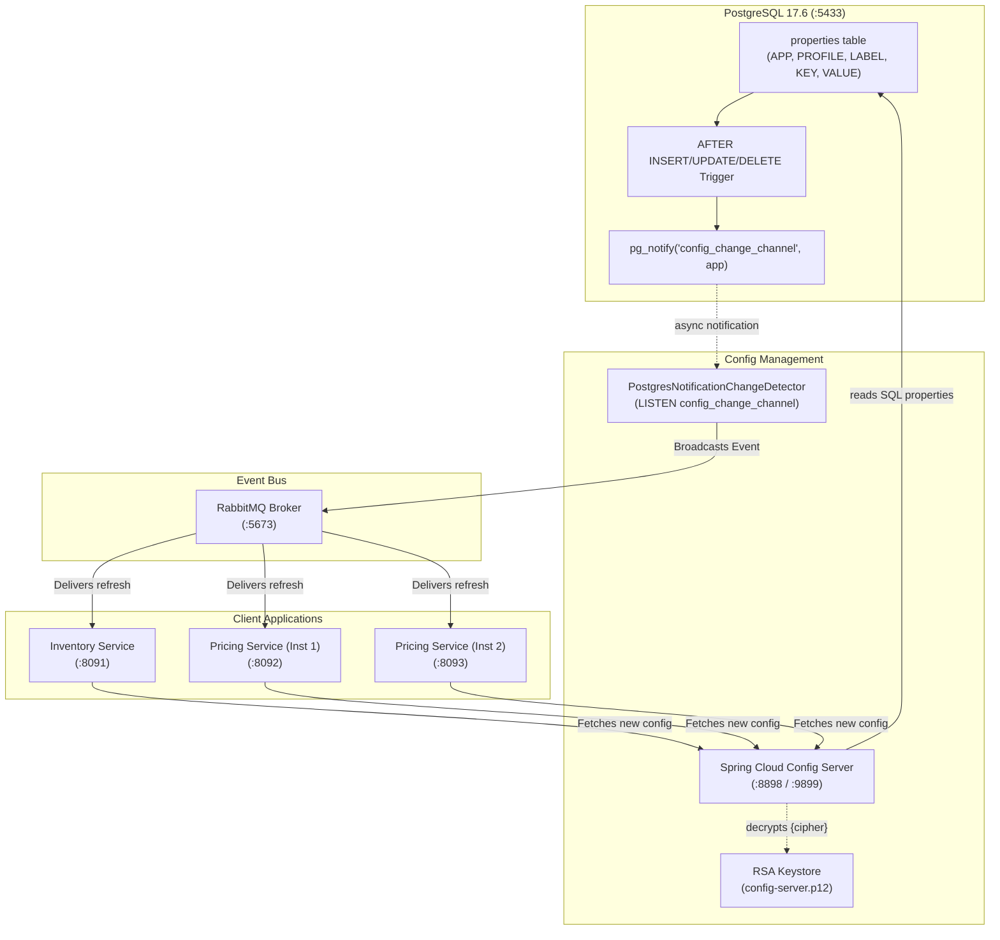
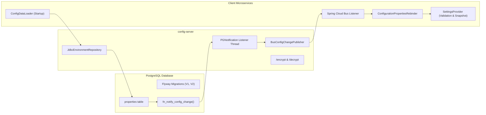
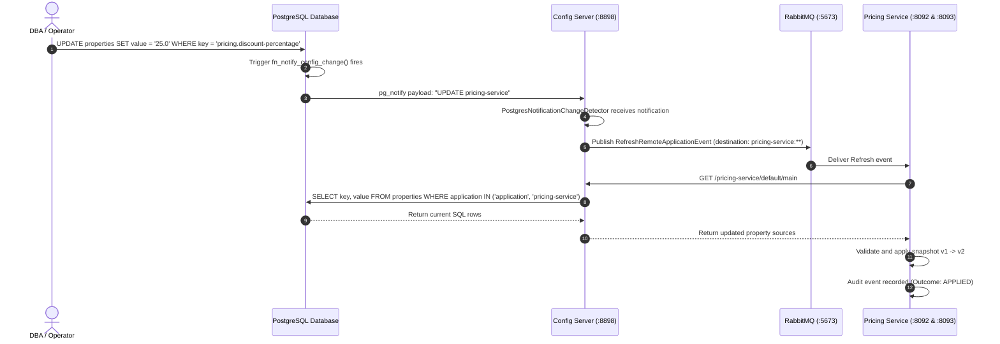

# Version B: JDBC (PostgreSQL) Backend with Live Refresh over Spring Cloud Bus

> **Storage Backend:** PostgreSQL 17.6 Relational Database (`configdb.properties` table)  
> **Change Detection:** PostgreSQL Trigger &rarr; `pg_notify` &rarr; `LISTEN` Notification Thread &rarr; Spring Cloud Bus (RabbitMQ)  
> **Encryption:** Asymmetric RSA 4096-bit Keystore (PKCS12)  
> **Default Ports:** Config Server `8898` (Management: `9899`), PostgreSQL `5433`, Inventory Service `8091`, Pricing Service `8092`, Pricing Service 2 `8093`

---

## 1. Architectural Overview

Version B stores centralized properties inside a **PostgreSQL relational database** instead of a Git repository. 

Whenever an administrator or automated system updates, inserts, or deletes a row in the `properties` table, a PostgreSQL database trigger fires `pg_notify`. Config Server maintains an active PostgreSQL connection with `LISTEN config_change_channel`, detects the exact impacted application name, and broadcasts a refresh event over **Spring Cloud Bus** (RabbitMQ).



---

## 2. Component Diagram



---

## 3. Sequence Diagram: SQL Update to Zero-Downtime Propagation



---

## 4. Quick Start: Build and Run

### Step 1: Generate Keystore
```bash
cd version-b-jdbc
./scripts/generate-keystore.sh
```

### Step 2: Build Application JARs
```bash
mvn -Pfast package
```

### Step 3: Run with Docker Compose
```bash
docker compose -f docker/compose.yaml build --no-cache
docker compose -f docker/compose.yaml up -d
```

### Step 4: Verify Container Status
```bash
docker ps
```
All 5 containers will report `(healthy)`:
- `cfg-jdbc-postgres` (PostgreSQL 17.6 on port `5433`)
- `cfg-jdbc-server` (Config Server on port `8898` / `9899`)
- `cfg-jdbc-inventory` (Inventory Service on port `8091`)
- `cfg-jdbc-pricing` (Pricing Service 1 on port `8092`)
- `cfg-jdbc-pricing-2` (Pricing Service 2 on port `8093`)
- `cfg-jdbc-rabbitmq` (RabbitMQ on port `5673`)

---

## 5. Database Schema & Flyway Migrations

The database schema is automatically created and managed by Flyway on Config Server startup:

### `V1__config_schema.sql`
```sql
CREATE TABLE properties (
    id BIGSERIAL PRIMARY KEY,
    created_at TIMESTAMPTZ NOT NULL DEFAULT NOW(),
    updated_at TIMESTAMPTZ NOT NULL DEFAULT NOW(),
    application VARCHAR(128) NOT NULL,
    profile VARCHAR(128) NOT NULL DEFAULT 'default',
    label VARCHAR(128) NOT NULL DEFAULT 'main',
    key VARCHAR(255) NOT NULL,
    value TEXT NOT NULL,
    CONSTRAINT uq_properties_natural_key UNIQUE NULLS NOT DISTINCT (application, profile, label, key)
);
```

### `V2__config_change_notify.sql`
Creates the PostgreSQL trigger function:
```sql
CREATE OR REPLACE FUNCTION fn_notify_config_change() RETURNS trigger AS $$
BEGIN
    PERFORM pg_notify('config_change_channel', TG_OP || ' ' || COALESCE(NEW.application, OLD.application));
    RETURN NEW;
END;
$$ LANGUAGE plpgsql;

CREATE TRIGGER trg_properties_change
AFTER INSERT OR UPDATE OR DELETE ON properties
FOR EACH ROW EXECUTE FUNCTION fn_notify_config_change();
```

---

## 6. Testing Guide

### A. Automated Acceptance Test Suite
```bash
cd version-b-jdbc
./scripts/e2e-test.sh
```

---

### B. Manual Testing & Verification

#### 1. Query Config Server Environment API
```bash
# Pricing Service configuration from PostgreSQL
curl -s -u config-client:client-secret http://localhost:8898/pricing-service/default/main | jq .

# Inventory Service configuration (decrypted from SQL)
curl -s -u config-client:client-secret http://localhost:8898/inventory-service/default/main | jq .
```

#### 2. Query Client Service Snapshots
```bash
# Inventory Service
curl -s http://localhost:8091/api/v1/config/snapshot | jq .

# Pricing Service 1 & 2
curl -s http://localhost:8092/api/v1/config/snapshot | jq .
curl -s http://localhost:8093/api/v1/config/snapshot | jq .
```

#### 3. Test Business Logic
```bash
# Inventory reservation
curl -s -X POST http://localhost:8091/api/v1/inventory/reservations \
  -H 'Content-Type: application/json' \
  -d '{"sku":"SKU-1","quantity":10}' | jq .

# Pricing Quote calculation
curl -s "http://localhost:8092/api/v1/pricing/quotes/SKU-100?basePrice=1000.00" | jq .
```

---

### C. Testing Live Refresh via SQL Update

#### Step 1: Update Property in PostgreSQL
Connect directly to Postgres and change a property:
```bash
docker exec -i cfg-jdbc-postgres psql -U config_admin -d configdb <<'SQL'
UPDATE properties 
SET value = '30.0', updated_at = NOW() 
WHERE application = 'pricing-service' AND key = 'pricing.discount-percentage';
SQL
```

#### Step 2: Observe Automatic Refresh
Without any REST calls, restarts, or delays:
1. PostgreSQL trigger fires `pg_notify`.
2. Config Server receives notification via `LISTEN`.
3. Config Server broadcasts event to RabbitMQ.
4. Both Pricing Service instances rebind and apply `v2`.

#### Step 3: Verify Live Price Quotes
```bash
curl -s "http://localhost:8092/api/v1/pricing/quotes/SKU-100?basePrice=1000.00" | jq .
curl -s "http://localhost:8093/api/v1/pricing/quotes/SKU-100?basePrice=1000.00" | jq .
```
Both instances immediately calculate:
- `discountPercentage: 30.0`
- `finalPrice: 700.00`
- `configVersion: 2`
