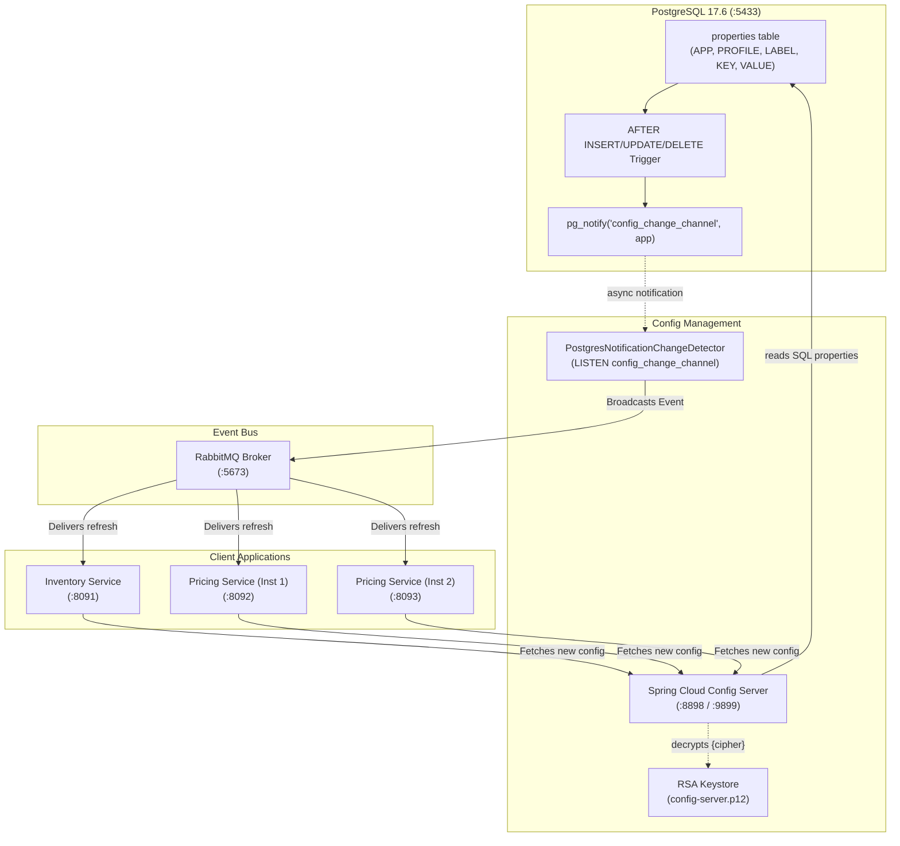
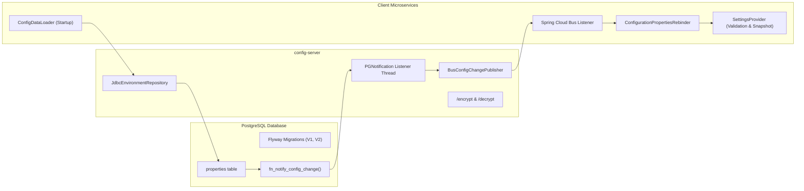
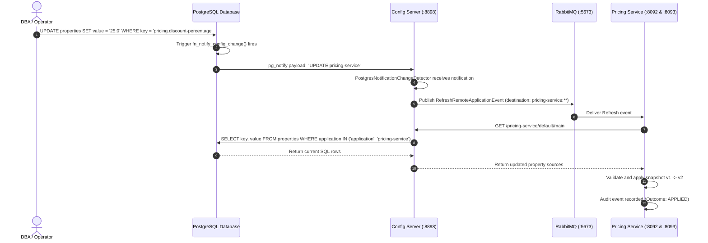
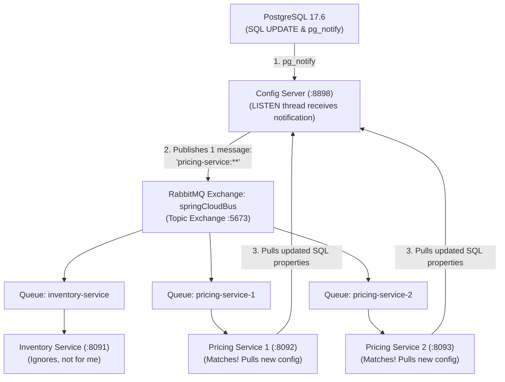

# Version B: JDBC (PostgreSQL) Backend with Live Refresh over Spring Cloud Bus

> **Storage Backend:** PostgreSQL 17.6 Relational Database (`configdb.properties` table)  
> **Change Detection:** PostgreSQL Trigger &rarr; `pg_notify` &rarr; `LISTEN` Notification Thread &rarr; Spring Cloud Bus (RabbitMQ)  
> **Encryption:** Asymmetric RSA 4096-bit Keystore (PKCS12)  
> **Default Ports:** Config Server `8898` (Management: `9899`), PostgreSQL `5433`, Inventory Service `8091`, Pricing Service `8092`, Pricing Service 2 `8093`

---

## 1. Architectural Overview

Version B stores centralized properties inside a **PostgreSQL relational database** instead of a Git repository. 

Whenever an administrator or automated system updates, inserts, or deletes a row in the `properties` table, a PostgreSQL database trigger fires `pg_notify`. Config Server maintains an active PostgreSQL connection with `LISTEN config_change_channel`, detects the exact impacted application name, and broadcasts a refresh event over **Spring Cloud Bus** (RabbitMQ).



---

## 2. Component Diagram



---

## 3. Sequence Diagram: SQL Update to Zero-Downtime Propagation



---

## 4. Understanding RabbitMQ & Spring Cloud Bus (Layman's Guide & Web UI)

### The Core Role of RabbitMQ (The "Megaphone" Analogy)
Think of **RabbitMQ** as a central **broadcast megaphone**:
- **Without RabbitMQ**: Config Server would need to maintain a database of every client IP/port and send individual HTTP `/actuator/refresh` calls to each service. If 50 pricing pods are running, Config Server has to call each one manually.
- **With RabbitMQ & Spring Cloud Bus**: When a SQL `UPDATE` happens, PostgreSQL notifies Config Server via `pg_notify`. Config Server then shouts **once** into RabbitMQ's topic exchange (`springCloudBus`): *"Hey everyone, `pricing-service` configuration has changed!"*. RabbitMQ automatically duplicates and delivers this message to every connected service's private queue.



### Accessing the RabbitMQ Web Management Dashboard

RabbitMQ comes with an interactive web dashboard running out of the box:

- **Web Dashboard URL**: [http://localhost:15673](http://localhost:15673)
- **Username**: `guest`
- **Password**: `guest`

#### What to observe in the RabbitMQ UI:
1. **Connections Tab ("The Phone Lines")**:
   - You will see 4 active AMQP connections.
   - **Service Name Identification**: Thanks to the `ConnectionNameStrategy` bean (`RabbitConfig.java`), connections display human-readable names (`config-server:8898`, `inventory-service:8091`, `pricing-service:8092`, `pricing-service:8093`).
   - *Tip*: Click the `+/-` icon on the top-right of the table to enable the **Client-provided name** column, or click any connection to inspect its details.
2. **Exchanges Tab ("The Router")**:
   - Click on **`springCloudBus`** (`topic` type) to see the broadcast bindings to each microservice's queue (`#`).
3. **Queues and Streams Tab ("The Inboxes")**:
   - See the temporary, auto-delete queues created by each microservice instance (`springCloudBus.anonymous.*`).
   - *Why anonymous names?* To ensure fan-out delivery so that every replica receives the refresh broadcast.
   - *How to match queue to service?* Click any queue &rarr; check **Consumers** to see the service name.
4. **Live Activity**: Run a SQL `UPDATE` in Postgres and watch the **Message Rates** graph spike in real time!

---

## 5. Quick Start: Build and Run

### Step 1: Generate Keystore
```bash
cd version-b-jdbc
./scripts/generate-keystore.sh
```

### Step 2: Build Application JARs
```bash
mvn -Pfast package
```

### Step 3: Run with Docker Compose
```bash
docker compose -f docker/compose.yaml build --no-cache
docker compose -f docker/compose.yaml up -d
```

### Step 4: Verify Container Status
```bash
docker ps
```
All 5 containers will report `(healthy)`:
- `cfg-jdbc-postgres` (PostgreSQL 17.6 on port `5433`)
- `cfg-jdbc-server` (Config Server on port `8898` / `9899`)
- `cfg-jdbc-inventory` (Inventory Service on port `8091`)
- `cfg-jdbc-pricing` (Pricing Service 1 on port `8092`)
- `cfg-jdbc-pricing-2` (Pricing Service 2 on port `8093`)
- `cfg-jdbc-rabbitmq` (RabbitMQ on port `5673`)

---

## 6. Database Schema & Flyway Migrations

The database schema is automatically created and managed by Flyway on Config Server startup:

### `V1__config_schema.sql`
```sql
CREATE TABLE properties (
    id BIGSERIAL PRIMARY KEY,
    created_at TIMESTAMPTZ NOT NULL DEFAULT NOW(),
    updated_at TIMESTAMPTZ NOT NULL DEFAULT NOW(),
    application VARCHAR(128) NOT NULL,
    profile VARCHAR(128) NOT NULL DEFAULT 'default',
    label VARCHAR(128) NOT NULL DEFAULT 'main',
    key VARCHAR(255) NOT NULL,
    value TEXT NOT NULL,
    CONSTRAINT uq_properties_natural_key UNIQUE NULLS NOT DISTINCT (application, profile, label, key)
);
```

### `V2__config_change_notify.sql`
Creates the PostgreSQL trigger function:
```sql
CREATE OR REPLACE FUNCTION fn_notify_config_change() RETURNS trigger AS $$
BEGIN
    PERFORM pg_notify('config_change_channel', TG_OP || ' ' || COALESCE(NEW.application, OLD.application));
    RETURN NEW;
END;
$$ LANGUAGE plpgsql;

CREATE TRIGGER trg_properties_change
AFTER INSERT OR UPDATE OR DELETE ON properties
FOR EACH ROW EXECUTE FUNCTION fn_notify_config_change();
```

---

## 7. Testing Guide

### A. Automated Acceptance Test Suite
```bash
cd version-b-jdbc
./scripts/e2e-test.sh
```

---

### B. Manual Testing & Verification

#### 1. Query Config Server Environment API
```bash
# Pricing Service configuration from PostgreSQL
curl -s -u config-client:client-secret http://localhost:8898/pricing-service/default/main | jq .

# Inventory Service configuration (decrypted from SQL)
curl -s -u config-client:client-secret http://localhost:8898/inventory-service/default/main | jq .
```

#### 2. Query Client Service Snapshots
```bash
# Inventory Service
curl -s http://localhost:8091/api/v1/config/snapshot | jq .

# Pricing Service 1 & 2
curl -s http://localhost:8092/api/v1/config/snapshot | jq .
curl -s http://localhost:8093/api/v1/config/snapshot | jq .
```

#### 3. Test Business Logic
```bash
# Inventory reservation
curl -s -X POST http://localhost:8091/api/v1/inventory/reservations \
  -H 'Content-Type: application/json' \
  -d '{"sku":"SKU-1","quantity":10}' | jq .

# Pricing Quote calculation
curl -s "http://localhost:8092/api/v1/pricing/quotes/SKU-100?basePrice=1000.00" | jq .
```

---

### C. Testing Live Refresh via SQL Update

#### Step 1: Update Property in PostgreSQL
Connect directly to Postgres and change a property:
```bash
docker exec -i cfg-jdbc-postgres psql -U config_admin -d configdb <<'SQL'
UPDATE properties 
SET value = '30.0', updated_at = NOW() 
WHERE application = 'pricing-service' AND key = 'pricing.discount-percentage';
SQL
```

#### Step 2: Observe Automatic Refresh
Without any REST calls, restarts, or delays:
1. PostgreSQL trigger fires `pg_notify`.
2. Config Server receives notification via `LISTEN`.
3. Config Server broadcasts event to RabbitMQ.
4. Both Pricing Service instances rebind and apply `v2`.

#### Step 3: Verify Live Price Quotes
```bash
curl -s "http://localhost:8092/api/v1/pricing/quotes/SKU-100?basePrice=1000.00" | jq .
curl -s "http://localhost:8093/api/v1/pricing/quotes/SKU-100?basePrice=1000.00" | jq .
```
Both instances immediately calculate:
- `discountPercentage: 30.0`
- `finalPrice: 700.00`
- `configVersion: 2`

---

## 8. Interactive OpenAPI 3 / Swagger Documentation

Every microservice exposes full OpenAPI 3.1 definitions and an interactive Swagger UI with live schema validation:

| Service | Swagger UI URL | OpenAPI 3 JSON Schema |
|---|---|---|
| **Inventory Service** | [http://localhost:8091/swagger-ui.html](http://localhost:8091/swagger-ui.html) | [http://localhost:8091/v3/api-docs](http://localhost:8091/v3/api-docs) |
| **Pricing Service (Inst 1)** | [http://localhost:8092/swagger-ui.html](http://localhost:8092/swagger-ui.html) | [http://localhost:8092/v3/api-docs](http://localhost:8092/v3/api-docs) |
| **Pricing Service (Inst 2)** | [http://localhost:8093/swagger-ui.html](http://localhost:8093/swagger-ui.html) | [http://localhost:8093/v3/api-docs](http://localhost:8093/v3/api-docs) |

### Features Included:
- **Rich DTO Schemas**: `@Schema` metadata including descriptions, example values, min/max constraints, and required fields.
- **Response Code Mapping**: Explicit `@ApiResponse` annotations documenting `200 OK`, `400 Bad Request` (RFC 9457), `404 Not Found`, and `500 Internal Server Error`.
- **Try-It-Out**: Directly execute quote calculations, stock reservations, and configuration snapshot inspections from your browser.

---

## 9. Production-Grade Security Hardening

### Security Filter Chain (`SecurityConfig.java`)
All microservices implement enterprise-grade HTTP security controls:
- **Stateless Session Management**: `SessionCreationPolicy.STATELESS` eliminates server-side session fixation vulnerabilities.
- **REST-Safe CSRF**: CSRF protection is safely disabled on stateless JSON endpoints in accordance with OWASP API Security guidelines.
- **Strict HTTP Security Response Headers**:
  - `Content-Security-Policy`: `"default-src 'self'; frame-ancestors 'none';"`
  - `Strict-Transport-Security`: `max-age=31536000; includeSubDomains` (HSTS)
  - `X-Frame-Options`: `DENY` (Clickjacking prevention)
  - `X-Content-Type-Options`: `nosniff` (MIME-sniffing prevention)
  - `Referrer-Policy`: `strict-origin-when-cross-origin`
  - `Permissions-Policy`: `"camera=(), microphone=(), geolocation=()"`

---

## 10. RFC 9457 Standardized Exception Handling

All uncaught exceptions and validation errors are intercepted by `@RestControllerAdvice` (`GlobalExceptionHandler`) and formatted as RFC 9457 `application/problem+json`:

```json
{
  "type": "https://api.acme.com/errors/validation-error",
  "title": "Validation Failed",
  "status": 400,
  "detail": "Request payload validation failed for 1 field(s)",
  "instance": "/api/v1/inventory/reservations",
  "errorId": "9c1b3f7a-821d-4e90-b1a5-3819441235b1",
  "timestamp": "2026-09-19T17:30:00Z",
  "fieldErrors": [
    {
      "field": "quantity",
      "rejectedValue": -5,
      "message": "Quantity must be greater than zero"
    }
  ]
}
```

### Handled Error Scenarios:
- **`MethodArgumentNotValidException` / `ConstraintViolationException`**: HTTP 400 with detailed `fieldErrors`.
- **`ConfigurationValidationException` / `IllegalStateException`**: HTTP 400 when business rules reject invalid configuration or payload state.
- **`NoResourceFoundException`**: HTTP 404 for nonexistent endpoints.
- **`HttpRequestMethodNotSupportedException`**: HTTP 405 for unsupported HTTP verbs.
- **`Exception` (Uncaught Fallback)**: HTTP 500 with unique `errorId` for log correlation without leaking internal stack traces.

---

## 11. Security Scanning & Quality Gates (SAST / SCA)

Every build is continuously analyzed by enterprise security and code quality gates:

```bash
# Run complete verification (Checkstyle, Spotless, SpotBugs + FindSecBugs, ArchUnit, JaCoCo)
mvn clean verify

# Run dedicated OWASP dependency vulnerability check (SCA)
mvn -Psecurity verify
```

| Quality Gate | Tool & Version | Inspection Scope |
|---|---|---|
| **SAST (Bytecode Analysis)** | SpotBugs 4.10.4 + `findsecbugs-plugin:1.13.0` | SQL injection, CSRF misconfiguration, insecure cryptography, path traversal, command injection |
| **SCA (Dependency Vulnerability)** | OWASP `dependency-check-maven:12.1.0` | Known CVEs in third-party libraries against the National Vulnerability Database (NVD) |
| **Architecture Enforcement** | ArchUnit 1.5.0 | Layer isolation, immutable snapshot boundaries, ban direct properties injection |
| **Code Formatting** | Spotless + google-java-format 1.36.1 | Deterministic code style formatting |
| **Static Code Analysis** | Checkstyle 14.1.0 | Coding conventions, naming standards, Javadoc hygiene |
| **Code Coverage** | JaCoCo 0.8.15 | Enforced line (>70%) and branch (>60%) coverage thresholds |

