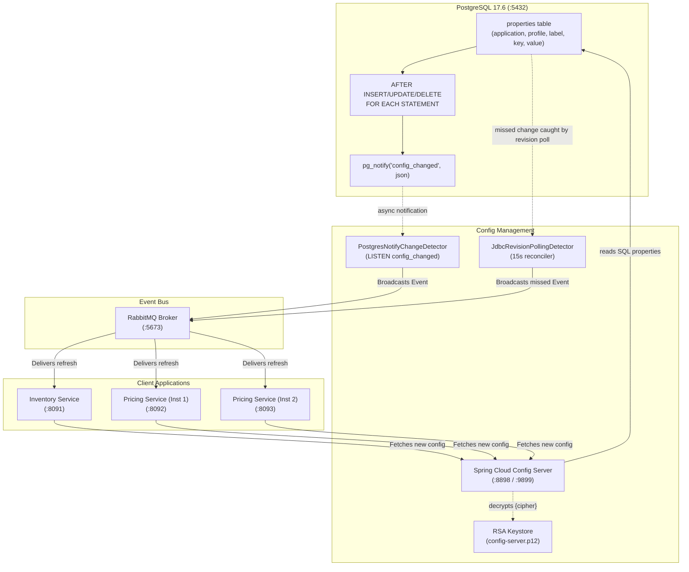
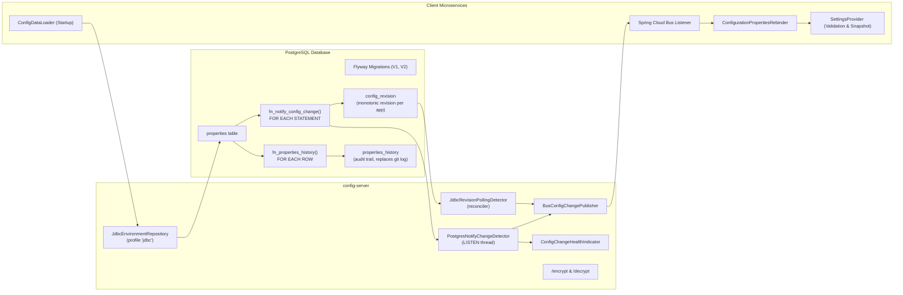
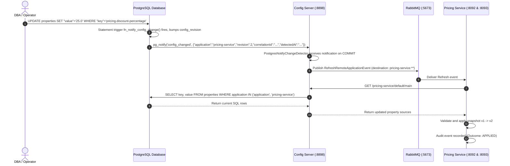
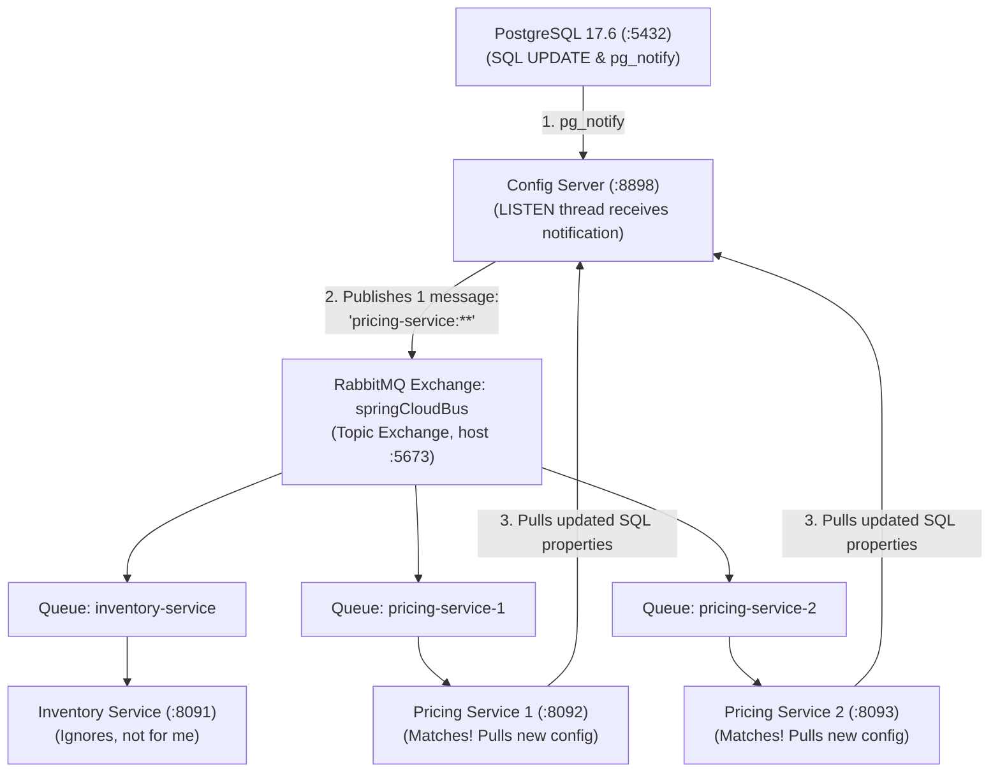

# Version B: JDBC (PostgreSQL) Backend with Live Refresh over Spring Cloud Bus

> **Storage Backend:** PostgreSQL 17.6 relational database (`configdb`, tables `properties`, `properties_history`, `config_revision`)  
> **Change Detection:** statement-level trigger &rarr; `pg_notify('config_changed', ...)` &rarr; `LISTEN` thread &rarr; Spring Cloud Bus (RabbitMQ), with a 15s revision poller as the safety net  
> **Encryption:** Asymmetric RSA 4096-bit Keystore (PKCS12)  
> **Default Ports (host):** Config Server `8898` (Actuator `9899`), PostgreSQL `5432`, Inventory Service `8091` (Actuator `9091`), Pricing Service `8092` (Actuator `9092`), Pricing Service 2 `8093` (Actuator `9093`), RabbitMQ `5673` / UI `15673`

---

## 1. Architectural Overview

Version B stores centralized properties inside a **PostgreSQL relational database** instead of a Git repository. 

Whenever an administrator or automated system updates, inserts, or deletes rows in the `properties` table, a PostgreSQL trigger fires `pg_notify`. Config Server holds an open PostgreSQL connection running `LISTEN config_changed`, reads the impacted application name out of the JSON payload, and broadcasts a refresh event over **Spring Cloud Bus** (RabbitMQ).

The triggers are **statement-level, not row-level** (`REFERENCING NEW TABLE`, PostgreSQL 10+): a bulk `UPDATE` touching 500 rows of one application produces **one** notification, not 500 - so there is no broadcast-storm risk and no debounce logic in the application. `NOTIFY` is also transactional, so a rolled-back change is never delivered: the transactional-outbox guarantee with no outbox table to maintain.


```mermaid
graph TD
    subgraph Database["PostgreSQL 17.6 (:5432)"]
        Table["properties table<br/>(application, profile, label, key, value)"]
        Trigger["AFTER INSERT/UPDATE/DELETE<br/>FOR EACH STATEMENT"]
        PGNotify["pg_notify('config_changed', json)"]
        Table --> Trigger --> PGNotify
    end

    subgraph ConfigLayer["Config Management"]
        CS["Spring Cloud Config Server<br/>(:8898 / :9899)"]
        Detector["PostgresNotifyChangeDetector<br/>(LISTEN config_changed)"]
        Poller["JdbcRevisionPollingDetector<br/>(15s reconciler)"]
        Keystore["RSA Keystore<br/>(config-server.p12)"]
        PGNotify -. async notification .-> Detector
        Table -. missed change caught by revision poll .-> Poller
        CS -. decrypts {cipher} .-> Keystore
        CS -- reads SQL properties --> Table
    end

    subgraph Messaging["Event Bus"]
        RabbitMQ["RabbitMQ Broker<br/>(:5673)"]
    end

    subgraph Microservices["Client Applications"]
        Inv["Inventory Service<br/>(:8091)"]
        Prc1["Pricing Service (Inst 1)<br/>(:8092)"]
        Prc2["Pricing Service (Inst 2)<br/>(:8093)"]
    end

    Detector -- "Broadcasts Event" --> RabbitMQ
    Poller -- "Broadcasts missed Event" --> RabbitMQ
    RabbitMQ -- "Delivers refresh" --> Inv
    RabbitMQ -- "Delivers refresh" --> Prc1
    RabbitMQ -- "Delivers refresh" --> Prc2
    Inv -- "Fetches new config" --> CS
    Prc1 -- "Fetches new config" --> CS
    Prc2 -- "Fetches new config" --> CS
```

---

## 2. Component Diagram


```mermaid
graph LR
    subgraph PostgreSQL["PostgreSQL Database"]
        Flyway["Flyway Migrations (V1, V2)"]
        PropsTable["properties table"]
        HistTable["properties_history<br/>(audit trail, replaces git log)"]
        RevTable["config_revision<br/>(monotonic revision per app)"]
        NotifyFunc["fn_notify_config_change()<br/>FOR EACH STATEMENT"]
        HistFunc["fn_properties_history()<br/>FOR EACH ROW"]
    end

    subgraph ConfigServer["config-server"]
        JdbcRepo["JdbcEnvironmentRepository<br/>(profile 'jdbc')"]
        ListenerThread["PostgresNotifyChangeDetector<br/>(LISTEN thread)"]
        RevPoller["JdbcRevisionPollingDetector<br/>(reconciler)"]
        Publisher["BusConfigChangePublisher"]
        Health["ConfigChangeHealthIndicator"]
        EncController["/encrypt & /decrypt"]
    end

    subgraph Clients["Client Microservices"]
        ConfigDataLoader["ConfigDataLoader (Startup)"]
        Rebinder["ConfigurationPropertiesRebinder"]
        Provider["SettingsProvider (Validation & Snapshot)"]
        BusListener["Spring Cloud Bus Listener"]
    end

    PropsTable --> NotifyFunc
    PropsTable --> HistFunc
    HistFunc --> HistTable
    NotifyFunc --> RevTable
    NotifyFunc --> ListenerThread
    RevTable --> RevPoller
    ListenerThread --> Publisher
    RevPoller --> Publisher
    ListenerThread --> Health
    Publisher --> BusListener
    BusListener --> Rebinder
    Rebinder --> Provider
    ConfigDataLoader --> JdbcRepo
    JdbcRepo --> PropsTable
```

---

## 3. Sequence Diagram: SQL Update to Zero-Downtime Propagation


```mermaid
sequenceDiagram
    autonumber
    actor Admin as DBA / Operator
    participant PG as PostgreSQL Database
    participant CS as Config Server (:8898)
    participant RMQ as RabbitMQ (:5673)
    participant Client as Pricing Service (:8092 & :8093)

    Admin->>PG: UPDATE properties SET "value"='25.0' WHERE "key"='pricing.discount-percentage';
    PG->>PG: Statement trigger fn_notify_config_change() fires, bumps config_revision
    PG->>CS: pg_notify('config_changed', {"application":"pricing-service","revision":2,"correlationId":"...","detectedAt":"..."})
    CS->>CS: PostgresNotifyChangeDetector receives notification on COMMIT
    CS->>RMQ: Publish RefreshRemoteApplicationEvent (destination: pricing-service:**)
    RMQ->>Client: Deliver Refresh event
    Client->>CS: GET /pricing-service/default/main
    CS->>PG: SELECT key, value FROM properties WHERE application IN ('application', 'pricing-service')
    PG-->>CS: Return current SQL rows
    CS-->>Client: Return updated property sources
    Client->>Client: Validate and apply snapshot v1 -> v2
    Client->>Client: Audit event recorded (Outcome: APPLIED)
```

---

## 4. Understanding RabbitMQ & Spring Cloud Bus (Layman's Guide & Web UI)

### The Core Role of RabbitMQ (The "Megaphone" Analogy)
Think of **RabbitMQ** as a central **broadcast megaphone**:
- **Without RabbitMQ**: Config Server would need to maintain a database of every client IP/port and send individual HTTP `/actuator/refresh` calls to each service. If 50 pricing pods are running, Config Server has to call each one manually.
- **With RabbitMQ & Spring Cloud Bus**: When a SQL `UPDATE` happens, PostgreSQL notifies Config Server via `pg_notify`. Config Server then shouts **once** into RabbitMQ's topic exchange (`springCloudBus`): *"Hey everyone, `pricing-service` configuration has changed!"*. RabbitMQ automatically duplicates and delivers this message to every connected service's private queue.


```mermaid
graph TD
    DB["PostgreSQL 17.6 (:5432)<br/>(SQL UPDATE & pg_notify)"]
    CS["Config Server (:8898)<br/>(LISTEN thread receives notification)"]
    Ex["RabbitMQ Exchange: springCloudBus<br/>(Topic Exchange, host :5673)"]
    Q1["Queue: inventory-service"]
    Q2["Queue: pricing-service-1"]
    Q3["Queue: pricing-service-2"]
    Inv["Inventory Service (:8091)<br/>(Ignores, not for me)"]
    Prc1["Pricing Service 1 (:8092)<br/>(Matches! Pulls new config)"]
    Prc2["Pricing Service 2 (:8093)<br/>(Matches! Pulls new config)"]

    DB -- "1. pg_notify" --> CS
    CS -- "2. Publishes 1 message:<br/>'pricing-service:**'" --> Ex
    Ex --> Q1 --> Inv
    Ex --> Q2 --> Prc1
    Ex --> Q3 --> Prc2
    Prc1 -- "3. Pulls updated SQL properties" --> CS
    Prc2 -- "3. Pulls updated SQL properties" --> CS
```

### Accessing the RabbitMQ Web Management Dashboard

RabbitMQ comes with an interactive web dashboard running out of the box:

- **Web Dashboard URL**: [http://localhost:15673](http://localhost:15673)
- **Username**: `guest`
- **Password**: `guest`

#### What to observe in the RabbitMQ UI:
1. **Connections Tab ("The Phone Lines")**:
   - You will see 4 active AMQP connections.
   - **Service Name Identification**: Thanks to the `ConnectionNameStrategy` bean (`RabbitConfig.java`), connections display human-readable names (`config-server:8898`, `inventory-service:8091`, `pricing-service:8092`, `pricing-service:8083`).
   - *Why the last one is `8083` and not `8093`*: the name is built from `${APP_INDEX:${SERVER_PORT:...}}`, which is the port **inside** the container. Compose sets `APP_INDEX: 8083` for the second pricing instance, while `8093` is only the host-side published port.
   - *Tip*: Click the `+/-` icon on the top-right of the table to enable the **Client-provided name** column, or click any connection to inspect its details.
2. **Exchanges Tab ("The Router")**:
   - Click on **`springCloudBus`** (`topic` type) to see the broadcast bindings to each microservice's queue (`#`).
3. **Queues and Streams Tab ("The Inboxes")**:
   - See the temporary, auto-delete queues created by each microservice instance (`springCloudBus.anonymous.*`).
   - *Why anonymous names?* To ensure fan-out delivery so that every replica receives the refresh broadcast.
   - *How to match queue to service?* Click any queue &rarr; check **Consumers** to see the service name.
4. **Live Activity**: Run a SQL `UPDATE` in Postgres and watch the **Message Rates** graph spike in real time!

### Why RabbitMQ instead of Kafka for Spring Cloud Bus?

Both **RabbitMQ** and **Apache Kafka** are supported by Spring Cloud Bus (`spring-cloud-starter-bus-amqp` vs `spring-cloud-starter-bus-kafka`). However, for a **configuration management bus**, **RabbitMQ is the industry-standard recommendation**:

#### A. The Nature of the Workload: "Ephemeral Broadcast" vs "Event Stream"

| Aspect | Spring Cloud Bus Requirement | RabbitMQ (Chosen) | Apache Kafka |
|---|---|---|---|
| **Message Type** | Rare, tiny notification signals *(e.g. "Pricing config updated")* | **Natural fit**: Built for point-in-time message routing. | **Mismatch**: Built for continuous streams of business data (millions of events/sec). |
| **History / Replay** | **Not needed**: If a pod boots up tomorrow, it pulls fresh config via HTTP `GET`. It does not need to replay past refresh events. | Discards messages immediately after delivery. | Retains and stores messages to disk in commit logs. |
| **Dynamic Scaling** | Pods scale from 2 to 50 and back down dynamically. | **Ephemeral Queues (`[AD]`)**: Creates a temporary queue on pod startup; deletes it the millisecond the pod terminates. | **Consumer Group Metadata**: Every replica needs a unique random Consumer Group, leaving behind orphaned metadata in Kafka when pods die. |
| **Resource Footprint** | Background infrastructure should be lightweight. | **~40–60 MB RAM**, starts in 2 seconds. | **~600 MB–1.5 GB RAM** (JVM + KRaft/Zookeeper), starts in 20–30s. |

#### B. The "Megaphone" Analogy (RabbitMQ) vs "The Permanent Archive" (Kafka)
- **RabbitMQ is a Megaphone**: When a config changes, Config Server shouts into the megaphone. Any microservice currently alive hears it and refreshes. If no one is listening or a pod is dead, the sound disappears. This is **exactly** what configuration refresh needs.
- **Kafka is a Recording Studio with Permanent Tape**: Kafka writes every shout onto disk, tracks offsets, and organizes data into partitions. For an occasional 1 KB config refresh ping once a week, spinning up Kafka partitions and storage segments is massive overkill.

#### C. Comparison Matrix

| Feature | RabbitMQ (Default) | Apache Kafka |
|---|---|---|
| **Spring Cloud Starter** | `spring-cloud-starter-bus-amqp` | `spring-cloud-starter-bus-kafka` |
| **Broker Memory Usage** | ~50 MB RAM | ~800 MB+ RAM |
| **Queue Lifecycle** | Automatically deleted on pod exit (`[AD]`) | Topic partition offsets must be managed/rebalanced |
| **Routing Flexibility** | Native Topic Exchanges (`pricing-service:**`) | Requires topic-per-service or manual payload filtering |
| **Local Dev & CI/CD Speed** | Instant startup in Docker/Testcontainers | Slower Docker spin-up |

#### D. Swapping to Kafka (If Required by Enterprise Policy)
If your organization mandates Apache Kafka, Spring Cloud Bus supports it via a simple **1-line dependency swap**:

**1. In `pom.xml`**:
```xml
<!-- Replace RabbitMQ: -->
<!-- <dependency>
       <groupId>org.springframework.cloud</groupId>
       <artifactId>spring-cloud-starter-bus-amqp</artifactId>
     </dependency> -->

<!-- With Kafka: -->
<dependency>
  <groupId>org.springframework.cloud</groupId>
  <artifactId>spring-cloud-starter-bus-kafka</artifactId>
</dependency>
```

**2. In `application.yml`**:
```yaml
spring:
  cloud:
    bus:
      id: ${spring.application.name}:${random.uuid}
  kafka:
    bootstrap-servers: localhost:9092
```

All your Java code, `@RefreshScope`, snapshot providers, and zero-downtime refresh mechanics remain **100% identical**.

---

## 5. Quick Start: Build and Run

### Where to run these commands

Everything below runs from **`version-b-jdbc/`**, not from the repository root. Every code block
starts with a `# from: ...` comment saying which directory it assumes.

```
springboot-external-properties-demo-II/     <- repository root
├── version-a-git/
├── version-b-jdbc/                         <- run everything from HERE
│   ├── config-server/                      <- also holds db/migration/*.sql (the schema)
│   ├── inventory-service/  pricing-service/
│   ├── docker/compose.yaml                 <- referenced as docker/compose.yaml, so cwd matters
│   ├── k8s/                                <- deploy / verify / teardown scripts
│   ├── scripts/                            <- keystore, e2e test, docker teardown
│   └── secrets/                            <- generated, gitignored, never committed
└── version-c-s3/
```

To get there from a fresh clone:

```bash
# from: wherever you keep your projects
git clone https://github.com/kirankumarhm/springboot-config-server-external-properties-demo.git
cd springboot-config-server-external-properties-demo/version-b-jdbc
```

Unlike version A there is no configuration directory to edit and no Git repository to commit to:
**the database is the configuration**, so changes are `UPDATE` statements run against PostgreSQL
(section 8.C). The seed values live in `config-server/src/main/resources/db/migration/V1__config_schema.sql`
and are inserted by Flyway on first startup.

### Prerequisites
- **Java 21** and **Maven 3.9+** (`java -version`, `mvn -v`)
- **Docker & Docker Compose** with Docker Desktop running (`docker ps`)
- **`keytool`** - ships with the JDK, so Java 21 covers it
- **`jq`** and **`python3`** - used by the curl examples and by `scripts/e2e-test.sh`
- **`psql`** is *not* needed on the host: every SQL example runs it inside the container with
  `docker exec`

Check all of them in one go:

```bash
# from: version-b-jdbc/
java -version && mvn -v && docker ps >/dev/null && keytool -help >/dev/null 2>&1 && jq --version && python3 -V
```

### Step 1: Generate the Encryption Keystore

```bash
# from: version-b-jdbc/
./scripts/generate-keystore.sh
```

**Why this step exists at all**, since nothing seeded into the database is currently encrypted:
the Config Server is configured with `encrypt.key-store.*` in
`config-server/src/main/resources/application.yml`, and Spring Cloud Config resolves that keystore
while it is still *preparing the environment* - before the application context is even built. If
the file is not there, the server does not start degraded, it **does not start at all**:

```
java.lang.IllegalStateException: Invalid keystore location
    at org.springframework.cloud.bootstrap.encrypt.TextEncryptorUtils.createTextEncryptor(...)
```

So this is a hard prerequisite for Steps 3 onward, not an optional security extra. It is also the
first step because the keystore is **not in Git** (`secrets/` is gitignored) - a fresh clone has
no keystore, and that is deliberate: a private key in a repository is a private key you have to
assume is compromised.

**What the script creates** (it is idempotent - run it twice and the second run prints
`Keystore already exists` and changes nothing):

| Property | Value | Where it comes from |
|---|---|---|
| Path | `version-b-jdbc/secrets/config-server.p12` | fixed, relative to the script |
| Format | PKCS12 | `-storetype PKCS12` |
| Key | RSA 4096-bit, valid 10 years | `-keyalg RSA -keysize 4096 -validity 3650` |
| Alias | `configkey` | `$ENCRYPT_KEYSTORE_ALIAS`, default `configkey` |
| Password | `keystore-secret` | `$ENCRYPT_KEYSTORE_PASSWORD`, default `keystore-secret` |
| Permissions | `600` (owner read/write only) | `chmod 600` |

Those last three must match what the server is told to look for - Compose passes them as
`ENCRYPT_KEYSTORE_ALIAS` / `ENCRYPT_KEYSTORE_PASSWORD` (section 6), and Kubernetes takes the file
as a Secret with the password from `config-credentials` (section 9). Inspect what you generated:

```bash
# from: version-b-jdbc/
keytool -list -keystore secrets/config-server.p12 -storepass keystore-secret
```

**Why a keystore (asymmetric) rather than a plain `encrypt.key` (symmetric).** With an RSA keypair
the private key never leaves the Config Server, and an operator - or a DBA writing rows by hand,
which is very much the model in this version - can be handed only the public certificate and still
*encrypt* new values. A shared symmetric secret gives everyone who can encrypt the ability to
decrypt.

> **PKCS12 has no separate key password, and that is a real trap.** `keytool` silently ignores
> `-keypass` for a PKCS12 store, so `encrypt.key-store.secret` **must equal**
> `encrypt.key-store.password`. Set them differently and startup fails with
> `UnrecoverableKeyException: Get Key failed: Given final block not properly padded`.

**What you can now do with it.** Once the stack is up (Step 3), encrypt a secret and store the
ciphertext in the `properties` table instead of the plaintext - so the credential is unreadable
even to someone with `SELECT` on the database:

```bash
# from: anywhere (these are just HTTP calls)
CIPHER=$(curl -s -u config-admin:admin-secret -X POST http://localhost:8898/encrypt \
  -H "Content-Type: text/plain" --data-binary "s3cr3t-db-password")
echo "$CIPHER"
```

```bash
# from: version-b-jdbc/
docker exec -i cfg-jdbc-postgres psql -U config_admin -d configdb <<SQL
INSERT INTO properties (application, profile, label, "key", "value")
VALUES ('inventory-service', NULL, 'main', 'inventory.api-key', '{cipher}$CIPHER');
SQL
```

Clients never see the ciphertext: the Config Server decrypts on the way out with the private key
and serves the plaintext, so `{cipher}` is transparent to the application. The `INSERT` also fires
the notification trigger, so the new value propagates immediately (section 7).

> **The failure mode to recognise.** If a `{cipher}` value cannot be decrypted with the current
> keystore - typically because the keystore was regenerated after the value was encrypted, which
> produces a *new* keypair - the Config Server does not error. It serves the key renamed to
> `invalid.<key>` with the value `<n/a>`. The client then fails validation on a missing property
> and it looks like an application bug. If you see `invalid.` anywhere in an Environment API
> response, the keystore no longer matches the ciphertext: re-encrypt the value with the current
> key, or restore the keystore that encrypted it.
>
> Note that the seeded configuration contains **no `{cipher}` values**, so nothing in the default
> setup exercises decryption. The keystore is still mandatory, for the startup reason above.

### Step 2: Build Application JARs & Container Images

You can build the applications using either standard Maven packaging with Docker Compose, or containerize directly using **Google Jib 3.5.2**:

```bash
# from: version-b-jdbc/

# Option A: Build host JARs for Docker Compose
mvn -Pfast package

# Option B: Build container images directly into local Docker daemon with Google Jib 3.5.2
mvn compile jib:dockerBuild

# Option C: Build container images as standalone tarballs without a Docker daemon
mvn compile jib:buildTar
```
*(`-Pfast` skips the quality gates - Spotless, Checkstyle, SpotBugs, JaCoCo - which are not needed to produce a runnable jar. Add `-o` if Maven stalls checking the network for dependencies it already has.)*

### Step 3: Run with Docker Compose
```bash
# from: version-b-jdbc/
docker compose -f docker/compose.yaml build --no-cache
docker compose -f docker/compose.yaml up -d
```

### Step 4: Verify Container Status
```bash
# from: version-b-jdbc/
docker ps
```
All 6 containers will report `(healthy)`:

| Container | Role | Host ports | Image tag built by Compose |
|---|---|---|---|
| `cfg-jdbc-postgres` | PostgreSQL 17.6 | `5432` | `postgres:17.6` (pulled) |
| `cfg-jdbc-server` | Config Server | `8898`, `9899` | `config-jdbc-demo-config-server:latest` |
| `cfg-jdbc-inventory` | Inventory Service | `8091`, `9091` | `config-jdbc-demo-inventory-service:latest` |
| `cfg-jdbc-pricing` | Pricing Service 1 | `8092`, `9092` | `config-jdbc-demo-pricing-service:latest` |
| `cfg-jdbc-pricing-2` | Pricing Service 2 | `8093`, `9093` | `config-jdbc-demo-pricing-service:latest` |
| `cfg-jdbc-rabbitmq` | RabbitMQ broker | `5673`, `15673` | `rabbitmq:4-management` (pulled) |

The tags come from `name: config-jdbc-demo` on line 1 of `docker/compose.yaml` (`<project>-<service>:latest`). The Kubernetes manifests in `k8s/` reference these exact strings.

### Step 5: Shut Down

> **Read this before typing `docker compose down`.** Look at the `postgres` service in
> `docker/compose.yaml`: there is **no `volumes:` entry**, so the data directory lives in the
> container's writable layer. That makes the two commands mean very different things here:
>
> | Command | Effect on the configuration database |
> |---|---|
> | `docker compose stop` | **Survives** - the container still exists |
> | `docker compose down` | **Destroyed**, along with the whole `properties_history` audit trail |
>
> Version A's configuration lives in Git and version C's in S3, both outside Docker, so no
> teardown can lose them. In version B the database **is** the source of truth.

`./scripts/teardown-docker.sh` accounts for that: it runs `pg_dump` into
`scripts/backups/configdb-<timestamp>.sql` **before** removing anything, and stops to ask if the
dump fails.

```bash
# from: version-b-jdbc/
./scripts/teardown-docker.sh                # dump, then remove the containers and network
./scripts/teardown-docker.sh --stop         # put it away and KEEP the database
./scripts/teardown-docker.sh --no-dump      # skip the dump (only sensible with --stop)
./scripts/teardown-docker.sh --volumes      # also remove anonymous volumes
./scripts/teardown-docker.sh --images       # also remove the 3 images built here
./scripts/teardown-docker.sh --base-images  # also remove postgres:17.6 and rabbitmq:4-management
./scripts/teardown-docker.sh --jars         # also run `mvn clean`
./scripts/teardown-docker.sh --all -y       # --volumes --images --jars, no prompt
```

Restore a dump into a fresh stack with:
```bash
# from: version-b-jdbc/
docker exec -i cfg-jdbc-postgres psql -U config_admin -d configdb < scripts/backups/configdb-<timestamp>.sql
```

> **`--base-images` has a side effect worth knowing.** `k8s/deploy-minikube.sh` loads
> `postgres:17.6` and `rabbitmq:4-management` from the **host** daemon into minikube, because the
> VM cannot pull them itself. Removing them here breaks the Kubernetes deploy until you pull them
> again.

---

## 6. Configuration & Environment Variables

The default compiled into `config-server/src/main/resources/application.yml` and the value
`docker/compose.yaml` actually sets are **not** always the same:

| Variable | Default in `application.yml` | Set by `docker/compose.yaml` | Description |
|---|---|---|---|
| `DB_URL` | `jdbc:postgresql://localhost:5432/configdb` | `jdbc:postgresql://postgres:5432/configdb` | JDBC URL of the configuration database |
| `DB_USERNAME` / `DB_PASSWORD` | `config_admin` / `config-secret` | same | Database credentials |
| `CONFIG_LABEL` | `main` | `main` | Default label. **Must be set** - the shipped Spring default is `master`, and a mismatch returns an empty environment, which looks exactly like "this application has no configuration" |
| `MANAGEMENT_PORT` | `9888` | `9888` (published as `9899`) | Actuator port - a separate management child context |
| `ENCRYPT_KEYSTORE_LOCATION` | `file:./secrets/config-server.p12` | `file:/secrets/config-server.p12` | RSA PKCS12 keystore (mounted read-only) |
| `ENCRYPT_KEYSTORE_PASSWORD` | `keystore-secret` | same | Keystore password; also the key password - PKCS12 has no separate one |
| `ENCRYPT_KEYSTORE_ALIAS` | `configkey` | same | Key alias inside the keystore |
| `CONFIG_ADMIN_USERNAME` / `CONFIG_ADMIN_PASSWORD` | `config-admin` / `{noop}admin-secret` | password only | Admin auth for `/encrypt`, `/decrypt`, `/actuator/busrefresh` |
| `CONFIG_CLIENT_USERNAME` / `CONFIG_CLIENT_PASSWORD` | `config-client` / `{noop}client-secret` | password only | Client auth for the Environment API |
| `RABBITMQ_HOST` / `RABBITMQ_PORT` | `localhost` / `5672` | `rabbitmq` / *(default)* | Spring Cloud Bus broker |

Two server-side knobs have no environment variable and are set in `application.yml`:
`app.config-change.listener.channel` (`config_changed`) and
`app.config-change.revision-poller.interval` (15000 ms).

The Config Server runs with `spring.profiles.active: jdbc`. That profile name is **load-bearing** -
Spring Cloud Config keys `JdbcEnvironmentRepository` autoconfiguration off it.

---

## 7. Database Schema & Flyway Migrations

Flyway runs `classpath:db/migration` on Config Server startup, so the schema, the triggers and the
seed configuration all exist before the first client fetch.

### `V1__config_schema.sql`

Three tables. Column names and types are dictated by `JdbcEnvironmentRepository`'s queries:

```sql
CREATE TABLE properties (
    id          BIGSERIAL     PRIMARY KEY,
    application VARCHAR(128)  NOT NULL,
    profile     VARCHAR(128)  NULL,          -- real NULL = "applies regardless of profile"
    label       VARCHAR(128)  NOT NULL DEFAULT 'main',
    "key"       VARCHAR(512)  NOT NULL,      -- lowercase, quoted
    "value"     TEXT          NULL,
    created_at  TIMESTAMPTZ   NOT NULL DEFAULT now(),
    updated_at  TIMESTAMPTZ   NOT NULL DEFAULT now(),
    updated_by  VARCHAR(128)  NOT NULL DEFAULT current_user,

    CONSTRAINT properties_profile_not_blank CHECK (profile IS NULL OR profile <> ''),
    -- NULLS NOT DISTINCT requires PostgreSQL 15+. Without it, every profile-independent row
    -- (profile IS NULL) escapes the uniqueness check and duplicate keys become possible.
    CONSTRAINT uq_properties UNIQUE NULLS NOT DISTINCT (application, profile, label, "key")
);

CREATE TABLE properties_history (   -- replaces `git log`: who changed what, when, from what to what
    history_id  BIGSERIAL    PRIMARY KEY,
    operation   CHAR(1)      NOT NULL,       -- I / U / D
    changed_at  TIMESTAMPTZ  NOT NULL DEFAULT now(),
    changed_by  VARCHAR(128) NOT NULL DEFAULT current_user,
    application VARCHAR(128) NOT NULL,
    profile     VARCHAR(128) NULL,
    label       VARCHAR(128) NOT NULL,
    "key"       VARCHAR(512) NOT NULL,
    old_value   TEXT         NULL,
    new_value   TEXT         NULL
);

CREATE TABLE config_revision (      -- monotonic per-application revision, powers the poller
    application VARCHAR(128) PRIMARY KEY,
    revision    BIGINT       NOT NULL DEFAULT 0,
    updated_at  TIMESTAMPTZ  NOT NULL DEFAULT now()
);
```

Two details bite if changed carelessly:

- **`profile` must be a real `NULL`**, not `'default'` and not `''`. The lookup statement says
  `profile IS NULL`, so a row written as `'default'` is simply never found.
- **`"key"` / `"value"` are lowercase and quoted.** Spring's shipped default SQL selects `"KEY"`
  and `"VALUE"` in *uppercase*, and PostgreSQL double quotes are case-**sensitive**, so the
  defaults would fail with `column "KEY" does not exist`. `application.yml` therefore overrides
  **both** statements - `sql` and `sql-without-profile`. Overriding only one sets an internal
  `configIncomplete` flag that silently skips the null-profile query and prepends `default,` to
  the profile list. Override both, or neither.

V1 also seeds the same values version A keeps in `config-repo/`, so all three versions serve
identical configuration and share one acceptance suite. Rows with `application = 'application'`
are the database equivalent of `application.yml` and apply to every client.

### `V2__config_change_notify.sql`

Two trigger families. The audit trail is row-level; the notification is **statement**-level.

```sql
-- Audit trail: one history row per changed row.
CREATE TRIGGER trg_properties_history
    AFTER INSERT OR UPDATE OR DELETE ON properties
    FOR EACH ROW EXECUTE FUNCTION fn_properties_history();

-- Notification: ONE notify per statement per application, not one per row.
CREATE FUNCTION fn_notify_config_change() RETURNS trigger AS $$
DECLARE rec RECORD; payload TEXT;
BEGIN
    FOR rec IN SELECT DISTINCT application FROM changed_rows LOOP
        INSERT INTO config_revision (application, revision, updated_at)
             VALUES (rec.application, 1, now())
        ON CONFLICT (application)
             DO UPDATE SET revision = config_revision.revision + 1, updated_at = now();

        SELECT json_build_object(
                   'application',   rec.application,
                   'revision',      (SELECT revision FROM config_revision WHERE application = rec.application),
                   'correlationId', md5(random()::text || clock_timestamp()::text),
                   'detectedAt',    to_char(now() AT TIME ZONE 'UTC', 'YYYY-MM-DD"T"HH24:MI:SS.MS"Z"')
               )::text
          INTO payload;

        -- Transactional: delivered only if this transaction COMMITS.
        PERFORM pg_notify('config_changed', payload);
    END LOOP;
    RETURN NULL;
END $$ LANGUAGE plpgsql;

CREATE TRIGGER trg_notify_config_update AFTER UPDATE ON properties
    REFERENCING NEW TABLE AS changed_rows
    FOR EACH STATEMENT EXECUTE FUNCTION fn_notify_config_change();
-- plus trg_notify_config_insert (NEW TABLE) and trg_notify_config_delete (OLD TABLE)
```

Why it is built this way:

| Decision | Consequence |
|---|---|
| Trigger on the table, not an admin write API | **Every** writer is caught - including a DBA running `psql` by hand, or a migration tool. Configuration cannot change invisibly |
| `FOR EACH STATEMENT` with transition tables (PostgreSQL 10+) | A bulk `UPDATE` of 500 rows for one application produces **1** notification, not 500. No broadcast storm, no debounce code (AC-16) |
| `NOTIFY` is transactional | A **rolled-back** change is never delivered (AC-14). This is the transactional-outbox guarantee with no outbox table |
| `config_revision` bumped in the same transaction | `JdbcRevisionPollingDetector` re-checks revisions every 15s, so a change missed while the `LISTEN` connection was down is still picked up (AC-15) |
| `properties_history` | The audit trail that `git log` provides in version A (AC-17) |

---

## 8. Testing Guide

### A. Automated Acceptance Test Suite
Changes are made with **plain SQL executed directly against the database** with `psql` - no
application code participates in the write, which is what proves the trigger path catches any
writer. Checks map to acceptance criteria in [REQUIREMENTS.md](../REQUIREMENTS.md): AC-01, AC-03,
AC-05, AC-13 (plain SQL propagates), AC-14 (a rolled-back change must not broadcast), AC-15
(listener connection killed - the reconciler catches the missed change), AC-16 (a bulk `UPDATE`
produces one broadcast) and AC-17 (`properties_history` replaces `git log`).

```bash
# from: version-b-jdbc/
./scripts/e2e-test.sh
```

It needs the Compose stack up (section 5) and `python3` on the PATH. The propagation SLA it
asserts is **8 seconds** - looser than version A's 5, because AC-15 deliberately kills the
`LISTEN` connection and waits for the 15-second revision poller to reconcile.

---

### B. Manual Testing & Verification

#### 1. Query Config Server Environment API
```bash
# from: anywhere (these are just HTTP calls)
# Pricing Service configuration from PostgreSQL
curl -s -u config-client:client-secret http://localhost:8898/pricing-service/default/main | jq .

# Inventory Service configuration (decrypted from SQL)
curl -s -u config-client:client-secret http://localhost:8898/inventory-service/default/main | jq .
```

#### 2. Query Client Service Snapshots
```bash
# from: anywhere (these are just HTTP calls)
# Inventory Service
curl -s http://localhost:8091/api/v1/config/snapshot | jq .

# Pricing Service 1 & 2
curl -s http://localhost:8092/api/v1/config/snapshot | jq .
curl -s http://localhost:8093/api/v1/config/snapshot | jq .

# Refresh audit trail (changed keys, never their values)
curl -s http://localhost:8091/api/v1/config/history | jq .
```

The change-detection path has its own health indicator, so a dead `LISTEN` thread is visible
rather than silent:
```bash
# from: anywhere (these are just HTTP calls)
curl -s http://localhost:9899/actuator/health | jq '.components.configChange'
```

#### 3. Test Business Logic
```bash
# from: anywhere (these are just HTTP calls)
# Inventory reservation
curl -s -X POST http://localhost:8091/api/v1/inventory/reservations \
  -H 'Content-Type: application/json' \
  -d '{"sku":"SKU-1","quantity":10}' | jq .

# Pricing Quote calculation
curl -s "http://localhost:8092/api/v1/pricing/quotes/SKU-100?basePrice=1000.00" | jq .
```

---

### C. Testing Live Refresh via SQL Update

#### Step 1: Update Property in PostgreSQL
Connect directly to Postgres and change a property:
```bash
# from: version-b-jdbc/
docker exec -i cfg-jdbc-postgres psql -U config_admin -d configdb <<'SQL'
UPDATE properties
SET "value" = '30.0', updated_at = now()
WHERE application = 'pricing-service' AND "key" = 'pricing.discount-percentage';
SQL
```

> The double quotes around `"value"` and `"key"` are **required**: both are reserved words in SQL,
> and the columns are deliberately lowercase (see section 7).

To watch the audit trail and the revision counter move with it:
```bash
# from: version-b-jdbc/
docker exec -i cfg-jdbc-postgres psql -U config_admin -d configdb -c \
  'SELECT operation, "key", old_value, new_value, changed_at FROM properties_history ORDER BY history_id DESC LIMIT 5;'
docker exec -i cfg-jdbc-postgres psql -U config_admin -d configdb -c \
  'SELECT * FROM config_revision;'
```

#### Step 2: Observe Automatic Refresh
Without any REST calls, restarts, or delays:
1. PostgreSQL trigger fires `pg_notify`.
2. Config Server receives notification via `LISTEN`.
3. Config Server broadcasts event to RabbitMQ.
4. Both Pricing Service instances rebind and apply `v2`.

#### Step 3: Verify Live Price Quotes
```bash
# from: anywhere (these are just HTTP calls)
curl -s "http://localhost:8092/api/v1/pricing/quotes/SKU-100?basePrice=1000.00" | jq .
curl -s "http://localhost:8093/api/v1/pricing/quotes/SKU-100?basePrice=1000.00" | jq .
```
Both instances immediately calculate:
- `discountPercentage: 30.0`
- `finalPrice: 700.00`
- `configVersion: 2`

---

## 9. Running on Kubernetes (minikube)

The manifests in `k8s/` run the same stack on Kubernetes. One script does the whole thing:

```bash
# from: version-b-jdbc/
./k8s/deploy-minikube.sh
```

It builds the jars (`mvn -B -q -Pfast clean install -DskipTests`), builds the images on the
**host** Docker daemon, `minikube image load`s them, applies the manifests in dependency order,
waits for each rollout, and finally runs `./k8s/verify-in-cluster.sh`.

| Manifest | What it creates |
|---|---|
| `00-namespace-and-config.yaml` | Namespace `config-demo`, ConfigMaps `config-server-env` and `client-env`, Secret `config-credentials` |
| `01-dependencies.yaml` | PostgreSQL **StatefulSet** and RabbitMQ Deployment |
| `02-config-server.yaml` | Config Server (2 replicas) + Service |
| `03-clients.yaml` | `inventory-service` and `pricing-service` (2 replicas) + Services |
| `04-network-policies.yaml` | Zero-Trust default-deny ingress + least-privilege pod-to-pod network policies |
| `05-hpa.yaml` | Horizontal Pod Autoscalers targeting CPU 75% & Memory 80% (min 2, max 5 replicas) |

The keystore is **not** in any manifest - it is a real secret (and `secrets/` is gitignored), so
it is created from the local file. **This is mandatory:** `k8s/02-config-server.yaml` mounts a
volume whose `secretName` is `config-encryption-keystore`, and Kubernetes will not start a
container whose volumes cannot be mounted. Skip it and the pods sit in `ContainerCreating` with:

```
Warning  FailedMount  54s (x8 over 118s)  kubelet  MountVolume.SetUp failed for volume
         "encryption-keystore" : secret "config-encryption-keystore" not found
```

Note the relative path - this must run from `version-b-jdbc/`:

```bash
# from: version-b-jdbc/   # the --from-file path is relative to it
kubectl -n config-demo create secret generic config-encryption-keystore \
  --from-file=config-server.p12=secrets/config-server.p12
```

The name left of the `=` is what the container sees as `/secrets/config-server.p12`, which is what
`ENCRYPT_KEYSTORE_LOCATION` points at. If you hit the error above, just create the Secret - the
kubelet retries the mount, so the stuck pods start on their own; `kubectl -n config-demo rollout
restart deployment/config-server` stops the waiting. To *replace* a Secret that holds a stale
keystore, add `--dry-run=client -o yaml | kubectl apply -f -`. `./k8s/deploy-minikube.sh` does all
of this for you, which is why it cannot be forgotten there.

Two things worth knowing before you run it:

- **Images are built on the host and loaded in, not pulled.** On this machine the minikube VM
  cannot pull from Docker Hub (`x509: certificate signed by unknown authority`, because a
  corporate TLS certificate the host trusts is absent from the VM's trust store). `postgres:17.6`
  and `rabbitmq:4-management` must therefore already be present on the host - `docker pull` them
  there first if they are not.
- **`enableServiceLinks: false` is set in the pod specs on purpose.** Kubernetes would otherwise
  inject a `RABBITMQ_PORT=tcp://10.x.x.x:5672` variable that collides with the property of the
  same name, and Boot fails with `NumberFormatException`.

Change configuration in the cluster - the whole point, with no restart and no redeploy:

```bash
# from: anywhere (these are just HTTP calls)
kubectl -n config-demo exec statefulset/postgres -- \
  psql -U config_admin -d configdb -c \
  "UPDATE properties SET \"value\"='750' WHERE application='inventory-service' AND \"key\"='inventory.max-order-quantity';"
```

Reach the services from the host, and verify:

```bash
# from: version-b-jdbc/   # paths below are relative to it
kubectl -n config-demo port-forward svc/inventory-service 8081:8081
kubectl -n config-demo port-forward svc/config-server 9888:9888
./k8s/verify-in-cluster.sh    # asserts every pod IP individually, not through the Service
```

`verify-in-cluster.sh` queries **individual pod IPs** rather than the Service, because a Service
would load-balance and could hide a replica that never received the broadcast - exactly the
failure this design must not have.

### Tearing down

```bash
# from: version-b-jdbc/
./k8s/teardown-minikube.sh                   # pg_dump, then delete the namespace; next deploy is fast
./k8s/teardown-minikube.sh --keep-data       # free the app pods, KEEP the database (and the config)
./k8s/teardown-minikube.sh --no-dump         # skip the automatic dump
./k8s/teardown-minikube.sh --images          # also drop the 5 loaded images (next deploy must rebuild)
./k8s/teardown-minikube.sh --jars            # also run `mvn clean`
./k8s/teardown-minikube.sh --stop            # also stop the VM; `minikube start` resumes it
./k8s/teardown-minikube.sh --delete-cluster  # also DELETE the VM - everything rebuilds from scratch
./k8s/teardown-minikube.sh --all -y          # --images --jars --stop, no prompt
```

> **This is the one version where teardown can destroy configuration.** Version A's configuration
> lives in Git and version C's lives in S3, both outside the cluster. Here the **database is the
> source of truth**, and its PersistentVolumeClaim (`data-postgres-0`) lives *inside* the
> namespace - so a plain `kubectl delete namespace config-demo` takes every hand-edited property
> and the whole `properties_history` audit trail with it.
>
> The script therefore runs `pg_dump` into `k8s/backups/configdb-<timestamp>.sql` **before**
> deleting anything, and stops to ask if the dump fails. Restore into a fresh deploy with:
> ```bash
> kubectl -n config-demo exec -i statefulset/postgres -- \
>   psql -U config_admin -d configdb < k8s/backups/configdb-<timestamp>.sql
> ```
> Use `--keep-data` to tear down the applications while leaving postgres and its PVC standing;
> the next `deploy-minikube.sh` then reuses the same database.

It also closes any `kubectl port-forward` left open for the namespace - they outlive their pods
and then fail with "address already in use" on the next deploy.

---

## 10. Interactive OpenAPI 3 / Swagger Documentation

Every microservice exposes full OpenAPI 3.1 definitions and an interactive Swagger UI with live schema validation:

| Service | Swagger UI URL | OpenAPI 3 JSON Schema |
|---|---|---|
| **Inventory Service** | [http://localhost:8091/swagger-ui.html](http://localhost:8091/swagger-ui.html) | [http://localhost:8091/v3/api-docs](http://localhost:8091/v3/api-docs) |
| **Pricing Service (Inst 1)** | [http://localhost:8092/swagger-ui.html](http://localhost:8092/swagger-ui.html) | [http://localhost:8092/v3/api-docs](http://localhost:8092/v3/api-docs) |
| **Pricing Service (Inst 2)** | [http://localhost:8093/swagger-ui.html](http://localhost:8093/swagger-ui.html) | [http://localhost:8093/v3/api-docs](http://localhost:8093/v3/api-docs) |

### Features Included:
- **Rich DTO Schemas**: `@Schema` metadata including descriptions, example values, min/max constraints, and required fields.
- **Response Code Mapping**: Explicit `@ApiResponse` annotations documenting `200 OK`, `400 Bad Request` (RFC 9457), `404 Not Found`, and `500 Internal Server Error`.
- **Try-It-Out**: Directly execute quote calculations, stock reservations, and configuration snapshot inspections from your browser.

---

## 11. Production-Grade Security Hardening

### Security Filter Chain (`SecurityConfig.java`)
All microservices implement enterprise-grade HTTP security controls:
- **Stateless Session Management**: `SessionCreationPolicy.STATELESS` eliminates server-side session fixation vulnerabilities.
- **REST-Safe CSRF**: CSRF protection is safely disabled on stateless JSON endpoints in accordance with OWASP API Security guidelines.
- **Strict HTTP Security Response Headers**:
  - `Content-Security-Policy`: `"default-src 'self'; frame-ancestors 'none';"`
  - `Strict-Transport-Security`: `max-age=31536000; includeSubDomains` (HSTS)
  - `X-Frame-Options`: `DENY` (Clickjacking prevention)
  - `X-Content-Type-Options`: `nosniff` (MIME-sniffing prevention)
  - `Referrer-Policy`: `strict-origin-when-cross-origin`
  - `Permissions-Policy`: `"camera=(), microphone=(), geolocation=()"`

---

## 12. RFC 9457 Standardized Exception Handling

All uncaught exceptions and validation errors are intercepted by `@RestControllerAdvice` (`GlobalExceptionHandler`) and formatted as RFC 9457 `application/problem+json`:

```json
{
  "type": "https://api.acme.com/errors/validation-error",
  "title": "Validation Failed",
  "status": 400,
  "detail": "Request payload validation failed for 1 field(s)",
  "instance": "/api/v1/inventory/reservations",
  "errorId": "9c1b3f7a-821d-4e90-b1a5-3819441235b1",
  "timestamp": "2026-09-19T17:30:00Z",
  "fieldErrors": [
    {
      "field": "quantity",
      "rejectedValue": -5,
      "message": "Quantity must be greater than zero"
    }
  ]
}
```

### Handled Error Scenarios:
- **`MethodArgumentNotValidException` / `ConstraintViolationException`**: HTTP 400 with detailed `fieldErrors`.
- **`ConfigurationValidationException` / `IllegalStateException`**: HTTP 400 when business rules reject invalid configuration or payload state.
- **`NoResourceFoundException`**: HTTP 404 for nonexistent endpoints.
- **`HttpRequestMethodNotSupportedException`**: HTTP 405 for unsupported HTTP verbs.
- **`Exception` (Uncaught Fallback)**: HTTP 500 with unique `errorId` for log correlation without leaking internal stack traces.

---

## 13. Security Scanning & Quality Gates (SAST / SCA)

Every build is continuously analyzed by enterprise security and code quality gates:

```bash
# from: version-b-jdbc/
# Run complete verification (Checkstyle, Spotless, SpotBugs + FindSecBugs, ArchUnit, JaCoCo, Testcontainers ITs)
mvn clean verify

# Fast build (skips QA gates to quickly create JARs)
mvn -Pfast package

# Run dedicated OWASP dependency vulnerability check (SCA)
mvn -Psecurity verify

# Format all Java files with google-java-format
mvn spotless:apply

# Build container images via Google Jib 3.5.2
mvn compile jib:dockerBuild                              # Build to local Docker daemon
mvn compile jib:buildTar                                 # Build standalone tarball
mvn compile jib:build -Dimage=<registry>/<image>:<tag>   # Push directly to container registry
```

| Quality Gate | Tool & Version | Inspection Scope |
|---|---|---|
| **SAST (Bytecode Analysis)** | SpotBugs 4.10.4 + `findsecbugs-plugin:1.13.0` | SQL injection, CSRF misconfiguration, insecure cryptography, path traversal, command injection |
| **SCA (Dependency Vulnerability)** | OWASP `dependency-check-maven:13.0.0` | Known CVEs in third-party libraries against the National Vulnerability Database (NVD) |
| **Architecture Enforcement** | ArchUnit 1.5.0 | Layer isolation, immutable snapshot boundaries, ban direct properties injection |
| **Code Formatting** | Spotless + google-java-format 1.36.1 | Deterministic code style formatting |
| **Static Code Analysis** | Checkstyle 14.1.0 | Coding conventions, naming standards, Javadoc hygiene |
| **Code Coverage** | JaCoCo 0.8.15 | Enforced line (>70%) and branch (>60%) thresholds. **`config-server` lowers these to 25% / 20%** on purpose: its largest class, `PostgresNotifyChangeDetector`, is a background thread holding a raw socket in a blocking `getNotifications()` loop - unit-testing it would mean testing a mock of the PostgreSQL driver. Its real behaviour is proven by `ConfigChangeTriggerIT` against a real PostgreSQL container plus `scripts/e2e-test.sh` AC-15. The override and its rationale are in `config-server/pom.xml` |

`ConfigChangeTriggerIT` uses **Testcontainers 1.21.4**, pinned explicitly because - unlike Boot 3 -
the Spring Boot 4 BOM does not manage it. It needs a running Docker daemon.

Each of the three services is a **standalone Maven project** parented directly to
`spring-boot-starter-parent` 4.0.8, with its own dependency management, quality gates and
`config/` directory. The `pom.xml` at `version-b-jdbc/` is an **aggregator only** - nothing is
inherited from it - so a single service builds on its own:

```bash
# from: version-b-jdbc/
cd inventory-service && mvn verify
```

