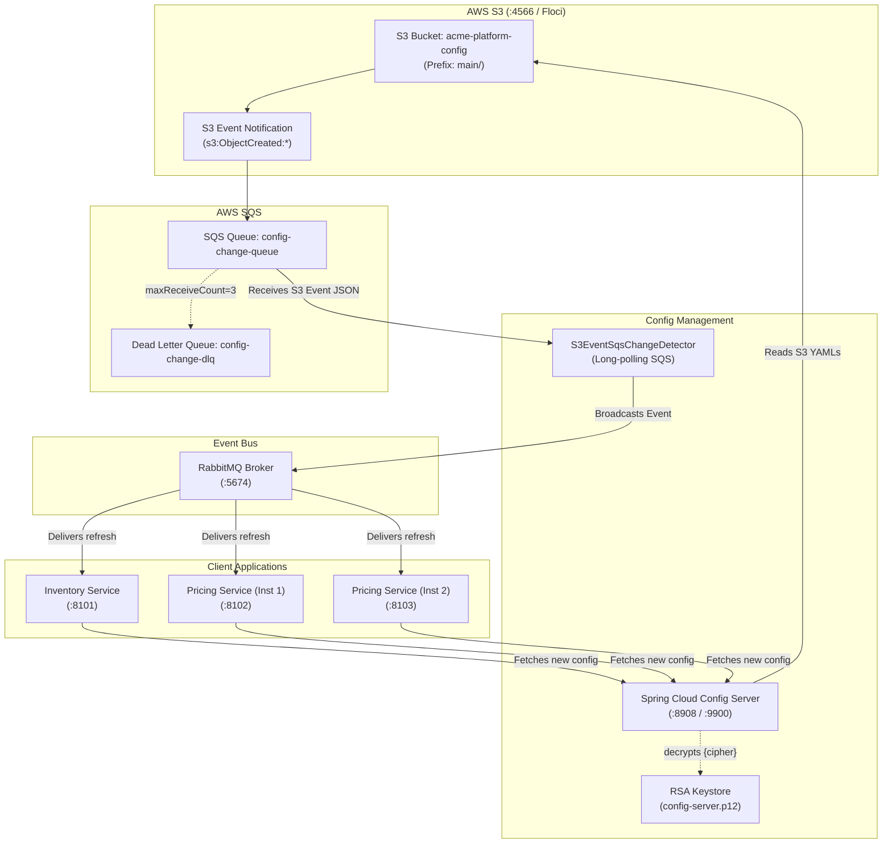
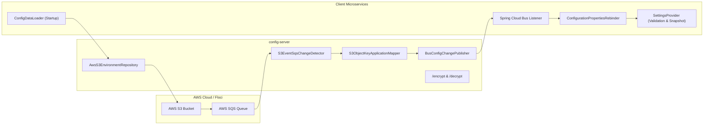
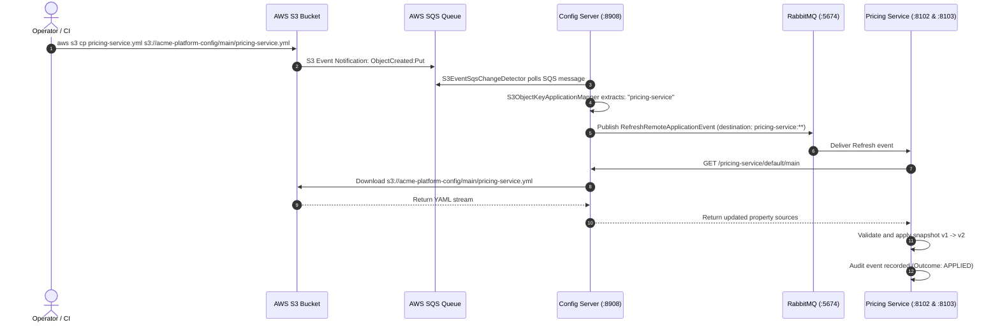

# Version C: AWS S3 + SQS Backend with Live Refresh over Spring Cloud Bus

> **Storage Backend:** AWS S3 Bucket (`acme-platform-config`) with object versioning  
> **Change Detection:** S3 Event Notification (`s3:ObjectCreated:*`) &rarr; SQS Queue (`config-change-queue`) &rarr; SQS Change Detector Thread &rarr; Spring Cloud Bus (RabbitMQ)  
> **Encryption:** Asymmetric RSA 4096-bit Keystore (PKCS12)  
> **Default Ports:** Config Server `8908` (Management: `9900`), Floci AWS Emulator `4566`, Inventory Service `8101`, Pricing Service `8102`, Pricing Service 2 `8103`

---

## 1. Architectural Overview

Version C stores YAML configuration files as versioned objects inside an **AWS S3 bucket**. 

When a configuration file is uploaded or modified in S3, S3 automatically publishes an **S3 Event Notification** to an **AWS SQS queue**. Config Server polls the SQS queue, maps the S3 object key (e.g. `main/pricing-service.yml`) to the target service (`pricing-service`), and broadcasts a refresh event across **Spring Cloud Bus** (RabbitMQ).



---

## 2. Component Diagram



---

## 3. Sequence Diagram: S3 Upload to Zero-Downtime Propagation



---

## 4. Quick Start: Build and Run

### Step 1: Ensure Local AWS Emulator (Floci) is Running
```bash
floci start
```

### Step 2: Provision S3 Bucket, SQS Queue & Notifications
```bash
cd version-c-s3
./scripts/provision-floci.sh
```

### Step 3: Generate Encryption Keystore
```bash
./scripts/generate-keystore.sh
```

### Step 4: Build Application JARs
```bash
mvn -Pfast package
```

### Step 5: Run with Docker Compose
```bash
docker compose -f docker/compose.yaml build --no-cache
docker compose -f docker/compose.yaml up -d
```

### Step 6: Verify Container Status
```bash
docker ps
```
All containers will report `(healthy)`:
- `cfg-s3-server` (Config Server on port `8908` / `9900`)
- `cfg-s3-inventory` (Inventory Service on port `8101`)
- `cfg-s3-pricing` (Pricing Service 1 on port `8102`)
- `cfg-s3-pricing-2` (Pricing Service 2 on port `8103`)
- `cfg-s3-rabbitmq` (RabbitMQ on port `5674`)

---

## 5. Testing Guide

### A. Automated Acceptance Test Suite
```bash
cd version-c-s3
./scripts/e2e-test.sh
```

---

### B. Manual Testing & Verification

#### 1. Query Config Server Environment API
```bash
# Pricing Service configuration from AWS S3
curl -s -u config-client:client-secret http://localhost:8908/pricing-service/default/main | jq .

# Inventory Service configuration (decrypted from S3)
curl -s -u config-client:client-secret http://localhost:8908/inventory-service/default/main | jq .
```

#### 2. Query Client Service Snapshots
```bash
# Inventory Service Snapshot
curl -s http://localhost:8101/api/v1/config/snapshot | jq .

# Pricing Service 1 & 2 Snapshots
curl -s http://localhost:8102/api/v1/config/snapshot | jq .
curl -s http://localhost:8103/api/v1/config/snapshot | jq .
```

#### 3. Test Business Endpoints
```bash
# Test Inventory reservation
curl -s -X POST http://localhost:8101/api/v1/inventory/reservations \
  -H 'Content-Type: application/json' \
  -d '{"sku":"SKU-1","quantity":10}' | jq .

# Test Price Quote calculation
curl -s "http://localhost:8102/api/v1/pricing/quotes/SKU-100?basePrice=1000.00" | jq .
```

---

### C. Testing Live Refresh via AWS CLI S3 Upload

#### Step 1: Upload an Updated Configuration to S3
```bash
export AWS_ENDPOINT_URL="http://localhost.floci.io:4566"
export AWS_ACCESS_KEY_ID="test"
export AWS_SECRET_ACCESS_KEY="test"
export AWS_DEFAULT_REGION="us-east-1"

# Upload updated pricing YAML to S3
cat <<'YAML' | aws s3 cp - s3://acme-platform-config/main/pricing-service.yml
pricing:
  currency: "INR"
  discount-percentage: 35.0
  surge-pricing-enabled: false
  surge-multiplier: 1.5
YAML
```

#### Step 2: Observe Automatic Propagation
Within ~0.5–1 second:
1. S3 fires an `ObjectCreated` event to SQS queue `config-change-queue`.
2. Config Server long-polls SQS, extracts application name `pricing-service`.
3. Config Server broadcasts event to RabbitMQ.
4. Both Pricing Service instances rebind and apply `v2`.

#### Step 3: Verify Live Price Quotes
```bash
curl -s "http://localhost:8102/api/v1/pricing/quotes/SKU-100?basePrice=1000.00" | jq .
curl -s "http://localhost:8103/api/v1/pricing/quotes/SKU-100?basePrice=1000.00" | jq .
```
Both instances will show:
- `discountPercentage: 35.0`
- `finalPrice: 650.00`
- `configVersion: 2`

---

## 7. Interactive OpenAPI 3 / Swagger Documentation

Every microservice exposes full OpenAPI 3.1 definitions and an interactive Swagger UI with live schema validation:

| Service | Swagger UI URL | OpenAPI 3 JSON Schema |
|---|---|---|
| **Inventory Service** | [http://localhost:8101/swagger-ui.html](http://localhost:8101/swagger-ui.html) | [http://localhost:8101/v3/api-docs](http://localhost:8101/v3/api-docs) |
| **Pricing Service (Inst 1)** | [http://localhost:8102/swagger-ui.html](http://localhost:8102/swagger-ui.html) | [http://localhost:8102/v3/api-docs](http://localhost:8102/v3/api-docs) |
| **Pricing Service (Inst 2)** | [http://localhost:8103/swagger-ui.html](http://localhost:8103/swagger-ui.html) | [http://localhost:8103/v3/api-docs](http://localhost:8103/v3/api-docs) |

### Features Included:
- **Rich DTO Schemas**: `@Schema` metadata including descriptions, example values, min/max constraints, and required fields.
- **Response Code Mapping**: Explicit `@ApiResponse` annotations documenting `200 OK`, `400 Bad Request` (RFC 9457), `404 Not Found`, and `500 Internal Server Error`.
- **Try-It-Out**: Directly execute quote calculations, stock reservations, and configuration snapshot inspections from your browser.

---

## 8. Production-Grade Security Hardening

### Security Filter Chain (`SecurityConfig.java`)
All microservices implement enterprise-grade HTTP security controls:
- **Stateless Session Management**: `SessionCreationPolicy.STATELESS` eliminates server-side session fixation vulnerabilities.
- **REST-Safe CSRF**: CSRF protection is safely disabled on stateless JSON endpoints in accordance with OWASP API Security guidelines.
- **Strict HTTP Security Response Headers**:
  - `Content-Security-Policy`: `"default-src 'self'; frame-ancestors 'none';"`
  - `Strict-Transport-Security`: `max-age=31536000; includeSubDomains` (HSTS)
  - `X-Frame-Options`: `DENY` (Clickjacking prevention)
  - `X-Content-Type-Options`: `nosniff` (MIME-sniffing prevention)
  - `Referrer-Policy`: `strict-origin-when-cross-origin`
  - `Permissions-Policy`: `"camera=(), microphone=(), geolocation=()"`

---

## 9. RFC 9457 Standardized Exception Handling

All uncaught exceptions and validation errors are intercepted by `@RestControllerAdvice` (`GlobalExceptionHandler`) and formatted as RFC 9457 `application/problem+json`:

```json
{
  "type": "https://api.acme.com/errors/validation-error",
  "title": "Validation Failed",
  "status": 400,
  "detail": "Request payload validation failed for 1 field(s)",
  "instance": "/api/v1/inventory/reservations",
  "errorId": "3b2e1f4a-718c-4a50-9d8a-1294875623c1",
  "timestamp": "2026-09-19T17:30:00Z",
  "fieldErrors": [
    {
      "field": "quantity",
      "rejectedValue": -5,
      "message": "Quantity must be greater than zero"
    }
  ]
}
```

### Handled Error Scenarios:
- **`MethodArgumentNotValidException` / `ConstraintViolationException`**: HTTP 400 with detailed `fieldErrors`.
- **`ConfigurationValidationException` / `IllegalStateException`**: HTTP 400 when business rules reject invalid configuration or payload state.
- **`NoResourceFoundException`**: HTTP 404 for nonexistent endpoints.
- **`HttpRequestMethodNotSupportedException`**: HTTP 405 for unsupported HTTP verbs.
- **`Exception` (Uncaught Fallback)**: HTTP 500 with unique `errorId` for log correlation without leaking internal stack traces.

---

## 10. Security Scanning & Quality Gates (SAST / SCA)

Every build is continuously analyzed by enterprise security and code quality gates:

```bash
# Run complete verification (Checkstyle, Spotless, SpotBugs + FindSecBugs, ArchUnit, JaCoCo)
mvn clean verify

# Run dedicated OWASP dependency vulnerability check (SCA)
mvn -Psecurity verify
```

| Quality Gate | Tool & Version | Inspection Scope |
|---|---|---|
| **SAST (Bytecode Analysis)** | SpotBugs 4.10.4 + `findsecbugs-plugin:1.13.0` | SQL injection, CSRF misconfiguration, insecure cryptography, path traversal, command injection |
| **SCA (Dependency Vulnerability)** | OWASP `dependency-check-maven:12.1.0` | Known CVEs in third-party libraries against the National Vulnerability Database (NVD) |
| **Architecture Enforcement** | ArchUnit 1.5.0 | Layer isolation, immutable snapshot boundaries, ban direct properties injection |
| **Code Formatting** | Spotless + google-java-format 1.36.1 | Deterministic code style formatting |
| **Static Code Analysis** | Checkstyle 14.1.0 | Coding conventions, naming standards, Javadoc hygiene |
| **Code Coverage** | JaCoCo 0.8.15 | Enforced line (>70%) and branch (>60%) coverage thresholds |

