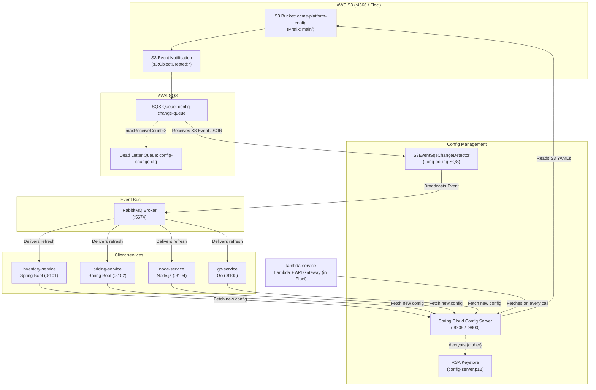
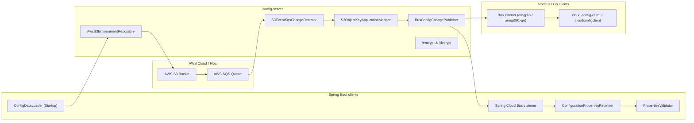
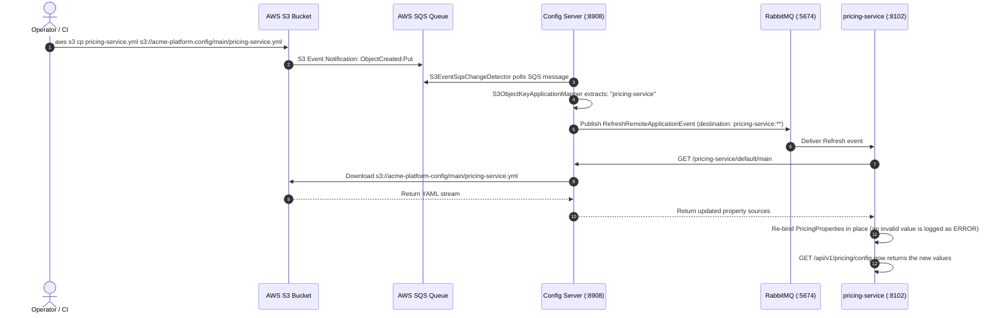
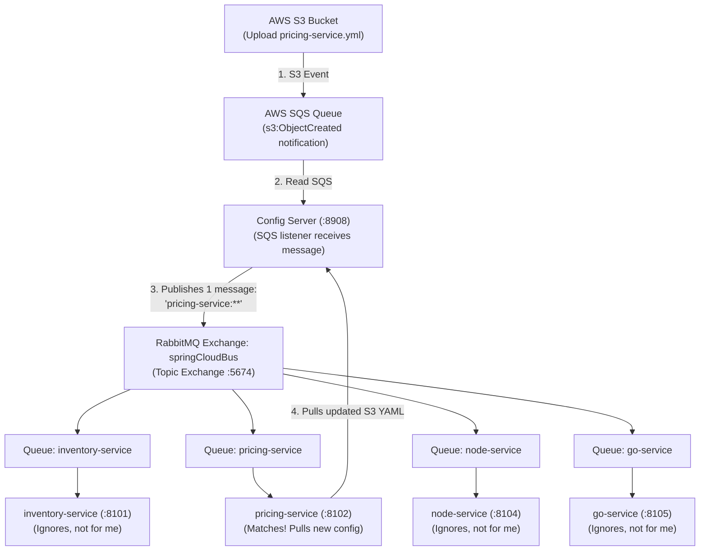

# Version C: AWS S3 + SQS Backend with Live Refresh over Spring Cloud Bus

> **Storage Backend:** AWS S3 Bucket (`acme-platform-config`) with object versioning  
> **Change Detection:** S3 Event Notification (`s3:ObjectCreated:*`) &rarr; SQS Queue (`config-change-queue`) &rarr; SQS Change Detector Thread &rarr; Spring Cloud Bus (RabbitMQ)  
> **Encryption:** Asymmetric RSA 4096-bit Keystore (PKCS12)  
> **Default Ports (host):** Config Server `8908` (Actuator `9900`), Floci AWS emulator `4566`, inventory-service `8101` (Actuator `9101`), pricing-service `8102` (Actuator `9102`), node-service `8104`, go-service `8105`, RabbitMQ `5674` / UI `15674`

---

## The services in this version

One Config Server, five clients in three languages. Every client has **one API** that returns
its own configuration, and every client picks up a change **without a restart**.

| Service | Language | Its API | How it hears about a change | README |
|---|---|---|---|---|
| inventory-service | Spring Boot | `GET :8101/api/v1/inventory/config` | Spring Cloud Bus (RabbitMQ) | [inventory-service/](inventory-service/README.md) |
| pricing-service | Spring Boot | `GET :8102/api/v1/pricing/config` | Spring Cloud Bus (RabbitMQ) | [pricing-service/](pricing-service/README.md) |
| node-service | Node.js 22 | `GET :8104/api/v1/node/config` | Spring Cloud Bus, via its own small RabbitMQ listener | [node-service/](node-service/README.md) |
| go-service | Go 1.23 | `GET :8105/api/v1/go/config` | Spring Cloud Bus, via its own small RabbitMQ listener | [go-service/](go-service/README.md) |
| lambda-service | AWS Lambda (Node.js 22) in Floci | `GET /api/v1/lambda/config` through API Gateway | none needed - it reads the Config Server on every call | [lambda-service/](lambda-service/README.md) |

Each lives in its own directory, builds on its own and shares no code with the others.

## 1. Architectural Overview

Version C stores YAML configuration files as versioned objects inside an **AWS S3 bucket**. 

When a configuration file is uploaded or modified in S3, S3 automatically publishes an **S3 Event Notification** to an **AWS SQS queue**. Config Server polls the SQS queue, maps the S3 object key (e.g. `main/pricing-service.yml`) to the target service (`pricing-service`), and broadcasts a refresh event across **Spring Cloud Bus** (RabbitMQ).


```mermaid
graph TD
    subgraph Storage["AWS S3 (:4566 / Floci)"]
        S3Bucket["S3 Bucket: acme-platform-config<br/>(Prefix: main/)"]
        S3Event["S3 Event Notification<br/>(s3:ObjectCreated:*)"]
        S3Bucket --> S3Event
    end

    subgraph MessagingQueue["AWS SQS"]
        SQS["SQS Queue: config-change-queue"]
        DLQ["Dead Letter Queue: config-change-dlq"]
        S3Event --> SQS
        SQS -. maxReceiveCount=3 .-> DLQ
    end

    subgraph ConfigLayer["Config Management"]
        CS["Spring Cloud Config Server<br/>(:8908 / :9900)"]
        Detector["S3EventSqsChangeDetector<br/>(Long-polling SQS)"]
        Keystore["RSA Keystore<br/>(config-server.p12)"]
        SQS -- Receives S3 Event JSON --> Detector
        CS -. decrypts {cipher} .-> Keystore
        CS -- Reads S3 YAMLs --> S3Bucket
    end

    subgraph MessagingBus["Event Bus"]
        RabbitMQ["RabbitMQ Broker<br/>(:5674)"]
    end

    subgraph Clients["Client services"]
        Inv["inventory-service<br/>Spring Boot (:8101)"]
        Prc["pricing-service<br/>Spring Boot (:8102)"]
        Node["node-service<br/>Node.js (:8104)"]
        Go["go-service<br/>Go (:8105)"]
    end

    Lambda["lambda-service<br/>Lambda + API Gateway (in Floci)"]

    Detector -- "Broadcasts Event" --> RabbitMQ
    RabbitMQ -- "Delivers refresh" --> Inv & Prc & Node & Go
    Inv & Prc & Node & Go -- "Fetch new config" --> CS
    Lambda -- "Fetches on every call" --> CS
```

---

## 2. Component Diagram


```mermaid
graph LR
    subgraph AWS["AWS Cloud / Floci"]
        S3["AWS S3 Bucket"]
        SQS["AWS SQS Queue"]
    end

    subgraph ConfigServer["config-server"]
        S3Repo["AwsS3EnvironmentRepository"]
        SqsDetector["S3EventSqsChangeDetector"]
        AppMapper["S3ObjectKeyApplicationMapper"]
        Publisher["BusConfigChangePublisher"]
        EncController["/encrypt & /decrypt"]
    end

    subgraph Clients["Spring Boot clients"]
        ConfigDataLoader["ConfigDataLoader (Startup)"]
        Rebinder["ConfigurationPropertiesRebinder"]
        Provider["PropertiesValidator"]
        BusListener["Spring Cloud Bus Listener"]
    end

    subgraph Polyglot["Node.js / Go clients"]
        Lib["cloud-config-client / cloudconfigclient"]
        OwnBus["Bus listener (amqplib / amqp091-go)"]
    end

    S3 --> SQS
    SQS --> SqsDetector
    SqsDetector --> AppMapper
    AppMapper --> Publisher
    Publisher --> OwnBus --> Lib
    Publisher --> BusListener
    BusListener --> Rebinder
    Rebinder --> Provider
    ConfigDataLoader --> S3Repo
    S3Repo --> S3
```

---

## 3. Sequence Diagram: S3 Upload to Zero-Downtime Propagation


```mermaid
sequenceDiagram
    autonumber
    actor Admin as Operator / CI
    participant S3 as AWS S3 Bucket
    participant SQS as AWS SQS Queue
    participant CS as Config Server (:8908)
    participant RMQ as RabbitMQ (:5674)
    participant Client as pricing-service (:8102)

    Admin->>S3: aws s3 cp pricing-service.yml s3://acme-platform-config/main/pricing-service.yml
    S3->>SQS: S3 Event Notification: ObjectCreated:Put
    CS->>SQS: S3EventSqsChangeDetector polls SQS message
    CS->>CS: S3ObjectKeyApplicationMapper extracts: "pricing-service"
    CS->>RMQ: Publish RefreshRemoteApplicationEvent (destination: pricing-service:**)
    RMQ->>Client: Deliver Refresh event
    Client->>CS: GET /pricing-service/default/main
    CS->>S3: Download s3://acme-platform-config/main/pricing-service.yml
    S3-->>CS: Return YAML stream
    CS-->>Client: Return updated property sources
    Client->>Client: Re-bind PricingProperties in place (an invalid value is logged as ERROR)
    Client->>Client: GET /api/v1/pricing/config now returns the new values
```

node-service and go-service follow the same steps with their own bus listener; lambda-service
reads the Config Server on every call, so it needs no broadcast at all.

---

## 4. Understanding RabbitMQ & Spring Cloud Bus (Layman's Guide & Web UI)

### The Core Role of RabbitMQ (The "Megaphone" Analogy)
Think of **RabbitMQ** as a central **broadcast megaphone**:
- **Without RabbitMQ**: Config Server would need to maintain an inventory of every client container IP/port and call each service's HTTP `/actuator/refresh` endpoint one by one.
- **With RabbitMQ & Spring Cloud Bus**: When an S3 object is uploaded, S3 sends an event to SQS. Config Server reads SQS and shouts **once** into RabbitMQ's topic exchange (`springCloudBus`): *"Hey everyone, `pricing-service` configuration has changed!"*. RabbitMQ automatically duplicates and delivers this message to every connected service's private queue.


```mermaid
graph TD
    S3["AWS S3 Bucket<br/>(Upload pricing-service.yml)"]
    SQS["AWS SQS Queue<br/>(s3:ObjectCreated notification)"]
    CS["Config Server (:8908)<br/>(SQS listener receives message)"]
    Ex["RabbitMQ Exchange: springCloudBus<br/>(Topic Exchange :5674)"]
    Q1["Queue: inventory-service"]
    Q2["Queue: pricing-service"]
    Q3["Queue: node-service"]
    Q4["Queue: go-service"]
    Inv["inventory-service (:8101)<br/>(Ignores, not for me)"]
    Prc["pricing-service (:8102)<br/>(Matches! Pulls new config)"]
    Node["node-service (:8104)<br/>(Ignores, not for me)"]
    Go["go-service (:8105)<br/>(Ignores, not for me)"]

    S3 -- "1. S3 Event" --> SQS
    SQS -- "2. Read SQS" --> CS
    CS -- "3. Publishes 1 message:<br/>'pricing-service:**'" --> Ex
    Ex --> Q1 --> Inv
    Ex --> Q2 --> Prc
    Ex --> Q3 --> Node
    Ex --> Q4 --> Go
    Prc -- "4. Pulls updated S3 YAML" --> CS
```

### Accessing the RabbitMQ Web Management Dashboard

RabbitMQ comes with an interactive web dashboard running out of the box:

- **Web Dashboard URL**: [http://localhost:15674](http://localhost:15674)
- **Username**: `guest`
- **Password**: `guest`

#### What to observe in the RabbitMQ UI:
1. **Connections Tab ("The Phone Lines")**:
   - You will see 5 active AMQP connections: the Config Server and the four clients.
   - **Service Name Identification**: each connection carries a readable name - the Spring services set it with `spring.cloud.stream.rabbit.binder.connection-name-prefix` (e.g. `inventory-service:8101#0`), and node-service / go-service use their bus id (e.g. `node-service:8104:3f2a...`).
   - *Tip*: Click the `+/-` icon on the top-right of the table to enable the **Client-provided name** column, or click any connection to inspect its details.
2. **Exchanges Tab ("The Router")**:
   - Click on **`springCloudBus`** (`topic` type) to see the broadcast bindings to each microservice's queue (`#`).
3. **Queues and Streams Tab ("The Inboxes")**:
   - See the temporary, auto-delete queues created by each microservice instance (`springCloudBus.anonymous.*`).
   - *Why anonymous names?* To ensure fan-out delivery so that every replica receives the refresh broadcast.
   - *How to match queue to service?* Click any queue &rarr; check **Consumers** to see the service name.
4. **Live Activity**: Upload an updated YAML to S3 and watch the **Message Rates** graph spike in real time!

### Why RabbitMQ instead of Kafka for Spring Cloud Bus?

Both **RabbitMQ** and **Apache Kafka** are supported by Spring Cloud Bus (`spring-cloud-starter-bus-amqp` vs `spring-cloud-starter-bus-kafka`). However, for a **configuration management bus**, **RabbitMQ is the industry-standard recommendation**:

#### A. The Nature of the Workload: "Ephemeral Broadcast" vs "Event Stream"

| Aspect | Spring Cloud Bus Requirement | RabbitMQ (Chosen) | Apache Kafka |
|---|---|---|---|
| **Message Type** | Rare, tiny notification signals *(e.g. "Pricing config updated")* | **Natural fit**: Built for point-in-time message routing. | **Mismatch**: Built for continuous streams of business data (millions of events/sec). |
| **History / Replay** | **Not needed**: If a pod boots up tomorrow, it pulls fresh config via HTTP `GET`. It does not need to replay past refresh events. | Discards messages immediately after delivery. | Retains and stores messages to disk in commit logs. |
| **Dynamic Scaling** | Pods scale from 2 to 50 and back down dynamically. | **Ephemeral Queues (`[AD]`)**: Creates a temporary queue on pod startup; deletes it the millisecond the pod terminates. | **Consumer Group Metadata**: Every replica needs a unique random Consumer Group, leaving behind orphaned metadata in Kafka when pods die. |
| **Resource Footprint** | Background infrastructure should be lightweight. | **~40–60 MB RAM**, starts in 2 seconds. | **~600 MB–1.5 GB RAM** (JVM + KRaft/Zookeeper), starts in 20–30s. |

#### B. The "Megaphone" Analogy (RabbitMQ) vs "The Permanent Archive" (Kafka)
- **RabbitMQ is a Megaphone**: When a config changes, Config Server shouts into the megaphone. Any microservice currently alive hears it and refreshes. If no one is listening or a pod is dead, the sound disappears. This is **exactly** what configuration refresh needs.
- **Kafka is a Recording Studio with Permanent Tape**: Kafka writes every shout onto disk, tracks offsets, and organizes data into partitions. For an occasional 1 KB config refresh ping once a week, spinning up Kafka partitions and storage segments is massive overkill.

#### C. Comparison Matrix

| Feature | RabbitMQ (Default) | Apache Kafka |
|---|---|---|
| **Spring Cloud Starter** | `spring-cloud-starter-bus-amqp` | `spring-cloud-starter-bus-kafka` |
| **Broker Memory Usage** | ~50 MB RAM | ~800 MB+ RAM |
| **Queue Lifecycle** | Automatically deleted on pod exit (`[AD]`) | Topic partition offsets must be managed/rebalanced |
| **Routing Flexibility** | Native Topic Exchanges (`pricing-service:**`) | Requires topic-per-service or manual payload filtering |
| **Local Dev & CI/CD Speed** | Instant startup in Docker/Testcontainers | Slower Docker spin-up |

#### D. Swapping to Kafka (If Required by Enterprise Policy)
If your organization mandates Apache Kafka, Spring Cloud Bus supports it via a simple **1-line dependency swap**:

**1. In `pom.xml`**:
```xml
<!-- Replace RabbitMQ: -->
<!-- <dependency>
       <groupId>org.springframework.cloud</groupId>
       <artifactId>spring-cloud-starter-bus-amqp</artifactId>
     </dependency> -->

<!-- With Kafka: -->
<dependency>
  <groupId>org.springframework.cloud</groupId>
  <artifactId>spring-cloud-starter-bus-kafka</artifactId>
</dependency>
```

**2. In `application.yml`**:
```yaml
spring:
  cloud:
    bus:
      id: ${spring.application.name}:${random.uuid}
  kafka:
    bootstrap-servers: localhost:9092
```

The Spring Boot code needs no change. **node-service and go-service do**: they talk to RabbitMQ
directly (`amqplib` / `amqp091-go`), so with Kafka their bus listener would have to be rewritten
on a Kafka client. lambda-service is unaffected - it never uses the bus.

---

## 5. Quick Start: Build and Run

### Where to run these commands

Everything below runs from **`version-c-s3/`**, not from the repository root. Every code block
starts with a `# from: ...` comment saying which directory it assumes.

```
springboot-external-properties-demo-II/     <- repository root
├── version-a-git/
├── version-b-jdbc/
└── version-c-s3/                           <- run everything from HERE
    ├── config-server/  inventory-service/  pricing-service/   <- Spring Boot
    ├── node-service/   go-service/   lambda-service/        <- Node.js, Go, AWS Lambda
    ├── docker/compose.yaml                 <- referenced as docker/compose.yaml, so cwd matters
    ├── k8s/                                <- deploy (minikube + EKS) / verify / teardown
    ├── scripts/                            <- provisioning, keystore, e2e test, docker teardown
    ├── seed-config/                        <- uploaded to S3 by provision-floci.sh
    └── secrets/                            <- generated, gitignored, never committed
```

To get there from a fresh clone:

```bash
# from: wherever you keep your projects
git clone https://github.com/kirankumarhm/springboot-config-server-external-properties-demo.git
cd springboot-config-server-external-properties-demo/version-c-s3
```

`seed-config/` is **not** what the Config Server reads - it is only the initial content that
`provision-floci.sh` uploads. Once the bucket exists, **S3 is the source of truth**: editing a
file in `seed-config/` changes nothing until you upload it (section 7.C), exactly as editing a
file locally changes nothing for version A's remote Git backend until you push.

Every `aws` command needs the emulator's endpoint and credentials in the environment. Export them
once per shell:

```bash
# from: anywhere - these apply to the whole shell session
export AWS_ENDPOINT_URL="http://localhost.floci.io:4566"
export AWS_ACCESS_KEY_ID="test"
export AWS_SECRET_ACCESS_KEY="test"
export AWS_DEFAULT_REGION="us-east-1"
```

*(`scripts/provision-floci.sh`, `scripts/e2e-test.sh` and the k8s scripts set these themselves, so
the export is only needed when you run `aws` by hand.)*

### Prerequisites
- **Java 21** and **Maven 3.9+** (`java -version`, `mvn -v`)
- **Docker & Docker Compose** with Docker Desktop running (`docker ps`)
- **`keytool`** - ships with the JDK, so Java 21 covers it
- **Floci** - the local AWS emulator (`floci status`). Used instead of LocalStack here
- **`aws` CLI v2** - provisioning and the upload examples use the real AWS APIs
- **`jq`** and **`python3`** - used by the curl examples and by `scripts/e2e-test.sh`
- **Node.js 22** and **npm** - only to test node-service / lambda-service, or run them without Docker
- **Go 1.23** - only to test go-service or run it without Docker (Docker builds it for you otherwise)

Check all of them in one go:

```bash
# from: version-c-s3/
java -version && mvn -v && docker ps >/dev/null && keytool -help >/dev/null 2>&1 && floci status && aws --version && jq --version && python3 -V
```

### Step 1: Ensure the Local AWS Emulator (Floci) is Running
```bash
# from: anywhere
floci start
```

### Step 2: Provision S3 Bucket, SQS Queues & Notifications
```bash
# from: version-c-s3/
./scripts/provision-floci.sh
```
This is idempotent and does five things:
1. Creates the bucket `acme-platform-config` if missing.
2. Enables **object versioning** - the audit trail that replaces `git log`, and what makes AC-21 (rollback to a prior version) possible.
3. Creates `config-change-dlq`, then `config-change-queue` with a redrive policy pointing at it (`maxReceiveCount=3`), so a poison message lands in the DLQ instead of blocking the queue forever.
4. Wires `s3:ObjectCreated:*` and `s3:ObjectRemoved:*` notifications for the `main/` prefix to the queue.
5. Uploads `seed-config/*.yml` to `s3://acme-platform-config/main/` - the same configuration content version A keeps in `config-repo/`.

> The object keys are byte-identical to version A's filenames (`use-directory-layout: false`), so the same configuration is portable across all three backends.

### Step 3: Generate the Encryption Keystore

```bash
# from: version-c-s3/
./scripts/generate-keystore.sh
```

**Why this step exists at all**, since nothing in `seed-config/` is currently encrypted: the
Config Server is configured with `encrypt.key-store.*` in
`config-server/src/main/resources/application.yml`, and Spring Cloud Config resolves that keystore
while it is still *preparing the environment* - before the application context is even built. If
the file is not there, the server does not start degraded, it **does not start at all**:

```
java.lang.IllegalStateException: Invalid keystore location
    at org.springframework.cloud.bootstrap.encrypt.TextEncryptorUtils.createTextEncryptor(...)
```

So this is a hard prerequisite for Steps 5 onward, not an optional security extra. It is also
early because the keystore is **not in Git** (`secrets/` is gitignored) - a fresh clone has no
keystore, and that is deliberate: a private key in a repository is a private key you have to
assume is compromised.

**What the script creates** (it is idempotent - run it twice and the second run prints
`Keystore already exists` and changes nothing):

| Property | Value | Where it comes from |
|---|---|---|
| Path | `version-c-s3/secrets/config-server.p12` | fixed, relative to the script |
| Format | PKCS12 | `-storetype PKCS12` |
| Key | RSA 4096-bit, valid 10 years | `-keyalg RSA -keysize 4096 -validity 3650` |
| Alias | `configkey` | `$ENCRYPT_KEYSTORE_ALIAS`, default `configkey` |
| Password | `keystore-secret` | `$ENCRYPT_KEYSTORE_PASSWORD`, default `keystore-secret` |
| Permissions | `600` (owner read/write only) | `chmod 600` |

Those last three must match what the server is told to look for - Compose passes them as
`ENCRYPT_KEYSTORE_ALIAS` / `ENCRYPT_KEYSTORE_PASSWORD` (section 6), and Kubernetes takes the file
as a Secret with the password from `config-credentials` (section 8). Inspect what you generated:

```bash
# from: version-c-s3/
keytool -list -keystore secrets/config-server.p12 -storepass keystore-secret
```

**Why a keystore (asymmetric) rather than a plain `encrypt.key` (symmetric).** With an RSA keypair
the private key never leaves the Config Server, and an operator - or a CI pipeline uploading
objects to S3, which is the model in this version - can be handed only the public certificate and
still *encrypt* new values. A shared symmetric secret gives everyone who can encrypt the ability
to decrypt.

This matters more here than in the other two backends: an S3 bucket is far easier to grant broad
read access to than a Git repository or a database, so the fact that a `{cipher}` value in an
object is useless without the Config Server's private key is doing real work.

> **PKCS12 has no separate key password, and that is a real trap.** `keytool` silently ignores
> `-keypass` for a PKCS12 store, so `encrypt.key-store.secret` **must equal**
> `encrypt.key-store.password`. Set them differently and startup fails with
> `UnrecoverableKeyException: Get Key failed: Given final block not properly padded`.

**What you can now do with it.** Once the stack is up (Step 5), encrypt a secret and put the
ciphertext in the object instead of the plaintext:

```bash
# from: anywhere (these are just HTTP calls)
CIPHER=$(curl -s -u config-admin:admin-secret -X POST http://localhost:8908/encrypt \
  -H "Content-Type: text/plain" --data-binary "s3cr3t-db-password")
echo "$CIPHER"
```

```bash
# from: version-c-s3/ (with the AWS_* exports above in this shell)
cat <<YAML | aws s3 cp - s3://acme-platform-config/main/inventory-service.yml
inventory:
  warehouse-code: "WH-BLR-01"
  max-order-quantity: 400
  express-shipping-enabled: true
  low-stock-threshold: 25
  api-key: "{cipher}$CIPHER"
YAML
```

Clients never see the ciphertext: the Config Server decrypts on the way out with the private key
and serves the plaintext, so `{cipher}` is transparent to the application. The upload also fires
the S3 event, so the new value propagates immediately.

> **The failure mode to recognise.** If a `{cipher}` value cannot be decrypted with the current
> keystore - typically because the keystore was regenerated after the value was encrypted, which
> produces a *new* keypair - the Config Server does not error. It serves the key renamed to
> `invalid.<key>` with the value `<n/a>`. The client then fails validation on a missing property
> and it looks like an application bug. If you see `invalid.` anywhere in an Environment API
> response, the keystore no longer matches the ciphertext: re-encrypt the value with the current
> key, or restore the keystore that encrypted it.
>
> Note that `seed-config/` contains **no `{cipher}` values**, so nothing in the default setup
> exercises decryption. The keystore is still mandatory, for the startup reason above.

### Step 4: Build Application JARs & Container Images

You can build the applications using either standard Maven packaging with Docker Compose, or containerize directly using **Google Jib 3.5.2**:

```bash
# from: version-c-s3/

# Option A: Build host JARs for Docker Compose
mvn -Pfast package

# Option B: Build container images directly into local Docker daemon with Google Jib 3.5.2
mvn compile jib:dockerBuild

# Option C: Build container images as standalone tarballs without a Docker daemon
mvn compile jib:buildTar
```
*(`-Pfast` skips the quality gates - Spotless, Checkstyle, SpotBugs, JaCoCo - which are not needed to produce a runnable jar.)*

### Step 5: Run with Docker Compose
```bash
# from: version-c-s3/
docker compose -f docker/compose.yaml up -d --build
```

Compose builds node-service and go-service itself (they download their dependencies while
building). **Behind a TLS-inspecting corporate proxy** such as Zscaler that fails with
`x509: certificate signed by unknown authority`; export the proxy's root certificate first:
`export EXTRA_CA_CERT="$(cat proxy-root.pem)"` (on macOS:
`security find-certificate -a -c Zscaler -p /Library/Keychains/System.keychain`).

Then deploy lambda-service to Floci (it is not a container in this file):

```bash
# from: version-c-s3/
floci start                                  # if it is not running yet
./lambda-service/scripts/deploy-floci.sh     # role, function and API Gateway route
./lambda-service/scripts/invoke-floci.sh     # -> {"greeting":"Hello from AWS Lambda",...}
```

### Step 6: Verify Container Status
```bash
# from: version-c-s3/
docker compose -f docker/compose.yaml ps
```
All 6 containers will report `(healthy)`:

| Container | Role | Host ports | Image tag built by Compose |
|---|---|---|---|
| `cfg-s3-server` | Config Server | `8908`, `9900` | `config-s3-demo-config-server:latest` |
| `cfg-s3-inventory` | inventory-service | `8101`, `9101` | `config-s3-demo-inventory-service:latest` |
| `cfg-s3-pricing` | pricing-service | `8102`, `9102` | `config-s3-demo-pricing-service:latest` |
| `cfg-s3-node` | node-service | `8104` | `config-s3-demo-node-service:latest` |
| `cfg-s3-go` | go-service | `8105` | `config-s3-demo-go-service:latest` |
| `cfg-s3-rabbitmq` | RabbitMQ broker | `5674`, `15674` | `rabbitmq:4-management` (pulled) |

The tags come from `name: config-s3-demo` on line 1 of `docker/compose.yaml` (`<project>-<service>:latest`). The Kubernetes manifests in `k8s/` reference these exact strings.

Ask each client for its configuration:

```bash
# from: anywhere (these are just HTTP calls)
curl -s http://localhost:8101/api/v1/inventory/config
curl -s http://localhost:8102/api/v1/pricing/config
curl -s http://localhost:8104/api/v1/node/config
curl -s http://localhost:8105/api/v1/go/config
```

**Floci runs outside this Compose stack** (`floci start`), so there is no S3/SQS container. Reaching it from inside a container needs the two `extra_hosts` entries at the top of `docker/compose.yaml`: `localhost.floci.io` and `acme-platform-config.localhost.floci.io`, both mapped to `host-gateway`. The bucket-prefixed one is not optional - the AWS SDK uses **virtual-host-style** addressing (`<bucket>.<host>`) against a custom endpoint, and `AwsS3EnvironmentRepositoryFactory` builds its own `S3Client` with no path-style option to turn that off.

### Step 7: Shut Down

`./scripts/teardown-docker.sh` is tiered, prints what it is about to do, and asks first:

```bash
# from: version-c-s3/
./scripts/teardown-docker.sh                     # remove the containers and network
./scripts/teardown-docker.sh --stop              # only stop them; resume with `docker compose start`
./scripts/teardown-docker.sh --volumes           # also remove anonymous volumes
./scripts/teardown-docker.sh --images            # also remove built images, incl. per-deploy 1.0.0-* tags
./scripts/teardown-docker.sh --base-images       # also remove rabbitmq:4-management
./scripts/teardown-docker.sh --jars              # also run `mvn clean`
./scripts/teardown-docker.sh --stop-floci        # also `floci stop` (bucket and queues survive)
./scripts/teardown-docker.sh --all -y            # --volumes --images --jars, no prompt
```

**No option above can lose your configuration** - it lives in S3, outside Docker. The one that
can is deliberately separate:

```bash
# from: version-c-s3/
./scripts/teardown-docker.sh --purge-aws         # empties the bucket and deletes both queues
```

Recover from that by re-running `./scripts/provision-floci.sh`, which re-seeds from
`seed-config/`. `--stop-floci` is also separate from `--stop` on purpose: other projects may be
using the emulator, and a stop preserves the bucket and queues either way.

> `--images` also sweeps the `1.0.0-<timestamp>` tags that `k8s/deploy-floci-eks.sh` creates on
> every EKS deploy. Nothing else cleans those up, and they accumulate one set per deploy.

---

## 6. Configuration & Environment Variables

The default compiled into `config-server/src/main/resources/application.yml` and the value
`docker/compose.yaml` actually sets are **not** always the same:

| Variable | Default in `application.yml` | Set by `docker/compose.yaml` | Description |
|---|---|---|---|
| `CONFIG_BUCKET` | `acme-platform-config` | same | S3 bucket holding the configuration objects |
| `CONFIG_KEY_PREFIX` | `main/` | same | Key prefix. In the S3 backend the prefix **is** the label: `main/` = label `main` |
| `CONFIG_CHANGE_QUEUE` | `config-change-queue` | same | SQS queue receiving the S3 event notifications |
| `AWS_REGION` | `us-east-1` | same | AWS region |
| `AWS_ENDPOINT` | `http://localhost.floci.io:4566` | same | Endpoint override. **Delete it on real AWS** and attach an IAM role via IRSA instead |
| `AWS_ACCESS_KEY_ID` / `AWS_SECRET_ACCESS_KEY` | `test` / `test` | same | Static credentials for the emulator only. Omit on real AWS so the Default Credential Provider Chain takes over |
| `MANAGEMENT_PORT` | `9888` | `9888` (published as `9900`) | Actuator port - a separate management child context |
| `ENCRYPT_KEYSTORE_LOCATION` | `file:./secrets/config-server.p12` | `file:/secrets/config-server.p12` | RSA PKCS12 keystore (mounted read-only) |
| `ENCRYPT_KEYSTORE_PASSWORD` | `keystore-secret` | same | Keystore password; also the key password - PKCS12 has no separate one |
| `ENCRYPT_KEYSTORE_ALIAS` | `configkey` | same | Key alias inside the keystore |
| `CONFIG_ADMIN_USERNAME` / `CONFIG_ADMIN_PASSWORD` | `config-admin` / `{noop}admin-secret` | password only | Admin auth for `/encrypt`, `/decrypt`, `/actuator/busrefresh` |
| `CONFIG_CLIENT_USERNAME` / `CONFIG_CLIENT_PASSWORD` | `config-client` / `{noop}client-secret` | password only | Client auth for the Environment API |
| `RABBITMQ_HOST` / `RABBITMQ_PORT` | `localhost` / `5672` | `rabbitmq` / *(default)* | Spring Cloud Bus broker |

Two server-side settings have no environment variable and are set in `application.yml`:
`spring.profiles.active: awss3` (the profile name Spring Cloud Config keys
`AwsS3EnvironmentRepository` off - it is load-bearing) and
`app.known-applications: inventory-service,pricing-service`, which lets
`S3ObjectKeyApplicationMapper` resolve a profile suffix exactly instead of guessing at dashes.

---

## 7. Testing Guide

### A. Automated Acceptance Test Suite

Every change is an upload with `aws s3 cp` - the real operator path. S3 event delivery is
**at-least-once and unordered**, so besides the common checks this suite proves the refresh path
is idempotent and that bad messages are contained:

- every client returns only its own properties, and an upload reaches **only** the service that
  owns it, within the 5-second SLA - for Spring Boot, Node.js, Go and Lambda alike;
- restoring an earlier **object version** rolls a change back by the same path (S3 versioning is
  this backend's `git revert`);
- three **duplicate** S3 events change nothing;
- a **malformed message** ends up in the dead-letter queue and does not block real changes;
- the security and error-format rules.

```bash
# from: version-c-s3/
./scripts/e2e-test.sh                 # 45 checks (about 3 minutes: the dead-letter check waits for retries)
SKIP_LAMBDA=1 ./scripts/e2e-test.sh   # skips the lambda-service checks
```

It needs Floci running, the stack provisioned and up (section 5), lambda-service deployed, plus
`aws` and `python3` on the PATH. It restores its baseline at the end, so it can be run again.

---

### B. Manual Testing & Verification

#### 1. Query Config Server Environment API
```bash
# from: anywhere (these are just HTTP calls)
# Pricing Service configuration from AWS S3
curl -s -u config-client:client-secret http://localhost:8908/pricing-service/default/main | jq .

# Inventory Service configuration (decrypted from S3)
curl -s -u config-client:client-secret http://localhost:8908/inventory-service/default/main | jq .
```

#### 2. Ask each client what it is using
```bash
# from: anywhere (these are just HTTP calls)
curl -s http://localhost:8101/api/v1/inventory/config | jq .
curl -s http://localhost:8102/api/v1/pricing/config | jq .
curl -s http://localhost:8104/api/v1/node/config | jq .
curl -s http://localhost:8105/api/v1/go/config | jq .
./lambda-service/scripts/invoke-floci.sh        # from: version-c-s3/
```
Each returns only its own properties.

The SQS change-detection path has its own health indicator, so a dead poller is visible rather
than silent:
```bash
# from: anywhere (these are just HTTP calls)
curl -s http://localhost:9900/actuator/health | jq '.components.configChange'
```

---

### C. Testing Live Refresh via AWS CLI S3 Upload

#### Step 1: Upload an Updated Configuration to S3
```bash
# from: anywhere - this block exports the AWS_* variables itself
export AWS_ENDPOINT_URL="http://localhost.floci.io:4566"
export AWS_ACCESS_KEY_ID="test"
export AWS_SECRET_ACCESS_KEY="test"
export AWS_DEFAULT_REGION="us-east-1"

# Upload updated pricing YAML to S3
cat <<'YAML' | aws s3 cp - s3://acme-platform-config/main/pricing-service.yml
pricing:
  currency: "INR"
  discount-percentage: 35.0
  surge-pricing-enabled: false
  surge-multiplier: 1.5
YAML
# (cat <<'YAML' replaces the whole object: keep every key of the file, not only the one you change)
```

#### Step 2: Observe Automatic Propagation
Within ~0.5–1 second:
1. S3 fires an `ObjectCreated` event to SQS queue `config-change-queue`.
2. Config Server long-polls SQS, extracts application name `pricing-service`.
3. Config Server broadcasts event to RabbitMQ.
4. pricing-service re-binds its properties.

#### Step 3: Verify the new value
```bash
# from: anywhere (these are just HTTP calls)
curl -s http://localhost:8102/api/v1/pricing/config | jq .discountPercentage   # -> 35.0
curl -s http://localhost:8101/api/v1/inventory/config | jq .                   # unchanged
```
The same works for node-service and go-service (upload `node-service.yml` / `go-service.yml`),
and lambda-service shows a change on its very next call.

#### Step 4: Roll Back Using S3 Object Versioning
Versioning is this backend's `git log`. Listing versions and copying an older one back over the
current key re-fires the `ObjectCreated` event, so a rollback propagates by the same path as a
change - this is AC-21:
```bash
# from: version-c-s3/ (with the AWS_* exports from section 5 in this shell)
aws s3api list-object-versions --bucket acme-platform-config \
  --prefix main/pricing-service.yml --query 'Versions[].[VersionId,LastModified]' --output table

aws s3api copy-object --bucket acme-platform-config --key main/pricing-service.yml \
  --copy-source "acme-platform-config/main/pricing-service.yml?versionId=<PREVIOUS_VERSION_ID>"
```

### What happens with an invalid value

The Spring services check their values against rules in their `config/*Properties.java`
(`@Min`, `@Max`, `@DecimalMax`, ...); node-service, go-service and lambda-service check theirs in
`node-config.js` / `goconfig.go` / `lambda-config.js`.

| When the bad value arrives | Spring Boot services | node-service / go-service | lambda-service |
|---|---|---|---|
| At startup | refuse to start: `Invalid pricing configuration: pricing.discountPercentage must be less than or equal to 90.0` | refuse to start, same kind of message | n/a |
| In a refresh | keep running, log `ERROR Refreshed pricing configuration is invalid: ...` | **keep the values they already had** and log the error | answer `503` problem details until it is fixed |

Try it: upload `pricing-service.yml` with `discount-percentage: 95.0`, and watch `docker logs -f cfg-s3-pricing`.
Then set it back.


---

## 8. Running on Kubernetes

The manifests in `k8s/` run the same stack on Kubernetes. There are two target clusters, each with
its own script.

### A. Local minikube

```bash
# from: version-c-s3/
./k8s/deploy-minikube.sh
```

It builds the jars, builds the images on the **host** Docker daemon, `minikube image load`s them,
applies the manifests in order, waits for each rollout, and runs `./k8s/verify-in-cluster.sh`.

| Manifest | What it creates |
|---|---|
| `00-namespace-and-config.yaml` | Namespace `config-demo`, ConfigMaps `config-server-env` and `client-env`, Secret `config-credentials` |
| `01-dependencies.yaml` | RabbitMQ Deployment (no S3/SQS container - that is Floci or real AWS, outside the cluster) |
| `02-config-server.yaml` | Config Server (2 replicas) + Service |
| `03-clients.yaml` | `inventory-service`, `pricing-service`, `node-service`, `go-service` (1 replica each) + Services |

The keystore is **not** in any manifest - it is a real secret (and `secrets/` is gitignored), so
it is created from the local file. **This is mandatory:** `k8s/02-config-server.yaml` mounts a
volume whose `secretName` is `config-encryption-keystore`, and Kubernetes will not start a
container whose volumes cannot be mounted. Skip it and the pods sit in `ContainerCreating` with:

```
Warning  FailedMount  54s (x8 over 118s)  kubelet  MountVolume.SetUp failed for volume
         "encryption-keystore" : secret "config-encryption-keystore" not found
```

Note the relative path - this must run from `version-c-s3/`:

```bash
# from: version-c-s3/   # the --from-file path is relative to it
kubectl -n config-demo create secret generic config-encryption-keystore \
  --from-file=config-server.p12=secrets/config-server.p12
```

The name left of the `=` is what the container sees as `/secrets/config-server.p12`, which is what
`ENCRYPT_KEYSTORE_LOCATION` points at. If you hit the error above, just create the Secret - the
kubelet retries the mount, so the stuck pods start on their own; `kubectl -n config-demo rollout
restart deployment/config-server` stops the waiting. To *replace* a Secret that holds a stale
keystore, add `--dry-run=client -o yaml | kubectl apply -f -`. `./k8s/deploy-minikube.sh` does all
of this for you, which is why it cannot be forgotten there.

Three constraints are specific to this backend and each one blocks the deployment if missed:

- **`AWS_ENDPOINT` must be an IP address, not a hostname, when pointing at a local emulator.**
  `AwsS3EnvironmentRepositoryFactory` builds its own `S3Client` with no injection point and no
  path-style option, so with a hostname the SDK uses virtual-host addressing and needs
  `<bucket>.<host>` to resolve in cluster DNS. The SDK falls back to **path-style** automatically
  when the endpoint host is a bare IP - which is why `00-namespace-and-config.yaml` ships
  `AWS_ENDPOINT: "http://172.17.0.2:4566"` (Floci on the Docker bridge). Check the address matches
  your machine before deploying. **On real AWS: delete the `AWS_ENDPOINT` line and the static
  credentials in the Secret, and attach an IAM role via IRSA instead.**
- **Images are built on the host and loaded in, not pulled.** On this machine the cluster cannot
  pull from Docker Hub (`x509: certificate signed by unknown authority`, a corporate TLS
  certificate the host trusts being absent from the VM's trust store).
- **`enableServiceLinks: false` is set in the pod specs on purpose.** Kubernetes would otherwise
  inject `RABBITMQ_PORT=tcp://10.x.x.x:5672`, colliding with the property of the same name, and
  Boot fails with `NumberFormatException`.

### B. Floci's EKS (a real k3s control plane)

```bash
# from: version-c-s3/
./k8s/deploy-floci-eks.sh
```

`floci eks create-cluster` starts a `rancher/k3s` container and publishes its API server, so this
is a genuine control plane rather than a mock. The script writes a self-contained kubeconfig to
`k8s/floci-eks.kubeconfig` (API server `https://localhost:6500`) using k3s's own client
certificate - deliberately **not** what `aws eks update-kubeconfig` produces, which writes an exec
credential plugin that shells out to `aws eks get-token` and therefore fails in GUI tools like k9s
with "Unable to locate credentials".

Three traps the script exists to handle:

- **The container runtime cannot pull from Docker Hub.** The first symptom is *not* an error on
  your own pods - it is every pod stuck in `ContainerCreating`, because k3s cannot pull
  `rancher/mirrored-pause`, the sandbox image every pod needs. The node still reports `Ready`,
  which makes the cluster look healthy. The script handles it twice over: a `registries.yaml` that
  skips verification, plus pre-importing images from the host daemon.
- **No DNS, so every client crash-loops - and it looks like a Config Server problem.** k3s runs
  its own system pods (CoreDNS, the storage provisioner, metrics-server) and pulls their images
  on first start; behind the same TLS proxy those pulls fail too. Without CoreDNS no pod can
  resolve a Service name, so node-service logs `getaddrinfo EAI_AGAIN config-server` and the Spring
  services `I/O error on GET request for "http://config-server:8888/..."`. The script reads the
  list of system images from the cluster, pulls each on the host (falling back to Google's Docker
  Hub mirror `mirror.gcr.io`), and imports them. A multi-platform image that containerd rejects
  (`content digest ... not found`) is rebuilt as a single-platform image first.
- **A mutable `:latest` tag silently runs stale code.** With `imagePullPolicy: IfNotPresent` the
  kubelet resolves `:latest` once and pins that image ID; re-importing a rebuilt image under the
  same tag updates the tag in containerd while running pods keep the old ID - so a code change
  appears to deploy and does nothing. Every deploy therefore gets a unique tag
  (`1.0.0-<timestamp>`), and the script **asserts** the pod's `imageID` equals the image just
  built rather than trusting the rollout.

### Verifying, either way

```bash
# from: version-c-s3/
./k8s/verify-in-cluster.sh
```

It finishes with `ALL 13 CHECKS PASSED (in-cluster)`: one `aws s3 cp` per service changes a value
for inventory-service, pricing-service, node-service and go-service, and every pod of that service
must serve it with no restart; an unrelated service must stay untouched; and the object's version
history must be kept. On minikube, point it at minikube's cluster:
`KUBECONFIG_OVERRIDE=~/.kube/config ./k8s/verify-in-cluster.sh` (`deploy-minikube.sh` does this).

`verify-in-cluster.sh` queries **individual pod IPs** rather than the Service, because a Service
would load-balance and could hide a replica that never received the broadcast - exactly the
failure this design must not have.

### Tearing down

`teardown.sh` takes the **target explicitly** - deleting from the wrong cluster leaves a live
stack behind while reporting success:

```bash
# from: version-c-s3/
./k8s/teardown.sh                        # minikube (default): namespace only; next deploy is fast
./k8s/teardown.sh --eks                  # same, on the Floci EKS cluster
./k8s/teardown.sh --eks --images         # also clear the accumulated per-deploy image tags
./k8s/teardown.sh --jars                 # also run `mvn clean`
./k8s/teardown.sh --stop                 # minikube: stop the VM. --eks: `floci stop`
./k8s/teardown.sh --delete-cluster       # minikube: delete the VM. --eks: `aws eks delete-cluster`
./k8s/teardown.sh --all -y               # --images --jars --stop, no prompt
```

Two things specific to this backend:

- **`--eks --images` matters more here than anywhere else.** Every EKS deploy builds a unique
  immutable tag (`1.0.0-<timestamp>`, see the `:latest` trap above), so tags accumulate one set
  per deploy in both the k3s containerd namespace and the host daemon. The script removes them by
  pattern, and `--delete-cluster` also deletes the now-stale `k8s/floci-eks.kubeconfig` so the
  next run does not fail with a confusing "connection refused".
- **No teardown above touches your configuration.** It lives in S3, outside the cluster. The one
  flag that does is deliberately separate:

  ```bash
  ./k8s/teardown.sh --purge-aws     # empties the bucket (all object versions) and deletes both queues
  ```

  That removes the source of truth. Recover by re-running `./scripts/provision-floci.sh`, which
  re-seeds from `seed-config/`. The purge sweeps **object versions and delete markers**
  explicitly, because with versioning enabled `aws s3 rm --recursive` leaves every non-current
  version behind and the bucket is not actually empty.

Both paths also close any `kubectl port-forward` left open for the namespace - they outlive their
pods and then fail with "address already in use" on the next deploy.

---

## 9. Interactive OpenAPI 3 / Swagger Documentation

Every microservice exposes full OpenAPI 3.1 definitions and an interactive Swagger UI with live schema validation:

| Service | Swagger UI | OpenAPI 3 document |
|---|---|---|
| **inventory-service** | [http://localhost:8101/swagger-ui.html](http://localhost:8101/swagger-ui.html) | [http://localhost:8101/v3/api-docs](http://localhost:8101/v3/api-docs) |
| **pricing-service** | [http://localhost:8102/swagger-ui.html](http://localhost:8102/swagger-ui.html) | [http://localhost:8102/v3/api-docs](http://localhost:8102/v3/api-docs) |
| **node-service** | - (paste the document into [editor.swagger.io](https://editor.swagger.io)) | [http://localhost:8104/v3/api-docs](http://localhost:8104/v3/api-docs) |
| **go-service** | - (paste the document into [editor.swagger.io](https://editor.swagger.io)) | [http://localhost:8105/v3/api-docs](http://localhost:8105/v3/api-docs) |
| **lambda-service** | - | [lambda-service/openapi.json](lambda-service/openapi.json) (the API Gateway route) |

### Features Included:
- **Schemas with examples**: every field of every response is described, with an example value.
- **Documented responses**: `200` with the body, and errors as RFC 9457 problem details.
- **Try-It-Out** (Spring services): call the API from the browser.

---

## 10. Production-Grade Security Hardening

### Security Filter Chain (`SecurityConfig.java`)
The Spring services implement these HTTP security controls (node-service, go-service and
lambda-service send the same response headers; see their READMEs):
- **Deny by default**: only the API, the OpenAPI/Swagger docs and the health checks are reachable;
  every other path answers `403`. Note that in Spring Boot 4 this chain also guards the separate
  management port, which is why `/actuator/health/**` is listed explicitly - without it Docker and
  Kubernetes health probes get `403`.
- **No open refresh endpoint**: the clients expose only `health` on Actuator. Refreshes arrive over
  RabbitMQ, so an HTTP `/actuator/refresh` would only let anyone trigger reloads.
- **Stateless Session Management**: `SessionCreationPolicy.STATELESS` eliminates server-side session fixation vulnerabilities.
- **REST-Safe CSRF**: CSRF protection is safely disabled on stateless JSON endpoints in accordance with OWASP API Security guidelines.
- **Strict HTTP Security Response Headers**:
  - `Content-Security-Policy`: `"default-src 'self'; frame-ancestors 'none';"`
  - `Strict-Transport-Security`: `max-age=31536000; includeSubDomains` (HSTS)
  - `X-Frame-Options`: `DENY` (Clickjacking prevention)
  - `X-Content-Type-Options`: `nosniff` (MIME-sniffing prevention)
  - `Referrer-Policy`: `strict-origin-when-cross-origin`

---

## 11. RFC 9457 Standardized Exception Handling

Every error is formatted as RFC 9457 `application/problem+json` - by `GlobalExceptionHandler`
(`@RestControllerAdvice`) in the Spring services, and by each Node.js / Go service's own handler.
For example, an unknown path:

```bash
# from: anywhere (these are just HTTP calls)
curl -s http://localhost:8101/api/v1/inventory/nope
```
```json
{
  "type": "urn:problem:resource-not-found",
  "title": "Resource not found",
  "status": 404,
  "detail": "No endpoint api/v1/inventory/nope",
  "instance": "/api/v1/inventory/nope",
  "timestamp": "2026-10-06T16:18:39Z"
}
```

### Handled Error Scenarios:
- **`NoResourceFoundException`**: HTTP 404 for an endpoint that does not exist.
- **`HttpRequestMethodNotSupportedException`**: HTTP 405 for anything but `GET` / `HEAD`.
- **`HttpMediaTypeNotAcceptableException`**: HTTP 406 when the caller does not accept JSON.
- **`Exception` (fallback)**: HTTP 500 with a unique `errorId` that matches the log line; the
  cause and stack trace are logged, never returned.

---

## 12. Security Scanning & Quality Gates (SAST / SCA)

Every build is continuously analyzed by enterprise security and code quality gates:

```bash
# from: version-c-s3/
# Run complete verification (Checkstyle, Spotless, SpotBugs + FindSecBugs, ArchUnit, JaCoCo, Testcontainers ITs)
mvn clean verify

# Fast build (skips QA gates to quickly create JARs)
mvn -Pfast package

# Run dedicated OWASP dependency vulnerability check (SCA)
mvn -Psecurity verify

# Format all Java files with google-java-format
mvn spotless:apply

# Build container images via Google Jib 3.5.2
mvn compile jib:dockerBuild                              # Build to local Docker daemon
mvn compile jib:buildTar                                 # Build standalone tarball
mvn compile jib:build -Dimage=<registry>/<image>:<tag>   # Push directly to container registry
```

| Quality Gate | Tool & Version | Inspection Scope |
|---|---|---|
| **SAST (Bytecode Analysis)** | SpotBugs 4.10.4 + `findsecbugs-plugin:1.13.0` | SQL injection, CSRF misconfiguration, insecure cryptography, path traversal, command injection |
| **SCA (Dependency Vulnerability)** | OWASP `dependency-check-maven:13.0.0` | Known CVEs in third-party libraries against the National Vulnerability Database (NVD) |
| **Architecture Enforcement** | ArchUnit 1.5.0 | Refresh safety (`@ConfigurationProperties` with setters, not records; no `@Value`), package layering, no field injection |
| **Code Formatting** | Spotless + google-java-format 1.36.1 | Deterministic code style formatting |
| **Static Code Analysis** | Checkstyle 14.1.0 | Coding conventions, naming standards, Javadoc hygiene |
| **Code Coverage** | JaCoCo 0.8.15 | Enforced line (>70%) and branch (>60%) thresholds. **`config-server` lowers these to 45% / 35%** on purpose: `SecurityConfig` and the application class need a live S3 endpoint and broker to instantiate, and their behaviour is asserted end to end by `scripts/e2e-test.sh` (401 unauthenticated, 200 authenticated) instead. The override and its rationale are in `config-server/pom.xml` |

`SqsChangeDetectorIT` uses **Testcontainers 1.21.4**, pinned explicitly because - unlike Boot 3 -
the Spring Boot 4 BOM does not manage it. It needs a running Docker daemon.

Each of the three Java services is a **standalone Maven project** parented directly to
`spring-boot-starter-parent` 4.0.8, with its own dependency management, quality gates and
`config/` directory. The `pom.xml` at `version-c-s3/` is an **aggregator only** - nothing is
inherited from it - so a single service builds on its own:

```bash
# from: version-c-s3/
cd inventory-service && mvn verify
```

The other three services have their own checks:

```bash
# from: version-c-s3/
(cd node-service && npm ci && npm test)
(cd lambda-service && npm ci && npm test)
(cd go-service && gofmt -l . && go vet ./... && go test -race ./...)
```
