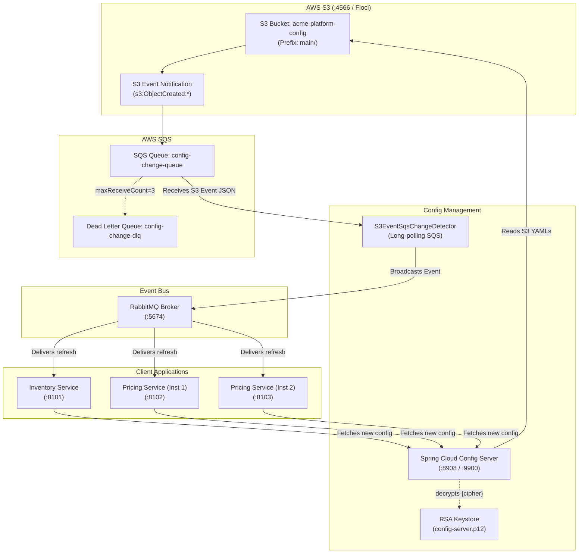
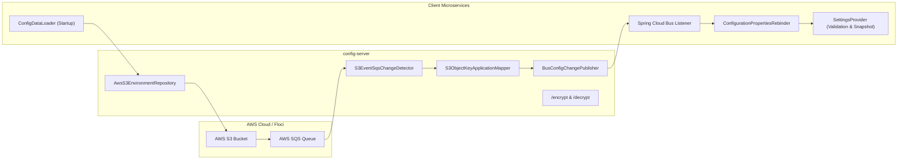
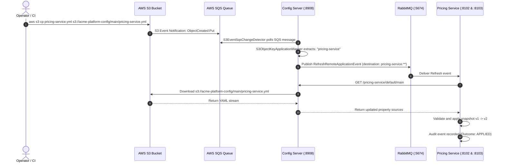
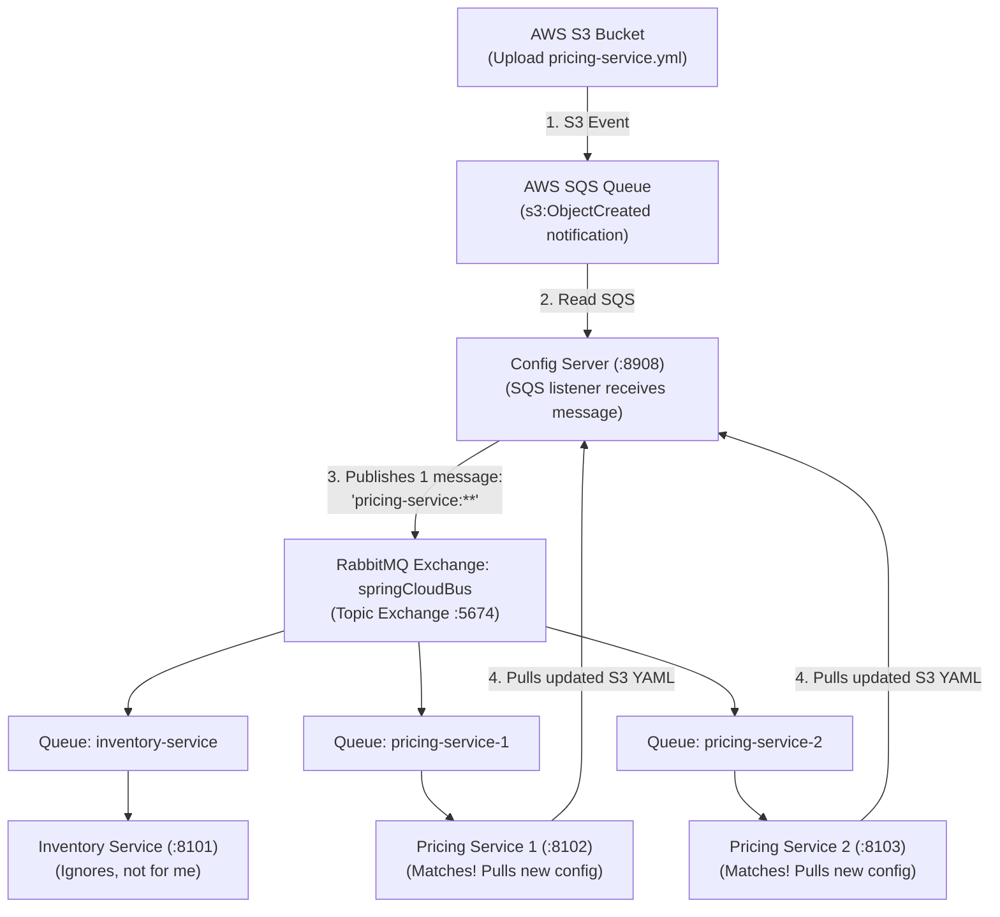

# Version C: AWS S3 + SQS Backend with Live Refresh over Spring Cloud Bus

> **Storage Backend:** AWS S3 Bucket (`acme-platform-config`) with object versioning  
> **Change Detection:** S3 Event Notification (`s3:ObjectCreated:*`) &rarr; SQS Queue (`config-change-queue`) &rarr; SQS Change Detector Thread &rarr; Spring Cloud Bus (RabbitMQ)  
> **Encryption:** Asymmetric RSA 4096-bit Keystore (PKCS12)  
> **Default Ports (host):** Config Server `8908` (Actuator `9900`), Floci AWS emulator `4566`, Inventory Service `8101` (Actuator `9101`), Pricing Service `8102` (Actuator `9102`), Pricing Service 2 `8103` (Actuator `9103`), RabbitMQ `5674` / UI `15674`

---

## 1. Architectural Overview

Version C stores YAML configuration files as versioned objects inside an **AWS S3 bucket**. 

When a configuration file is uploaded or modified in S3, S3 automatically publishes an **S3 Event Notification** to an **AWS SQS queue**. Config Server polls the SQS queue, maps the S3 object key (e.g. `main/pricing-service.yml`) to the target service (`pricing-service`), and broadcasts a refresh event across **Spring Cloud Bus** (RabbitMQ).


```mermaid
graph TD
    subgraph Storage["AWS S3 (:4566 / Floci)"]
        S3Bucket["S3 Bucket: acme-platform-config<br/>(Prefix: main/)"]
        S3Event["S3 Event Notification<br/>(s3:ObjectCreated:*)"]
        S3Bucket --> S3Event
    end

    subgraph MessagingQueue["AWS SQS"]
        SQS["SQS Queue: config-change-queue"]
        DLQ["Dead Letter Queue: config-change-dlq"]
        S3Event --> SQS
        SQS -. maxReceiveCount=3 .-> DLQ
    end

    subgraph ConfigLayer["Config Management"]
        CS["Spring Cloud Config Server<br/>(:8908 / :9900)"]
        Detector["S3EventSqsChangeDetector<br/>(Long-polling SQS)"]
        Keystore["RSA Keystore<br/>(config-server.p12)"]
        SQS -- Receives S3 Event JSON --> Detector
        CS -. decrypts {cipher} .-> Keystore
        CS -- Reads S3 YAMLs --> S3Bucket
    end

    subgraph MessagingBus["Event Bus"]
        RabbitMQ["RabbitMQ Broker<br/>(:5674)"]
    end

    subgraph Microservices["Client Applications"]
        Inv["Inventory Service<br/>(:8101)"]
        Prc1["Pricing Service (Inst 1)<br/>(:8102)"]
        Prc2["Pricing Service (Inst 2)<br/>(:8103)"]
    end

    Detector -- "Broadcasts Event" --> RabbitMQ
    RabbitMQ -- "Delivers refresh" --> Inv
    RabbitMQ -- "Delivers refresh" --> Prc1
    RabbitMQ -- "Delivers refresh" --> Prc2
    Inv -- "Fetches new config" --> CS
    Prc1 -- "Fetches new config" --> CS
    Prc2 -- "Fetches new config" --> CS
```

---

## 2. Component Diagram


```mermaid
graph LR
    subgraph AWS["AWS Cloud / Floci"]
        S3["AWS S3 Bucket"]
        SQS["AWS SQS Queue"]
    end

    subgraph ConfigServer["config-server"]
        S3Repo["AwsS3EnvironmentRepository"]
        SqsDetector["S3EventSqsChangeDetector"]
        AppMapper["S3ObjectKeyApplicationMapper"]
        Publisher["BusConfigChangePublisher"]
        EncController["/encrypt & /decrypt"]
    end

    subgraph Clients["Client Microservices"]
        ConfigDataLoader["ConfigDataLoader (Startup)"]
        Rebinder["ConfigurationPropertiesRebinder"]
        Provider["SettingsProvider (Validation & Snapshot)"]
        BusListener["Spring Cloud Bus Listener"]
    end

    S3 --> SQS
    SQS --> SqsDetector
    SqsDetector --> AppMapper
    AppMapper --> Publisher
    Publisher --> BusListener
    BusListener --> Rebinder
    Rebinder --> Provider
    ConfigDataLoader --> S3Repo
    S3Repo --> S3
```

---

## 3. Sequence Diagram: S3 Upload to Zero-Downtime Propagation


```mermaid
sequenceDiagram
    autonumber
    actor Admin as Operator / CI
    participant S3 as AWS S3 Bucket
    participant SQS as AWS SQS Queue
    participant CS as Config Server (:8908)
    participant RMQ as RabbitMQ (:5674)
    participant Client as Pricing Service (:8102 & :8103)

    Admin->>S3: aws s3 cp pricing-service.yml s3://acme-platform-config/main/pricing-service.yml
    S3->>SQS: S3 Event Notification: ObjectCreated:Put
    CS->>SQS: S3EventSqsChangeDetector polls SQS message
    CS->>CS: S3ObjectKeyApplicationMapper extracts: "pricing-service"
    CS->>RMQ: Publish RefreshRemoteApplicationEvent (destination: pricing-service:**)
    RMQ->>Client: Deliver Refresh event
    Client->>CS: GET /pricing-service/default/main
    CS->>S3: Download s3://acme-platform-config/main/pricing-service.yml
    S3-->>CS: Return YAML stream
    CS-->>Client: Return updated property sources
    Client->>Client: Validate and apply snapshot v1 -> v2
    Client->>Client: Audit event recorded (Outcome: APPLIED)
```

---

## 4. Understanding RabbitMQ & Spring Cloud Bus (Layman's Guide & Web UI)

### The Core Role of RabbitMQ (The "Megaphone" Analogy)
Think of **RabbitMQ** as a central **broadcast megaphone**:
- **Without RabbitMQ**: Config Server would need to maintain an inventory of every client container IP/port and call each service's HTTP `/actuator/refresh` endpoint one by one.
- **With RabbitMQ & Spring Cloud Bus**: When an S3 object is uploaded, S3 sends an event to SQS. Config Server reads SQS and shouts **once** into RabbitMQ's topic exchange (`springCloudBus`): *"Hey everyone, `pricing-service` configuration has changed!"*. RabbitMQ automatically duplicates and delivers this message to every connected service's private queue.


```mermaid
graph TD
    S3["AWS S3 Bucket<br/>(Upload pricing-service.yml)"]
    SQS["AWS SQS Queue<br/>(s3:ObjectCreated notification)"]
    CS["Config Server (:8908)<br/>(SQS listener receives message)"]
    Ex["RabbitMQ Exchange: springCloudBus<br/>(Topic Exchange :5674)"]
    Q1["Queue: inventory-service"]
    Q2["Queue: pricing-service-1"]
    Q3["Queue: pricing-service-2"]
    Inv["Inventory Service (:8101)<br/>(Ignores, not for me)"]
    Prc1["Pricing Service 1 (:8102)<br/>(Matches! Pulls new config)"]
    Prc2["Pricing Service 2 (:8103)<br/>(Matches! Pulls new config)"]

    S3 -- "1. S3 Event" --> SQS
    SQS -- "2. Read SQS" --> CS
    CS -- "3. Publishes 1 message:<br/>'pricing-service:**'" --> Ex
    Ex --> Q1 --> Inv
    Ex --> Q2 --> Prc1
    Ex --> Q3 --> Prc2
    Prc1 -- "4. Pulls updated S3 YAML" --> CS
    Prc2 -- "4. Pulls updated S3 YAML" --> CS
```

### Accessing the RabbitMQ Web Management Dashboard

RabbitMQ comes with an interactive web dashboard running out of the box:

- **Web Dashboard URL**: [http://localhost:15674](http://localhost:15674)
- **Username**: `guest`
- **Password**: `guest`

#### What to observe in the RabbitMQ UI:
1. **Connections Tab ("The Phone Lines")**:
   - You will see 4 active AMQP connections.
   - **Service Name Identification**: Thanks to the `ConnectionNameStrategy` bean (`RabbitConfig.java`), connections display human-readable names (`config-server:8908`, `inventory-service:8101`, `pricing-service:8102`, `pricing-service:8083`).
   - *Why the last one is `8083` and not `8103`*: the name is built from `${APP_INDEX:${SERVER_PORT:...}}`, which is the port **inside** the container. Compose sets `APP_INDEX: 8083` for the second pricing instance, while `8103` is only the host-side published port.
   - *Tip*: Click the `+/-` icon on the top-right of the table to enable the **Client-provided name** column, or click any connection to inspect its details.
2. **Exchanges Tab ("The Router")**:
   - Click on **`springCloudBus`** (`topic` type) to see the broadcast bindings to each microservice's queue (`#`).
3. **Queues and Streams Tab ("The Inboxes")**:
   - See the temporary, auto-delete queues created by each microservice instance (`springCloudBus.anonymous.*`).
   - *Why anonymous names?* To ensure fan-out delivery so that every replica receives the refresh broadcast.
   - *How to match queue to service?* Click any queue &rarr; check **Consumers** to see the service name.
4. **Live Activity**: Upload an updated YAML to S3 and watch the **Message Rates** graph spike in real time!

### Why RabbitMQ instead of Kafka for Spring Cloud Bus?

Both **RabbitMQ** and **Apache Kafka** are supported by Spring Cloud Bus (`spring-cloud-starter-bus-amqp` vs `spring-cloud-starter-bus-kafka`). However, for a **configuration management bus**, **RabbitMQ is the industry-standard recommendation**:

#### A. The Nature of the Workload: "Ephemeral Broadcast" vs "Event Stream"

| Aspect | Spring Cloud Bus Requirement | RabbitMQ (Chosen) | Apache Kafka |
|---|---|---|---|
| **Message Type** | Rare, tiny notification signals *(e.g. "Pricing config updated")* | **Natural fit**: Built for point-in-time message routing. | **Mismatch**: Built for continuous streams of business data (millions of events/sec). |
| **History / Replay** | **Not needed**: If a pod boots up tomorrow, it pulls fresh config via HTTP `GET`. It does not need to replay past refresh events. | Discards messages immediately after delivery. | Retains and stores messages to disk in commit logs. |
| **Dynamic Scaling** | Pods scale from 2 to 50 and back down dynamically. | **Ephemeral Queues (`[AD]`)**: Creates a temporary queue on pod startup; deletes it the millisecond the pod terminates. | **Consumer Group Metadata**: Every replica needs a unique random Consumer Group, leaving behind orphaned metadata in Kafka when pods die. |
| **Resource Footprint** | Background infrastructure should be lightweight. | **~40–60 MB RAM**, starts in 2 seconds. | **~600 MB–1.5 GB RAM** (JVM + KRaft/Zookeeper), starts in 20–30s. |

#### B. The "Megaphone" Analogy (RabbitMQ) vs "The Permanent Archive" (Kafka)
- **RabbitMQ is a Megaphone**: When a config changes, Config Server shouts into the megaphone. Any microservice currently alive hears it and refreshes. If no one is listening or a pod is dead, the sound disappears. This is **exactly** what configuration refresh needs.
- **Kafka is a Recording Studio with Permanent Tape**: Kafka writes every shout onto disk, tracks offsets, and organizes data into partitions. For an occasional 1 KB config refresh ping once a week, spinning up Kafka partitions and storage segments is massive overkill.

#### C. Comparison Matrix

| Feature | RabbitMQ (Default) | Apache Kafka |
|---|---|---|
| **Spring Cloud Starter** | `spring-cloud-starter-bus-amqp` | `spring-cloud-starter-bus-kafka` |
| **Broker Memory Usage** | ~50 MB RAM | ~800 MB+ RAM |
| **Queue Lifecycle** | Automatically deleted on pod exit (`[AD]`) | Topic partition offsets must be managed/rebalanced |
| **Routing Flexibility** | Native Topic Exchanges (`pricing-service:**`) | Requires topic-per-service or manual payload filtering |
| **Local Dev & CI/CD Speed** | Instant startup in Docker/Testcontainers | Slower Docker spin-up |

#### D. Swapping to Kafka (If Required by Enterprise Policy)
If your organization mandates Apache Kafka, Spring Cloud Bus supports it via a simple **1-line dependency swap**:

**1. In `pom.xml`**:
```xml
<!-- Replace RabbitMQ: -->
<!-- <dependency>
       <groupId>org.springframework.cloud</groupId>
       <artifactId>spring-cloud-starter-bus-amqp</artifactId>
     </dependency> -->

<!-- With Kafka: -->
<dependency>
  <groupId>org.springframework.cloud</groupId>
  <artifactId>spring-cloud-starter-bus-kafka</artifactId>
</dependency>
```

**2. In `application.yml`**:
```yaml
spring:
  cloud:
    bus:
      id: ${spring.application.name}:${random.uuid}
  kafka:
    bootstrap-servers: localhost:9092
```

All your Java code, `@RefreshScope`, snapshot providers, and zero-downtime refresh mechanics remain **100% identical**.

---

## 5. Quick Start: Build and Run

### Step 1: Ensure Local AWS Emulator (Floci) is Running
```bash
floci start
```

### Step 2: Provision S3 Bucket, SQS Queues & Notifications
```bash
cd version-c-s3
./scripts/provision-floci.sh
```
This is idempotent and does five things:
1. Creates the bucket `acme-platform-config` if missing.
2. Enables **object versioning** - the audit trail that replaces `git log`, and what makes AC-21 (rollback to a prior version) possible.
3. Creates `config-change-dlq`, then `config-change-queue` with a redrive policy pointing at it (`maxReceiveCount=3`), so a poison message lands in the DLQ instead of blocking the queue forever.
4. Wires `s3:ObjectCreated:*` and `s3:ObjectRemoved:*` notifications for the `main/` prefix to the queue.
5. Uploads `seed-config/*.yml` to `s3://acme-platform-config/main/` - the same configuration content version A keeps in `config-repo/`.

> The object keys are byte-identical to version A's filenames (`use-directory-layout: false`), so the same configuration is portable across all three backends.

### Step 3: Generate Encryption Keystore
```bash
./scripts/generate-keystore.sh
```

### Step 4: Build Application JARs
The Dockerfiles are **runtime-only** (`eclipse-temurin:21-jre-alpine`, `COPY target/<service>-1.0.0.jar`), so the jars must exist on the host *before* the images are built:
```bash
mvn -Pfast package
```
*(`-Pfast` skips the quality gates - Spotless, Checkstyle, SpotBugs, JaCoCo - which are not needed to produce a runnable jar.)*

### Step 5: Run with Docker Compose
```bash
docker compose -f docker/compose.yaml build --no-cache
docker compose -f docker/compose.yaml up -d
```

### Step 6: Verify Container Status
```bash
docker ps
```
All 5 containers will report `(healthy)`:

| Container | Role | Host ports | Image tag built by Compose |
|---|---|---|---|
| `cfg-s3-server` | Config Server | `8908`, `9900` | `config-s3-demo-config-server:latest` |
| `cfg-s3-inventory` | Inventory Service | `8101`, `9101` | `config-s3-demo-inventory-service:latest` |
| `cfg-s3-pricing` | Pricing Service 1 | `8102`, `9102` | `config-s3-demo-pricing-service:latest` |
| `cfg-s3-pricing-2` | Pricing Service 2 | `8103`, `9103` | `config-s3-demo-pricing-service:latest` |
| `cfg-s3-rabbitmq` | RabbitMQ broker | `5674`, `15674` | `rabbitmq:4-management` (pulled) |

The tags come from `name: config-s3-demo` on line 1 of `docker/compose.yaml` (`<project>-<service>:latest`). The Kubernetes manifests in `k8s/` reference these exact strings.

**Floci runs outside this Compose stack** (`floci start`), so there is no S3/SQS container. Reaching it from inside a container needs the two `extra_hosts` entries at the top of `docker/compose.yaml`: `localhost.floci.io` and `acme-platform-config.localhost.floci.io`, both mapped to `host-gateway`. The bucket-prefixed one is not optional - the AWS SDK uses **virtual-host-style** addressing (`<bucket>.<host>`) against a custom endpoint, and `AwsS3EnvironmentRepositoryFactory` builds its own `S3Client` with no path-style option to turn that off.

---

## 6. Configuration & Environment Variables

The default compiled into `config-server/src/main/resources/application.yml` and the value
`docker/compose.yaml` actually sets are **not** always the same:

| Variable | Default in `application.yml` | Set by `docker/compose.yaml` | Description |
|---|---|---|---|
| `CONFIG_BUCKET` | `acme-platform-config` | same | S3 bucket holding the configuration objects |
| `CONFIG_KEY_PREFIX` | `main/` | same | Key prefix. In the S3 backend the prefix **is** the label: `main/` = label `main` |
| `CONFIG_CHANGE_QUEUE` | `config-change-queue` | same | SQS queue receiving the S3 event notifications |
| `AWS_REGION` | `us-east-1` | same | AWS region |
| `AWS_ENDPOINT` | `http://localhost.floci.io:4566` | same | Endpoint override. **Delete it on real AWS** and attach an IAM role via IRSA instead |
| `AWS_ACCESS_KEY_ID` / `AWS_SECRET_ACCESS_KEY` | `test` / `test` | same | Static credentials for the emulator only. Omit on real AWS so the Default Credential Provider Chain takes over |
| `MANAGEMENT_PORT` | `9888` | `9888` (published as `9900`) | Actuator port - a separate management child context |
| `ENCRYPT_KEYSTORE_LOCATION` | `file:./secrets/config-server.p12` | `file:/secrets/config-server.p12` | RSA PKCS12 keystore (mounted read-only) |
| `ENCRYPT_KEYSTORE_PASSWORD` | `keystore-secret` | same | Keystore password; also the key password - PKCS12 has no separate one |
| `ENCRYPT_KEYSTORE_ALIAS` | `configkey` | same | Key alias inside the keystore |
| `CONFIG_ADMIN_USERNAME` / `CONFIG_ADMIN_PASSWORD` | `config-admin` / `{noop}admin-secret` | password only | Admin auth for `/encrypt`, `/decrypt`, `/actuator/busrefresh` |
| `CONFIG_CLIENT_USERNAME` / `CONFIG_CLIENT_PASSWORD` | `config-client` / `{noop}client-secret` | password only | Client auth for the Environment API |
| `RABBITMQ_HOST` / `RABBITMQ_PORT` | `localhost` / `5672` | `rabbitmq` / *(default)* | Spring Cloud Bus broker |

Two server-side settings have no environment variable and are set in `application.yml`:
`spring.profiles.active: awss3` (the profile name Spring Cloud Config keys
`AwsS3EnvironmentRepository` off - it is load-bearing) and
`app.known-applications: inventory-service,pricing-service`, which lets
`S3ObjectKeyApplicationMapper` resolve a profile suffix exactly instead of guessing at dashes.

---

## 7. Testing Guide

### A. Automated Acceptance Test Suite
S3 event delivery is **at-least-once and unordered**, so this suite additionally proves the refresh
path is idempotent and that poison messages are contained. Checks map to acceptance criteria in
[REQUIREMENTS.md](../REQUIREMENTS.md): AC-01, AC-03, AC-05, AC-18 (an upload propagates, scoped to
one application), AC-19 (duplicate events are idempotent), AC-20 (a poison message lands in the DLQ
without blocking the queue) and AC-21 (rollback via a prior object version, replacing `git revert`).

```bash
cd version-c-s3
./scripts/e2e-test.sh
```

It needs Floci running, the stack provisioned and up (section 5), plus `aws` and `python3` on the
PATH. The propagation SLA it asserts is **10 seconds** - the loosest of the three versions, because
SQS long-polling adds latency that Git webhooks and `LISTEN/NOTIFY` do not have.

---

### B. Manual Testing & Verification

#### 1. Query Config Server Environment API
```bash
# Pricing Service configuration from AWS S3
curl -s -u config-client:client-secret http://localhost:8908/pricing-service/default/main | jq .

# Inventory Service configuration (decrypted from S3)
curl -s -u config-client:client-secret http://localhost:8908/inventory-service/default/main | jq .
```

#### 2. Query Client Service Snapshots
```bash
# Inventory Service Snapshot
curl -s http://localhost:8101/api/v1/config/snapshot | jq .

# Pricing Service 1 & 2 Snapshots
curl -s http://localhost:8102/api/v1/config/snapshot | jq .
curl -s http://localhost:8103/api/v1/config/snapshot | jq .

# Refresh audit trail (changed keys, never their values)
curl -s http://localhost:8101/api/v1/config/history | jq .
```

The SQS change-detection path has its own health indicator, so a dead poller is visible rather
than silent:
```bash
curl -s http://localhost:9900/actuator/health | jq '.components.configChange'
```

#### 3. Test Business Endpoints
```bash
# Test Inventory reservation
curl -s -X POST http://localhost:8101/api/v1/inventory/reservations \
  -H 'Content-Type: application/json' \
  -d '{"sku":"SKU-1","quantity":10}' | jq .

# Test Price Quote calculation
curl -s "http://localhost:8102/api/v1/pricing/quotes/SKU-100?basePrice=1000.00" | jq .
```

---

### C. Testing Live Refresh via AWS CLI S3 Upload

#### Step 1: Upload an Updated Configuration to S3
```bash
export AWS_ENDPOINT_URL="http://localhost.floci.io:4566"
export AWS_ACCESS_KEY_ID="test"
export AWS_SECRET_ACCESS_KEY="test"
export AWS_DEFAULT_REGION="us-east-1"

# Upload updated pricing YAML to S3
cat <<'YAML' | aws s3 cp - s3://acme-platform-config/main/pricing-service.yml
pricing:
  currency: "INR"
  discount-percentage: 35.0
  surge-pricing-enabled: false
  surge-multiplier: 1.5
YAML
```

#### Step 2: Observe Automatic Propagation
Within ~0.5–1 second:
1. S3 fires an `ObjectCreated` event to SQS queue `config-change-queue`.
2. Config Server long-polls SQS, extracts application name `pricing-service`.
3. Config Server broadcasts event to RabbitMQ.
4. Both Pricing Service instances rebind and apply `v2`.

#### Step 3: Verify Live Price Quotes
```bash
curl -s "http://localhost:8102/api/v1/pricing/quotes/SKU-100?basePrice=1000.00" | jq .
curl -s "http://localhost:8103/api/v1/pricing/quotes/SKU-100?basePrice=1000.00" | jq .
```
Both instances will show:
- `discountPercentage: 35.0`
- `finalPrice: 650.00`
- `configVersion: 2`

#### Step 4: Roll Back Using S3 Object Versioning
Versioning is this backend's `git log`. Listing versions and copying an older one back over the
current key re-fires the `ObjectCreated` event, so a rollback propagates by the same path as a
change - this is AC-21:
```bash
aws s3api list-object-versions --bucket acme-platform-config \
  --prefix main/pricing-service.yml --query 'Versions[].[VersionId,LastModified]' --output table

aws s3api copy-object --bucket acme-platform-config --key main/pricing-service.yml \
  --copy-source "acme-platform-config/main/pricing-service.yml?versionId=<PREVIOUS_VERSION_ID>"
```

---

## 8. Running on Kubernetes

The manifests in `k8s/` run the same stack on Kubernetes. There are two target clusters, each with
its own script.

### A. Local minikube

```bash
cd version-c-s3
./k8s/deploy-minikube.sh
```

It builds the jars, builds the images on the **host** Docker daemon, `minikube image load`s them,
applies the manifests in order, waits for each rollout, and runs `./k8s/verify-in-cluster.sh`.

| Manifest | What it creates |
|---|---|
| `00-namespace-and-config.yaml` | Namespace `config-demo`, ConfigMaps `config-server-env` and `client-env`, Secret `config-credentials` |
| `01-dependencies.yaml` | RabbitMQ Deployment (no S3/SQS container - that is Floci or real AWS, outside the cluster) |
| `02-config-server.yaml` | Config Server (2 replicas) + Service |
| `03-clients.yaml` | `inventory-service` (1 replica) and `pricing-service` (2 replicas) + Services |

The keystore is **not** in any manifest - it is a real secret, created from the local file:

```bash
kubectl -n config-demo create secret generic config-encryption-keystore \
  --from-file=config-server.p12=secrets/config-server.p12
```

Three constraints are specific to this backend and each one blocks the deployment if missed:

- **`AWS_ENDPOINT` must be an IP address, not a hostname, when pointing at a local emulator.**
  `AwsS3EnvironmentRepositoryFactory` builds its own `S3Client` with no injection point and no
  path-style option, so with a hostname the SDK uses virtual-host addressing and needs
  `<bucket>.<host>` to resolve in cluster DNS. The SDK falls back to **path-style** automatically
  when the endpoint host is a bare IP - which is why `00-namespace-and-config.yaml` ships
  `AWS_ENDPOINT: "http://172.17.0.2:4566"` (Floci on the Docker bridge). Check the address matches
  your machine before deploying. **On real AWS: delete the `AWS_ENDPOINT` line and the static
  credentials in the Secret, and attach an IAM role via IRSA instead.**
- **Images are built on the host and loaded in, not pulled.** On this machine the cluster cannot
  pull from Docker Hub (`x509: certificate signed by unknown authority`, a corporate TLS
  certificate the host trusts being absent from the VM's trust store).
- **`enableServiceLinks: false` is set in the pod specs on purpose.** Kubernetes would otherwise
  inject `RABBITMQ_PORT=tcp://10.x.x.x:5672`, colliding with the property of the same name, and
  Boot fails with `NumberFormatException`.

### B. Floci's EKS (a real k3s control plane)

```bash
./k8s/deploy-floci-eks.sh
```

`floci eks create-cluster` starts a `rancher/k3s` container and publishes its API server, so this
is a genuine control plane rather than a mock. The script writes a self-contained kubeconfig to
`k8s/floci-eks.kubeconfig` (API server `https://localhost:6500`) using k3s's own client
certificate - deliberately **not** what `aws eks update-kubeconfig` produces, which writes an exec
credential plugin that shells out to `aws eks get-token` and therefore fails in GUI tools like k9s
with "Unable to locate credentials".

Two traps the script exists to handle:

- **The container runtime cannot pull from Docker Hub.** The first symptom is *not* an error on
  your own pods - it is every pod stuck in `ContainerCreating`, because k3s cannot pull
  `rancher/mirrored-pause`, the sandbox image every pod needs. The node still reports `Ready`,
  which makes the cluster look healthy. The script handles it twice over: a `registries.yaml` that
  skips verification, plus pre-importing images from the host daemon.
- **A mutable `:latest` tag silently runs stale code.** With `imagePullPolicy: IfNotPresent` the
  kubelet resolves `:latest` once and pins that image ID; re-importing a rebuilt image under the
  same tag updates the tag in containerd while running pods keep the old ID - so a code change
  appears to deploy and does nothing. Every deploy therefore gets a unique tag
  (`1.0.0-<timestamp>`), and the script **asserts** the pod's `imageID` equals the image just
  built rather than trusting the rollout.

### Verifying, either way

```bash
./k8s/verify-in-cluster.sh
kubectl delete namespace config-demo   # tear down
```

`verify-in-cluster.sh` queries **individual pod IPs** rather than the Service, because a Service
would load-balance and could hide a replica that never received the broadcast - exactly the
failure this design must not have.

---

## 9. Interactive OpenAPI 3 / Swagger Documentation

Every microservice exposes full OpenAPI 3.1 definitions and an interactive Swagger UI with live schema validation:

| Service | Swagger UI URL | OpenAPI 3 JSON Schema |
|---|---|---|
| **Inventory Service** | [http://localhost:8101/swagger-ui.html](http://localhost:8101/swagger-ui.html) | [http://localhost:8101/v3/api-docs](http://localhost:8101/v3/api-docs) |
| **Pricing Service (Inst 1)** | [http://localhost:8102/swagger-ui.html](http://localhost:8102/swagger-ui.html) | [http://localhost:8102/v3/api-docs](http://localhost:8102/v3/api-docs) |
| **Pricing Service (Inst 2)** | [http://localhost:8103/swagger-ui.html](http://localhost:8103/swagger-ui.html) | [http://localhost:8103/v3/api-docs](http://localhost:8103/v3/api-docs) |

### Features Included:
- **Rich DTO Schemas**: `@Schema` metadata including descriptions, example values, min/max constraints, and required fields.
- **Response Code Mapping**: Explicit `@ApiResponse` annotations documenting `200 OK`, `400 Bad Request` (RFC 9457), `404 Not Found`, and `500 Internal Server Error`.
- **Try-It-Out**: Directly execute quote calculations, stock reservations, and configuration snapshot inspections from your browser.

---

## 10. Production-Grade Security Hardening

### Security Filter Chain (`SecurityConfig.java`)
All microservices implement enterprise-grade HTTP security controls:
- **Stateless Session Management**: `SessionCreationPolicy.STATELESS` eliminates server-side session fixation vulnerabilities.
- **REST-Safe CSRF**: CSRF protection is safely disabled on stateless JSON endpoints in accordance with OWASP API Security guidelines.
- **Strict HTTP Security Response Headers**:
  - `Content-Security-Policy`: `"default-src 'self'; frame-ancestors 'none';"`
  - `Strict-Transport-Security`: `max-age=31536000; includeSubDomains` (HSTS)
  - `X-Frame-Options`: `DENY` (Clickjacking prevention)
  - `X-Content-Type-Options`: `nosniff` (MIME-sniffing prevention)
  - `Referrer-Policy`: `strict-origin-when-cross-origin`
  - `Permissions-Policy`: `"camera=(), microphone=(), geolocation=()"`

---

## 11. RFC 9457 Standardized Exception Handling

All uncaught exceptions and validation errors are intercepted by `@RestControllerAdvice` (`GlobalExceptionHandler`) and formatted as RFC 9457 `application/problem+json`:

```json
{
  "type": "https://api.acme.com/errors/validation-error",
  "title": "Validation Failed",
  "status": 400,
  "detail": "Request payload validation failed for 1 field(s)",
  "instance": "/api/v1/inventory/reservations",
  "errorId": "3b2e1f4a-718c-4a50-9d8a-1294875623c1",
  "timestamp": "2026-09-19T17:30:00Z",
  "fieldErrors": [
    {
      "field": "quantity",
      "rejectedValue": -5,
      "message": "Quantity must be greater than zero"
    }
  ]
}
```

### Handled Error Scenarios:
- **`MethodArgumentNotValidException` / `ConstraintViolationException`**: HTTP 400 with detailed `fieldErrors`.
- **`ConfigurationValidationException` / `IllegalStateException`**: HTTP 400 when business rules reject invalid configuration or payload state.
- **`NoResourceFoundException`**: HTTP 404 for nonexistent endpoints.
- **`HttpRequestMethodNotSupportedException`**: HTTP 405 for unsupported HTTP verbs.
- **`Exception` (Uncaught Fallback)**: HTTP 500 with unique `errorId` for log correlation without leaking internal stack traces.

---

## 12. Security Scanning & Quality Gates (SAST / SCA)

Every build is continuously analyzed by enterprise security and code quality gates:

```bash
# Run complete verification (Checkstyle, Spotless, SpotBugs + FindSecBugs, ArchUnit, JaCoCo)
mvn clean verify

# Run dedicated OWASP dependency vulnerability check (SCA)
mvn -Psecurity verify
```

| Quality Gate | Tool & Version | Inspection Scope |
|---|---|---|
| **SAST (Bytecode Analysis)** | SpotBugs 4.10.4 + `findsecbugs-plugin:1.13.0` | SQL injection, CSRF misconfiguration, insecure cryptography, path traversal, command injection |
| **SCA (Dependency Vulnerability)** | OWASP `dependency-check-maven:13.0.0` | Known CVEs in third-party libraries against the National Vulnerability Database (NVD) |
| **Architecture Enforcement** | ArchUnit 1.5.0 | Layer isolation, immutable snapshot boundaries, ban direct properties injection |
| **Code Formatting** | Spotless + google-java-format 1.36.1 | Deterministic code style formatting |
| **Static Code Analysis** | Checkstyle 14.1.0 | Coding conventions, naming standards, Javadoc hygiene |
| **Code Coverage** | JaCoCo 0.8.15 | Enforced line (>70%) and branch (>60%) thresholds. **`config-server` lowers these to 45% / 35%** on purpose: `SecurityConfig` and the application class need a live S3 endpoint and broker to instantiate, and their behaviour is asserted end to end by `scripts/e2e-test.sh` (401 unauthenticated, 200 authenticated) instead. The override and its rationale are in `config-server/pom.xml` |

`SqsChangeDetectorIT` uses **Testcontainers 1.21.4**, pinned explicitly because - unlike Boot 3 -
the Spring Boot 4 BOM does not manage it. It needs a running Docker daemon.

Each of the three services is a **standalone Maven project** parented directly to
`spring-boot-starter-parent` 4.0.8, with its own dependency management, quality gates and
`config/` directory. The `pom.xml` at `version-c-s3/` is an **aggregator only** - nothing is
inherited from it - so a single service builds on its own:

```bash
cd inventory-service && mvn verify
```

